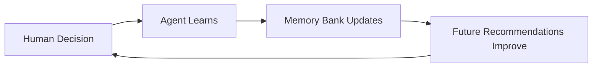

## The Vision Behind Cagen

Cagen represents a fundamental shift from traditional software architectures to AI-native design principles. Understanding why we built Cagen the way we did helps explain how it enables true organizational intelligence.

## Core Design Principles

### Agent-First Architecture

Traditional software puts humans at the center, with tools as extensions. Cagen inverts this paradigm:

**Traditional Model:**
```
Human → Software Tool → External Systems
```

**Cagen's Agent-First Model:**
```
Human + AI Agent ↔ Shared Context → External Systems
```

This design enables:
- **Continuous Intelligence**: Agents don't just respond—they proactively monitor, analyze, and act
- **Context Preservation**: Every interaction builds organizational memory
- **Scalable Expertise**: Knowledge multiplies rather than fragments across team members

### Memory-Centric Design

Most platforms treat data as static storage. Cagen treats memory as living, contextual intelligence:

#### Why Memory Comes First

**Problem with Traditional Systems:**
- Information silos across different tools
- Context loss between conversations and actions
- Knowledge trapped in individual minds

**Cagen's Memory Bank Solution:**
- All interactions contribute to organizational memory
- Context flows seamlessly between agents and humans
- Institutional knowledge grows with every decision

#### The Memory Feedback Loop



### Conversation as Infrastructure

In traditional organizations, conversations are ephemeral. In Cagen, conversations are **infrastructure**:

#### Why Conversations Matter

**Traditional Communication Problems:**
- Important decisions lost in chat history
- Context switching between communication and work tools
- Knowledge silos between teams

**Cagen's Conversation Infrastructure:**
- Every conversation can spawn actions
- Agents participate as equal team members
- Decisions automatically become institutional memory

#### Conversation Types Reflect Work Patterns

- **Private Chats**: Personal AI assistance and mentoring
- **Group Chats**: Team coordination with AI facilitation
- **Topics**: Focused decision-making with automatic archiving

### Issue-Centric Workflow

Cagen organizes work around outcomes (issues) rather than processes:

#### The Problem with Process-First Thinking

Most project management tools force rigid workflows:
```
Plan → Assign → Execute → Review → Close
```

#### Cagen's Issue-Centric Approach

Issues adapt to how teams actually work:
```
Idea → Discussion → Automatic Channel → Collaborative Execution → Knowledge Capture
```

Key innovations:
- **Automatic Channel Creation**: Every issue gets its own conversation space
- **Agent Participation**: AI agents can be assigned to and complete work
- **Living Documentation**: Issue discussions automatically update relevant documentation

## Technical Architecture Decisions

### Why Microservices + Unified Experience

Cagen appears as a single, cohesive platform but runs on microservices architecture:

**Benefits:**
- **Independent Scaling**: Different components scale based on usage
- **Technology Diversity**: Best tool for each job (Python for AI, Go for performance, etc.)
- **Fault Isolation**: Issues in one component don't break the entire system
- **Development Velocity**: Teams can work independently on different components

**Unified Experience:**
- Single authentication and authorization
- Shared data models and APIs
- Consistent UI/UX patterns
- Cross-component communication via event streams

### Runtime Environment Design

#### Sandboxed Execution

Every agent and action runs in isolated containers:

**Security Benefits:**
- Agents can't interfere with each other
- Failed actions don't crash the system
- Resource usage is controlled and monitored

**Performance Benefits:**
- Auto-scaling based on demand
- Efficient resource utilization
- Fast cold-start times through warm pools

#### Edge-First Deployment

Cagen deploys close to users rather than in centralized data centers:

**Why Edge Deployment:**
- **Reduced Latency**: Faster agent responses
- **Data Compliance**: Keep data in required regions
- **Reliability**: Multiple points of failure protection

### The Store as Ecosystem Strategy

The Cagen Store isn't just a marketplace—it's an ecosystem strategy:

#### Network Effects

As more organizations use Cagen:
- **Better Agents**: More usage data improves AI models
- **More Integrations**: Community builds connectors to every tool
- **Shared Knowledge**: Best practices emerge and spread
- **Economic Incentives**: Creators build valuable additions

#### Open vs. Closed Components

**Open Components:**
- MCP protocol implementation
- Basic agent templates
- Common workflow patterns

**Proprietary Components:**
- Advanced AI models and training
- Enterprise security features
- Optimization algorithms

## Design Trade-offs and Decisions

### Complexity vs. Power

**The Trade-off:**
Cagen could be simpler if we built a basic chat interface with AI. Instead, we built a complete organizational operating system.

**Why We Chose Complexity:**
- Organizations are inherently complex
- Simple tools force workarounds that create more complexity
- The complexity is hidden from end users through intelligent defaults

### Performance vs. Flexibility

**The Challenge:**
AI operations can be slow. Users expect instant responses.

**Our Approach:**
- **Predictive Pre-computation**: Anticipate likely user needs
- **Progressive Enhancement**: Show partial results while computing complete answers
- **Intelligent Caching**: Store and reuse relevant computations
- **Graceful Degradation**: Provide useful responses even when systems are stressed

### Privacy vs. Intelligence

**The Tension:**
Better AI requires more data. Privacy requires data minimization.

**Our Solution:**
- **Local-First Processing**: Compute on user data without storing it
- **Differential Privacy**: Add noise to protect individual privacy while preserving aggregate insights
- **User Control**: Granular controls over what data is used for what purposes
- **Transparent Algorithms**: Users can understand and audit AI decisions

## Philosophical Foundations

### Human-AI Collaboration, Not Replacement

Cagen is built on the belief that human+AI collaboration is more powerful than AI replacement:

**Why Collaboration Wins:**
- Humans provide creativity, judgment, and values
- AI provides scale, consistency, and processing power
- Together, they achieve outcomes neither could alone

**Design Implications:**
- Agents are team members, not tools
- Humans remain in control of important decisions
- AI augments human capabilities rather than replacing them

### Organizations as Learning Systems

Traditional organizations learn slowly, if at all. Cagen treats organizations as adaptive systems:

**Organizational Learning Principles:**
- **Experience Capture**: Every action becomes organizational knowledge
- **Pattern Recognition**: AI identifies what works across different contexts
- **Knowledge Transfer**: Insights from one team help others
- **Continuous Improvement**: Systems get better with use

### The Future of Work

Cagen embodies a vision of work where:
- **Routine Tasks**: Handled automatically by AI
- **Complex Problems**: Solved through human-AI collaboration
- **Knowledge Work**: Becomes more strategic and creative
- **Organizational Intelligence**: Continuously grows and improves

## Measuring Success

### Traditional Metrics vs. AI-Native Metrics

**Traditional Software Metrics:**
- User adoption
- Feature usage
- Performance benchmarks

**AI-Native Success Metrics:**
- **Decision Quality**: Are better decisions being made?
- **Learning Velocity**: How quickly does the organization improve?
- **Knowledge Leverage**: Is institutional knowledge being effectively used?
- **Human Flourishing**: Are people doing more meaningful work?

### The Compound Effect

The real value of Cagen emerges over time through compound effects:

**Month 1**: Basic productivity gains
**Month 6**: Improved decision-making patterns
**Year 1**: Transformed organizational capabilities
**Year 3**: Competitive advantages that are difficult to replicate

## Looking Forward

### Emerging Capabilities

As AI technology advances, Cagen will incorporate:
- **Multi-modal AI**: Understanding images, audio, and video
- **Reasoning Engines**: Complex problem-solving capabilities
- **Predictive Intelligence**: Anticipating organizational needs
- **Cross-Organizational Learning**: Insights shared across the network while preserving privacy

### The Network Effect

Every organization using Cagen makes the platform more valuable for all users:
- Better agent templates from community contributions
- Improved AI models from aggregated (anonymized) usage patterns
- More integrations and extensions
- Shared best practices and methodologies

## Conclusion

Cagen's design reflects our belief that organizations are ready for AI-native architectures. By putting agents, memory, and conversations at the center of our design, we enable new forms of organizational intelligence that weren't possible before.

The complexity of this approach is justified by the transformational outcomes it enables. Organizations using Cagen don't just get productivity gains—they develop new capabilities for learning, adapting, and thriving in an AI-enabled world.

<Note>
  Understanding these design principles helps explain why certain features work the way they do in Cagen. When in doubt about how to use the platform, consider how your approach aligns with these core principles of agent-first, memory-centric, conversation-driven work.
</Note>