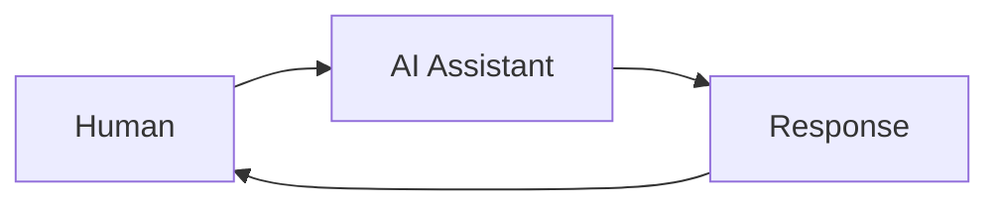
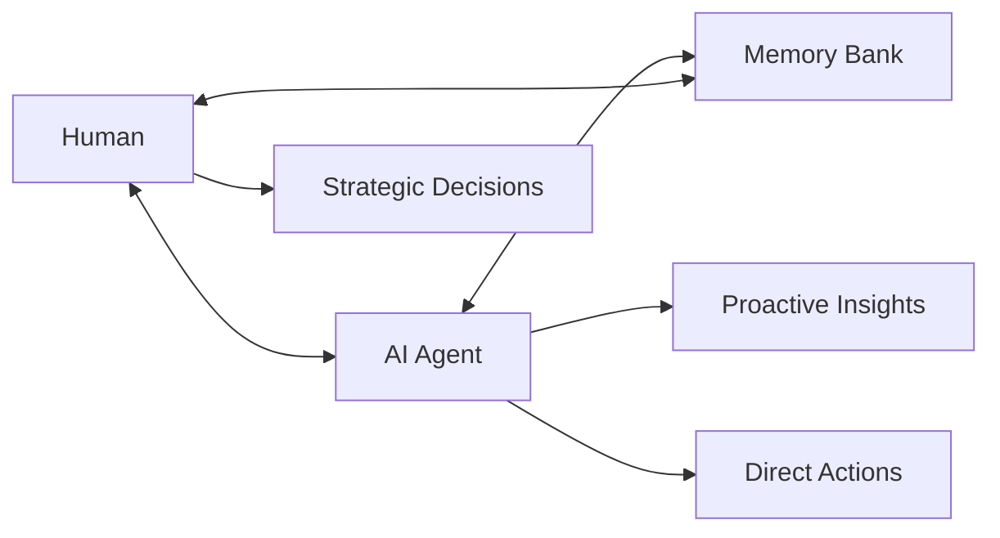

## Beyond the Assistant Model

Most AI tools position artificial intelligence as an assistant—a sophisticated helper that responds to human requests. Cagen embodies a fundamentally different model: **collaborative intelligence** where humans and AI agents work as peers on shared objectives.

## The Collaborative Intelligence Framework

### Traditional Assistant Model



**Characteristics:**
- Human initiates every interaction
- AI responds to queries
- Context resets between sessions
- AI has no agency or initiative

### Cagen's Collaborative Model



**Characteristics:**
- Continuous bidirectional communication
- AI takes initiative and suggests actions
- Shared access to organizational memory
- AI performs work independently
- Humans focus on strategy and judgment

## The Partnership Spectrum

Different types of work require different levels of human-AI collaboration:

### Level 1: AI as Tool

**When to use:** Routine, well-defined tasks
**Human role:** Define requirements, review outputs
**AI role:** Execute specific instructions

**Examples:**
- Generate meeting summaries
- Format data according to templates
- Send standardized notifications

```yaml
collaboration_pattern:
  human_input: "Summarize this week's customer feedback"
  ai_action: "Analyzes feedback, creates summary"
  human_review: "Approves or requests revisions"
```

### Level 2: AI as Advisor

**When to use:** Complex analysis requiring judgment
**Human role:** Make final decisions, provide context
**AI role:** Analyze options, provide recommendations

**Examples:**
- Market analysis for product decisions
- Risk assessment for investments
- Performance optimization recommendations

```yaml
collaboration_pattern:
  ai_initiative: "Identifies potential market opportunity"
  ai_analysis: "Researches competition, market size, trends"
  human_consultation: "Discusses findings, adds context"
  human_decision: "Decides whether to pursue opportunity"
  ai_execution: "Implements decision through actions"
```

### Level 3: AI as Partner

**When to use:** Creative, strategic, or ambiguous challenges
**Human role:** Vision, values, creative direction
**AI role:** Research, analysis, implementation suggestions

**Examples:**
- Product strategy development
- Organizational design decisions
- Complex problem-solving initiatives

```yaml
collaboration_pattern:
  shared_goal: "Increase customer satisfaction"
  human_vision: "Focus on reducing support response time"
  ai_research: "Analyzes current bottlenecks, best practices"
  joint_brainstorming: "Human creativity + AI pattern recognition"
  human_priorities: "Ranks solutions by strategic importance"
  ai_implementation: "Executes approved solutions"
  continuous_feedback: "Both monitor results and adjust"
```

## Trust and Agency in AI Collaboration

### Building Trust Through Transparency

Effective human-AI collaboration requires trust, which emerges through:

#### Predictable Behavior
AI agents in Cagen operate according to clear, consistent patterns:
- Always explain reasoning for recommendations
- Show confidence levels in analysis
- Acknowledge limitations and uncertainties
- Provide sources for information

#### Graceful Error Handling
When AI agents make mistakes:
- Errors are immediately flagged to humans
- Context is preserved for learning
- Corrections are applied to prevent similar future errors
- Humans remain in control of important decisions

#### Continuous Learning
Trust deepens as agents demonstrate learning:
- Agents remember past preferences and decisions
- Performance improves with interaction
- Agents adapt to individual and organizational styles

### Appropriate Levels of Agency

Different situations call for different levels of AI autonomy:

#### Full Autonomy (Pre-approved Actions)
**Examples:**
- Scheduling meetings based on availability
- Updating project status based on completed tasks
- Sending routine notifications and reminders

**Safeguards:**
- Clear boundaries defined in advance
- Audit trail of all autonomous actions
- Easy rollback mechanisms
- Human oversight and intervention capabilities

#### Supervised Autonomy (Review Before Action)
**Examples:**
- Drafting important communications
- Making purchasing decisions within budget limits
- Modifying workflows based on performance data

**Process:**
```yaml
ai_proposal: "Draft customer response based on issue analysis"
human_review: "Edit draft, adjust tone, add personal context"
joint_refinement: "AI suggests improvements, human approves"
ai_execution: "Send final version, track response"
```

#### Advisory Only (Human Decision Required)
**Examples:**
- Strategic business decisions
- Personnel decisions
- Legal or compliance matters

**Interaction Pattern:**
- AI provides comprehensive analysis
- Multiple options with pros/cons
- Human makes final decision
- AI supports implementation

## Collaboration Patterns in Practice

### Daily Standup Collaboration

**Traditional Standup:**
- Humans report what they did, plan to do, and blockers
- Information is shared but not acted upon
- Blockers may go unresolved

**Cagen-Enhanced Standup:**
```yaml
before_meeting:
  ai_preparation: "Analyzes project progress, identifies potential blockers"
  ai_suggestions: "Proposes agenda items based on current challenges"

during_meeting:
  human_updates: "Team members share progress and concerns"
  ai_insights: "Provides relevant context from memory bank"
  ai_connections: "Identifies dependencies between team member work"

after_meeting:
  ai_actions: "Creates follow-up tasks for identified blockers"
  ai_scheduling: "Proposes meetings for complex issues requiring discussion"
  human_prioritization: "Approves and prioritizes AI-suggested actions"
```

### Project Planning Collaboration

**Phase 1: Vision Setting (Human-Led)**
```yaml
human_role: "Define project goals, success criteria, constraints"
ai_support: "Research similar projects, identify potential challenges"
outcome: "Clear project vision with informed expectations"
```

**Phase 2: Planning (Collaborative)**
```yaml
ai_analysis: "Break down goals into tasks, estimate effort, identify dependencies"
human_review: "Adjust priorities, add missing requirements, validate assumptions"
ai_optimization: "Optimize timeline, resource allocation, risk mitigation"
human_approval: "Finalize plan, assign responsibilities"
```

**Phase 3: Execution (AI-Supported)**
```yaml
ai_monitoring: "Track progress, identify blockers, suggest optimizations"
human_decisions: "Resolve conflicts, make scope changes, handle exceptions"
ai_adaptation: "Update plans based on new information and decisions"
```

### Research and Analysis Collaboration

**Information Gathering (AI-Led)**
```yaml
ai_role: "Search multiple sources, synthesize information, identify patterns"
human_guidance: "Provide focus areas, validate source credibility, add context"
```

**Analysis and Insights (Collaborative)**
```yaml
ai_processing: "Statistical analysis, trend identification, correlation discovery"
human_interpretation: "Business context, strategic implications, actionable insights"
```

**Decision Support (Human-Led)**
```yaml
ai_options: "Present multiple courses of action with trade-off analysis"
human_judgment: "Consider organizational values, timing, resource constraints"
ai_implementation: "Execute chosen option, monitor results, suggest adjustments"
```

## Overcoming Collaboration Challenges

### Challenge: Over-Reliance on AI

**Symptoms:**
- Humans stop thinking critically about AI recommendations
- Skills atrophy from lack of practice
- Poor decisions when AI isn't available

**Solutions:**
- Regular "AI-free" periods for skill maintenance
- Mandatory human review of important decisions
- Training on AI limitations and failure modes

### Challenge: Under-Utilization of AI

**Symptoms:**
- Humans do work AI could handle more efficiently
- AI agents remain idle while humans are overloaded
- Resistance to AI suggestions and automation

**Solutions:**
- Regular collaboration training and best practice sharing
- Clear metrics showing AI contribution to outcomes
- Gradual introduction of AI capabilities

### Challenge: Mismatched Expectations

**Symptoms:**
- Frustration when AI doesn't understand context
- Disappointment with AI limitations
- Unrealistic expectations of AI capabilities

**Solutions:**
- Clear communication about AI strengths and limitations
- Transparent AI training and improvement processes
- Regular calibration of expectations based on results

## Measuring Collaboration Effectiveness

### Quantitative Metrics

**Productivity Metrics:**
- Tasks completed per person-day
- Time from problem identification to resolution
- Quality scores for deliverables

**Collaboration Quality:**
- Frequency of human-AI interactions
- Acceptance rate of AI suggestions
- Success rate of collaborative projects

**Learning and Improvement:**
- Rate of AI model improvement over time
- Human skill development in AI collaboration
- Organizational capability growth

### Qualitative Indicators

**Trust and Satisfaction:**
- Human confidence in AI recommendations
- Perceived value of AI contributions
- Satisfaction with collaborative outcomes

**Innovation and Creativity:**
- Novel solutions emerging from collaboration
- Quality of human-AI brainstorming sessions
- Breakthrough insights from combined intelligence

**Organizational Health:**
- Reduced burnout from automation of routine work
- Increased focus on strategic and creative work
- Improved decision-making quality and speed

## The Future of Human-AI Collaboration

### Emerging Collaboration Patterns

**Multi-Agent Collaboration:**
- Teams of specialized AI agents working together
- Humans orchestrating agent teams
- Agents collaborating independently with human oversight

**Cross-Organizational Collaboration:**
- AI agents representing different organizations
- Human-mediated inter-organizational problem solving
- Shared intelligence while preserving competitive advantages

**Continuous Learning Partnership:**
- AI that learns not just from data but from human reasoning
- Humans who develop enhanced decision-making through AI insights
- Organizational intelligence that evolves through collaborative experience

### Preparing for Advanced Collaboration

**Skills Development:**
- AI prompt engineering and interaction design
- Collaborative decision-making frameworks
- Trust and verification protocols

**Organizational Readiness:**
- Governance frameworks for human-AI collaboration
- Ethical guidelines for AI agency and autonomy
- Change management for AI integration

**Cultural Evolution:**
- Embracing AI as team members rather than tools
- Developing comfort with AI initiative and suggestions
- Building organizations around human-AI complementarity

## Conclusion

Successful human-AI collaboration in Cagen isn't about replacing human intelligence with artificial intelligence—it's about creating new forms of intelligence that combine the best of both. Humans contribute creativity, judgment, values, and strategic thinking. AI contributes scale, consistency, pattern recognition, and tireless execution.

The organizations that thrive in the AI era will be those that master this collaborative model, creating partnerships where humans and AI agents work together as peers toward shared goals. Cagen provides the platform and framework for this collaboration, but success depends on humans learning to be effective partners with AI.

<Note>
  The key to effective human-AI collaboration is remembering that it's a skill that develops over time. Start with simple collaborations and gradually increase the complexity and autonomy as trust and capability grow.
</Note>