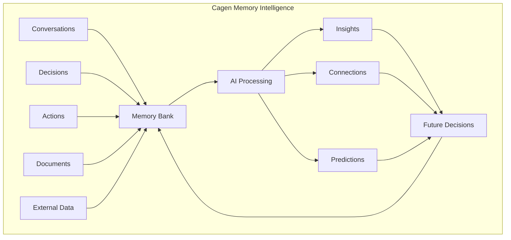

## Beyond Information Storage

Traditional organizational knowledge management treats information as static content to be stored and retrieved. Cagen's Memory Bank represents a fundamentally different approach: **memory as intelligence**—where information becomes smarter, more connected, and more useful over time.

## The Problem with Traditional Knowledge Management

### Information Silos

Most organizations suffer from fragmented knowledge:

```mermaid
graph TB
    subgraph "Traditional Silos"
        Email[Email Archives]
        Wiki[Company Wiki]
        Docs[Document Storage]
        CRM[Customer Data]
        Code[Code Repositories]
        Meetings[Meeting Notes]
    end
    
    Person[Employee] --> Email
    Person --> Wiki  
    Person --> Docs
    Person --> CRM
    Person --> Code
    Person --> Meetings
    
    Email -.x Docs
    Wiki -.x CRM
    Code -.x Meetings
```

**Problems with silos:**
- Critical insights trapped in individual systems
- Context lost when switching between tools
- Duplicate work due to lack of knowledge sharing
- Expertise concentrated in individual minds

### Static Information

Traditional systems store information but don't understand it:
- Documents that never get updated or verified
- Search results that lack context or relevance
- Historical decisions with no connection to current choices
- Knowledge that becomes stale without anyone noticing

## Cagen's Intelligent Memory Model

### Living Memory Architecture



**Key differences:**
- Information is automatically categorized and connected
- Context is preserved and enhanced over time
- Insights emerge from pattern recognition across all data
- Memory actively contributes to future decisions

### The Intelligence Feedback Loop

Memory in Cagen gets smarter through a continuous feedback loop:

#### 1. Capture
Every interaction adds to organizational memory:
- Conversations between humans and agents
- Decisions made and their outcomes
- Actions taken and their results
- External information and research
- Changes in strategy or direction

#### 2. Process
AI continuously analyzes and enhances memory:
- **Categorization**: Automatically tags and organizes information
- **Connection Discovery**: Links related concepts across different contexts
- **Pattern Recognition**: Identifies recurring themes and successful approaches
- **Contradiction Detection**: Flags conflicting information or outdated decisions

#### 3. Synthesize
Raw information becomes actionable intelligence:
- **Contextual Retrieval**: Finds relevant information based on current situation
- **Proactive Insights**: Surfaces relevant knowledge before it's requested
- **Decision Support**: Provides historical context for current choices
- **Predictive Guidance**: Suggests approaches based on past success patterns

#### 4. Apply
Intelligence influences future decisions and actions:
- Agents reference memory when responding to queries
- Humans receive memory-informed recommendations
- Workflows incorporate lessons from past executions
- New decisions are made with full historical context

#### 5. Learn
Outcomes feed back into memory improvement:
- Successful decisions strengthen related memory patterns
- Failed approaches are flagged for future avoidance
- User feedback improves memory relevance and accuracy
- External validation enhances memory reliability

## Types of Organizational Memory

### Explicit Memory: Documented Knowledge

**What it includes:**
- Written procedures and policies
- Project documentation and specifications
- Research reports and analysis
- Customer feedback and testimonials
- Meeting minutes and decision records

**How Cagen enhances it:**
- Automatic linking between related documents
- Version tracking with change rationale
- Relevance scoring based on usage and outcomes
- Translation between different formats and contexts

### Tacit Memory: Experiential Knowledge

**What it includes:**
- Lessons learned from project successes and failures
- Unwritten cultural knowledge and practices
- Individual expertise and insights
- Relationship patterns and communication preferences
- Intuitive understanding of what works in different contexts

**How Cagen captures it:**
- Analysis of conversation patterns and decision outcomes
- Extraction of insights from informal communications
- Recognition of successful collaboration patterns
- Documentation of implicit preferences and styles

### Procedural Memory: How Things Get Done

**What it includes:**
- Workflow patterns and optimization approaches
- Problem-solving methodologies that prove effective
- Resource allocation strategies that work
- Timeline and effort estimation based on historical data
- Quality standards derived from successful outcomes

**How Cagen develops it:**
- Learning from workflow execution patterns
- Optimization suggestions based on successful approaches
- Automatic incorporation of best practices
- Adaptation of procedures based on changing conditions

### Strategic Memory: Why Decisions Were Made

**What it includes:**
- Reasoning behind major decisions
- Trade-offs considered and alternatives rejected
- Environmental conditions that influenced choices
- Success criteria and how they were measured
- Evolution of strategic thinking over time

**How Cagen preserves it:**
- Documentation of decision context and rationale
- Tracking of assumption validation over time
- Connection of strategic decisions to operational outcomes
- Analysis of decision-making patterns and their effectiveness

## Memory-Driven Intelligence Features

### Contextual Awareness

Memory Bank doesn't just store information—it understands context:

**Time-Aware Relevance:**
- Recent information weighted more heavily for current decisions
- Historical trends identified and projected forward
- Seasonal patterns recognized and anticipated
- Obsolete information flagged and depreciated

**Stakeholder-Specific Context:**
- Information presented based on role and responsibilities
- Personalized relevance scoring based on individual work patterns
- Team-specific knowledge prioritized for group decisions
- Customer context preserved across all interactions

**Situation-Adaptive Insights:**
- Crisis situations trigger relevant precedent information
- Planning contexts surface historical data and projections
- Creative contexts emphasize innovative approaches and possibilities
- Routine contexts provide efficiency optimizations

### Proactive Intelligence

Rather than waiting for queries, Memory Bank actively supports work:

**Anticipatory Insights:**
```yaml
scenario: "Team planning quarterly goals"
memory_contribution:
  - "Last quarter's goals and actual outcomes"
  - "Seasonal patterns affecting similar goals"
  - "Resource constraints from previous quarters"
  - "Successful strategies from other teams"
  - "External factors likely to impact goals"
```

**Preventive Guidance:**
```yaml
scenario: "Team starting new project type"
memory_contribution:
  - "Common pitfalls from similar past projects"
  - "Resource requirements that were underestimated"
  - "Stakeholders who should be involved early"
  - "Success factors from comparable projects"
  - "Timeline risks based on historical data"
```

### Collective Intelligence

Individual memory contributes to organizational intelligence:

**Cross-Pollination:**
- Successful approaches from one team inform others
- Solutions to problems become available organization-wide
- Innovation in one area sparks improvements in others
- Learning compounds across the entire organization

**Pattern Recognition:**
- Identification of success patterns across different contexts
- Recognition of failure modes and their warning signs
- Discovery of unexpected connections between different areas
- Emergence of organizational best practices

## Memory Evolution and Learning

### Continuous Refinement

Memory Bank improves through multiple learning mechanisms:

#### Usage-Based Learning
- Frequently accessed information is refined for better presentation
- Search patterns inform better organization and categorization
- User feedback improves relevance ranking
- Successful applications strengthen memory connections

#### Outcome-Based Learning
- Decisions that lead to good outcomes strengthen related memory patterns
- Failed approaches are tagged with failure context
- Success metrics validate the utility of different memory types
- Long-term tracking shows which memory insights prove most valuable

#### Collaborative Learning
- Individual memory contributions benefit the entire organization
- Cross-validation improves memory accuracy and reliability
- Collective intelligence emerges from individual experiences
- Network effects make memory more valuable as more people contribute

### Memory Curation and Quality

#### Automatic Quality Control
- Contradiction detection between different information sources
- Freshness tracking and obsolescence warnings
- Source credibility assessment and weighting
- Accuracy validation through outcome tracking

#### Human-AI Collaboration in Curation
```yaml
ai_contribution:
  - "Identifies potential inaccuracies or contradictions"
  - "Suggests categorization and tagging improvements"
  - "Proposes connections between related information"
  - "Flags information that may be outdated"

human_contribution:
  - "Validates AI suggestions and corrections"
  - "Provides context that AI might miss"
  - "Makes judgment calls on conflicting information"
  - "Sets organizational priorities for memory development"
```

## Measuring Memory Intelligence

### Quantitative Metrics

**Memory Growth:**
- Volume of information captured and processed
- Number of connections discovered between different information
- Rate of new insight generation
- Reduction in information retrieval time

**Decision Support:**
- Percentage of decisions informed by memory bank
- Accuracy of memory-based predictions
- Time saved through memory-assisted decision making
- Improvement in decision outcomes with memory support

**Learning Velocity:**
- Speed of incorporating new information
- Rate of pattern recognition improvement
- Efficiency gains from memory-driven optimization
- Reduction in repeated mistakes

### Qualitative Indicators

**User Experience:**
- Satisfaction with memory-driven insights and recommendations
- Perceived relevance and usefulness of proactive information
- Confidence in memory-assisted decision making
- Ease of finding and using organizational knowledge

**Organizational Intelligence:**
- Quality of strategic planning informed by historical data
- Innovation rates driven by memory-enabled pattern recognition
- Efficiency improvements from memory-optimized processes
- Competitive advantages from superior organizational learning

## The Future of Memory Intelligence

### Emerging Capabilities

**Multi-Modal Memory:**
- Integration of text, images, audio, and video into unified memory
- Understanding of visual patterns and design principles
- Recognition of voice patterns and communication preferences
- Spatial memory for physical and digital workspace optimization

**Predictive Memory:**
- Anticipation of information needs based on context and patterns
- Forecasting of decision requirements and preparation of relevant context
- Prediction of knowledge gaps and proactive information gathering
- Simulation of decision outcomes based on historical patterns

**Collaborative Memory Networks:**
- Sharing of insights across organizations while preserving confidentiality
- Industry-wide pattern recognition and best practice development
- Collective intelligence that benefits entire ecosystems
- Memory federation enabling specialization and collaboration

### Preparing for Advanced Memory Intelligence

**Organizational Readiness:**
- Developing comfort with AI-curated organizational memory
- Building trust in memory-driven decision support
- Creating governance for memory quality and privacy
- Establishing processes for memory validation and correction

**Individual Skills:**
- Learning to work effectively with intelligent memory systems
- Developing judgment about when to trust memory-based insights
- Contributing high-quality information to organizational memory
- Understanding how to query and interact with memory intelligence

## Conclusion

Memory as organizational intelligence represents a fundamental shift from information management to knowledge evolution. In Cagen, memory doesn't just store what happened—it learns from what happened to make better predictions about what should happen next.

Organizations that master this approach develop a form of collective intelligence that continues growing smarter over time. Every decision becomes better informed, every action builds on previous learning, and every team member benefits from the accumulated wisdom of the entire organization.

The Memory Bank isn't just a feature of Cagen—it's the foundation that enables true organizational intelligence, where the whole becomes dramatically more than the sum of its parts.

<Note>
  The key insight about memory intelligence is that it's not about perfect recall—it's about intelligent forgetting, smart connections, and predictive insights that emerge from understanding patterns in organizational experience.
</Note>