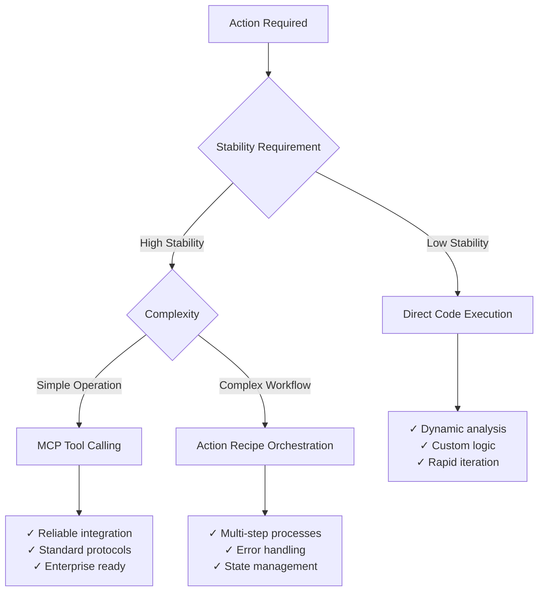

<Info>
  Actions in Cagen are automated operations that connect AI agents to external tools, APIs, and services, enabling them to take real-world actions on your behalf.
</Info>

## What are Actions?

All AI agents in Cagen can perform actions through two mechanisms:

### Action 0: Universal Execution
Every agent has access to **Action 0**—the foundational capability to execute any task using Claude Code as the execution engine. Action 0 provides universal functionality that doesn't require predefined configurations.

### Custom Actions: Specialized Functions
Beyond Action 0, you can create **custom actions**—specialized executable functions that allow AI agents to:

<CardGroup cols={2}>
  <Card title="External Integrations" icon="plug">
    Connect to APIs, databases, and third-party services
    
    **Examples:** Send emails, create GitHub issues, update spreadsheets
  </Card>
  
  <Card title="System Operations" icon="cog">
    Perform system-level tasks and automations
    
    **Examples:** File operations, data processing, workflow triggers
  </Card>
  
  <Card title="Data Processing" icon="chart-bar">
    Transform and analyze data from various sources
    
    **Examples:** Generate reports, analyze metrics, process uploads
  </Card>
  
  <Card title="Workflow Automation" icon="rocket">
    Chain multiple operations together
    
    **Examples:** Deployment pipelines, notification sequences, backup routines
  </Card>
</CardGroup>

## Action Design Philosophy: Code vs Tools vs Orchestration

<Info>
  **Best Practice**: Actions aren't just prompts—they're intelligent systems that can write and execute code, call APIs, or orchestrate complex workflows. The key is choosing the right approach for your specific needs.
</Info>

### When to Use Direct Code Execution (Action 0)

**Best for**: Dynamic, one-off tasks requiring flexibility and rapid adaptation

<CardGroup cols={2}>
  <Card title="High Flexibility Scenarios" icon="code">
    ```yaml
    Use Cases:
      - Data analysis with unknown structure
      - Custom integrations with unique APIs
      - Debugging and troubleshooting
      - Rapid prototyping
      
    Example:
      "Analyze this CSV and find anomalies"
      → Agent writes Python code dynamically
      → Handles any CSV structure
      → Adapts analysis based on data
    ```
  </Card>
  
  <Card title="Development & Exploration" icon="search">
    ```yaml
    Use Cases:
      - Code generation and testing
      - File system operations
      - Custom data transformations
      - Investigation tasks
      
    Example:
      "Fix the performance issue in this code"
      → Agent reads, analyzes, modifies code
      → Runs tests to verify fixes
      → Iterates until optimal
    ```
  </Card>
</CardGroup>

### When to Use MCP Tool Calling

**Best for**: Stable, well-defined integrations with external systems

<CardGroup cols={2}>
  <Card title="Reliable Integrations" icon="plug">
    ```yaml
    Use Cases:
      - Standard API integrations
      - Database operations
      - File management systems
      - Authentication workflows
      
    Example:
      Slack MCP Tool
      → Pre-configured, reliable
      → Handles auth automatically
      → Standardized parameters
    ```
  </Card>
  
  <Card title="Enterprise Systems" icon="building">
    ```yaml
    Use Cases:
      - CRM integrations (Salesforce)
      - HR systems (Workday)
      - Financial systems (SAP)
      - Monitoring tools (DataDog)
      
    Example:
      Database MCP
      → Connection pooling
      → Query optimization
      → Security compliance
    ```
  </Card>
</CardGroup>

### When to Use Action Recipe Orchestration

**Best for**: Complex workflows requiring coordination between multiple systems

<CardGroup cols={2}>
  <Card title="Multi-Step Workflows" icon="workflow">
    ```yaml
    Use Cases:
      - CI/CD pipelines
      - Data processing chains
      - Approval workflows
      - Multi-system updates
      
    Example:
      Deploy Pipeline
      1. Run tests (MCP: GitHub)
      2. Build image (Code: Docker)
      3. Update config (MCP: K8s)
      4. Notify team (MCP: Slack)
    ```
  </Card>
  
  <Card title="Business Processes" icon="briefcase">
    ```yaml
    Use Cases:
      - Order processing
      - Customer onboarding
      - Invoice generation
      - Compliance reporting
      
    Example:
      New Customer Flow
      1. Validate data (Code: validation)
      2. Create account (MCP: CRM)
      3. Send welcome (MCP: Email)
      4. Schedule followup (Recipe: Calendar)
    ```
  </Card>
</CardGroup>

## Decision Framework: Choosing the Right Approach

### Flexibility vs Stability Matrix



### Performance & Concurrency Considerations

<Tabs>
  <Tab title="Speed Requirements">
    ```yaml
    Ultra-fast (< 100ms):
      → Pre-cached MCP tools
      → Simple API calls
      
    Fast (< 1s):
      → Standard MCP tools
      → Simple code execution
      
    Moderate (1-10s):
      → Complex code generation
      → Multi-step recipes
      
    Batch (> 10s):
      → Heavy data processing
      → Long-running workflows
    ```
  </Tab>
  
  <Tab title="Concurrency Needs">
    ```yaml
    High Concurrency (100+ simultaneous):
      → MCP Tools (connection pooling)
      → Stateless operations
      
    Medium Concurrency (10-100):
      → Action Recipes (queue management)
      → Resource-aware execution
      
    Low Concurrency (< 10):
      → Direct Code (full flexibility)
      → Resource-intensive operations
    ```
  </Tab>
  
  <Tab title="Error Handling">
    ```yaml
    Critical Operations:
      → Action Recipes (retry logic)
      → Comprehensive error handling
      
    Standard Operations:
      → MCP Tools (built-in retries)
      → Standard error responses
      
    Experimental Operations:
      → Direct Code (custom handling)
      → Fail-fast with detailed logs
    ```
  </Tab>
</Tabs>

### Real-World Examples

<AccordionGroup>
  <Accordion title="Customer Support Automation">
    **Scenario**: Automated ticket resolution system
    
    ```yaml
    Initial Triage:
      Method: Direct Code Execution
      Why: Each ticket is unique, requires custom analysis
      
    Knowledge Base Search:
      Method: MCP Tool (Vector DB)
      Why: Stable, optimized search with consistent format
      
    Resolution Workflow:
      Method: Action Recipe
      Why: Multi-step process with human approval gates
      
    Implementation:
      1. Agent analyzes ticket content with custom code
      2. Searches knowledge base using MCP tool
      3. Orchestrates resolution workflow with recipe
      4. Updates CRM and notifies customer via MCP tools
    ```
  </Accordion>
  
  <Accordion title="DevOps Pipeline">
    **Scenario**: Automated deployment and monitoring
    
    ```yaml
    Code Analysis:
      Method: Direct Code Execution
      Why: Custom static analysis, security scanning
      
    Build & Test:
      Method: MCP Tools (CI/CD platforms)
      Why: Standardized, reliable build processes
      
    Deployment Orchestration:
      Method: Action Recipe
      Why: Complex multi-environment coordination
      
    Implementation:
      1. Agent writes custom tests based on code changes
      2. Triggers builds via GitHub Actions MCP
      3. Orchestrates blue-green deployment recipe
      4. Monitors via DataDog MCP, alerts via Slack MCP
    ```
  </Accordion>
  
  <Accordion title="Data Science Workflow">
    **Scenario**: Automated data analysis and reporting
    
    ```yaml
    Data Exploration:
      Method: Direct Code Execution
      Why: Unknown data structure, requires adaptive analysis
      
    Model Training:
      Method: MCP Tools (ML platforms)
      Why: Standardized training pipelines, resource management
      
    Report Generation:
      Method: Action Recipe
      Why: Multi-format outputs, approval workflows
      
    Implementation:
      1. Agent writes Python code to explore dataset
      2. Uses MLflow MCP for standardized model training
      3. Orchestrates report generation and distribution recipe
      4. Updates dashboard via BI tool MCP
    ```
  </Accordion>
</AccordionGroup>

## Action Types

### Built-in Actions

Cagen comes with pre-configured actions for common tasks:

<AccordionGroup>
  <Accordion title="Communication">
    ```yaml
    send_email:
      description: "Send email via configured provider"
      parameters:
        - to: string (required)
        - subject: string (required)  
        - body: string (required)
        - attachments: array (optional)
      
    send_slack:
      description: "Post message to Slack channel"
      parameters:
        - channel: string (required)
        - message: string (required)
        - thread_ts: string (optional)
    ```
  </Accordion>
  
  <Accordion title="File Operations">
    ```yaml
    create_file:
      description: "Create new file with content"
      parameters:
        - path: string (required)
        - content: string (required)
        - encoding: string (optional)
        
    read_file:
      description: "Read file content"
      parameters:
        - path: string (required)
        - encoding: string (optional)
        
    upload_to_s3:
      description: "Upload file to S3 bucket"
      parameters:
        - bucket: string (required)
        - key: string (required)
        - file: binary (required)
    ```
  </Accordion>
  
  <Accordion title="Development Tools">
    ```yaml
    create_github_issue:
      description: "Create issue in GitHub repository"
      parameters:
        - repo: string (required)
        - title: string (required)
        - body: string (optional)
        - labels: array (optional)
        
    run_git_command:
      description: "Execute git command"
      parameters:
        - command: string (required)
        - directory: string (optional)
        
    deploy_to_vercel:
      description: "Trigger Vercel deployment"
      parameters:
        - project: string (required)
        - branch: string (optional)
    ```
  </Accordion>
</AccordionGroup>

### Custom Actions

Create your own actions for specific business needs:

<Steps>
  <Step title="Define Action Schema">
    ```yaml
    # action_schema.yaml
    name: "create_invoice"
    description: "Generate invoice using accounting API"
    
    parameters:
      client_id:
        type: "string"
        required: true
        description: "Client identifier"
        
      amount:
        type: "number"
        required: true
        description: "Invoice amount"
        
      due_date:
        type: "string"
        format: "date"
        description: "Payment due date"
        
    returns:
      invoice_id: "string"
      invoice_url: "string"
    ```
  </Step>
  
  <Step title="Implement Action Logic">
    ```python
    # action_implementation.py
    import requests
    from datetime import datetime
    
    async def create_invoice(client_id: str, amount: float, due_date: str = None):
        """Create invoice via accounting API"""
        
        # Validate parameters
        if amount <= 0:
            raise ValueError("Amount must be positive")
            
        # Set default due date
        if not due_date:
            due_date = (datetime.now() + timedelta(days=30)).isoformat()
            
        # Call external API
        response = requests.post(
            "https://api.accounting.com/invoices",
            headers={"Authorization": f"Bearer {ACCOUNTING_API_KEY}"},
            json={
                "client_id": client_id,
                "amount": amount,
                "due_date": due_date,
                "currency": "USD"
            }
        )
        
        if response.status_code == 201:
            data = response.json()
            return {
                "invoice_id": data["id"],
                "invoice_url": data["public_url"],
                "success": True
            }
        else:
            raise Exception(f"API Error: {response.text}")
    ```
  </Step>
  
  <Step title="Register Action">
    ```yaml
    # Register in Cagen
    POST /api/actions
    
    {
      "name": "create_invoice",
      "schema_url": "https://your-server.com/schemas/create_invoice.yaml",
      "implementation_url": "https://your-server.com/actions/create_invoice",
      "authentication": {
        "type": "api_key",
        "header": "X-API-Key"
      },
      "timeout": 30000,
      "retry_policy": {
        "max_attempts": 3,
        "backoff": "exponential"
      }
    }
    ```
  </Step>
  
  <Step title="Test Action">
    ```yaml
    # Test the action
    POST /api/actions/create_invoice/test
    
    {
      "parameters": {
        "client_id": "client_123",
        "amount": 1500.00,
        "due_date": "2024-02-15"
      }
    }
    ```
  </Step>
</Steps>

## Using Actions with Agents

### Agent Action Integration

Actions become available to AI agents once configured:

```yaml
# Agent can now use actions in conversations
User: "Create an invoice for client ABC for $2,500"

Agent: "I'll create that invoice for you."
[Action: create_invoice]
Parameters: {
  "client_id": "ABC",
  "amount": 2500.00,
  "due_date": "2024-02-20"  
}
Result: {
  "invoice_id": "INV-001",
  "invoice_url": "https://accounting.com/invoice/INV-001"
}

Agent: "Invoice INV-001 created successfully! View it here: [Invoice Link]"
```

### Action Permissions

Control which agents can use which actions:

<Tabs>
  <Tab title="Agent-Level Permissions">
    ```yaml
    agent_permissions:
      @dev-agent:
        allowed_actions:
          - create_github_issue
          - run_git_command
          - deploy_to_vercel
        denied_actions:
          - delete_database
          
      @marketing-agent:
        allowed_actions:
          - send_email
          - create_social_post
          - analyze_metrics
        rate_limits:
          send_email: "10/hour"
    ```
  </Tab>
  
  <Tab title="Role-Based Permissions">
    ```yaml
    role_permissions:
      developer:
        actions: ["development", "deployment"]
        
      marketing:
        actions: ["communication", "analytics"]
        
      admin:
        actions: ["*"]  # All actions
        
      intern:
        actions: ["read_only"]
        approval_required: true
    ```
  </Tab>
  
  <Tab title="Context-Based Permissions">
    ```yaml
    context_permissions:
      - condition: "issue.priority == 'critical'"
        allow: ["emergency_deployment", "alert_oncall"]
        
      - condition: "user.role == 'manager'"
        allow: ["approve_expense", "generate_report"]
        
      - condition: "time.business_hours == false"
        deny: ["deploy_to_production"]
    ```
  </Tab>
</Tabs>

## Action Security & Reliability

### Authentication & Authorization

<CardGroup cols={2}>
  <Card title="API Key Auth" icon="key">
    ```yaml
    authentication:
      type: "api_key"
      header: "X-API-Key"
      key: "${API_KEY_SECRET}"
    ```
  </Card>
  
  <Card title="OAuth 2.0" icon="shield">
    ```yaml
    authentication:
      type: "oauth2"
      client_id: "${CLIENT_ID}"
      client_secret: "${CLIENT_SECRET}"
      scopes: ["read", "write"]
    ```
  </Card>
  
  <Card title="JWT Tokens" icon="id-card">
    ```yaml
    authentication:
      type: "jwt"
      secret: "${JWT_SECRET}"
      algorithm: "HS256"
      expires_in: 3600
    ```
  </Card>
  
  <Card title="Webhook Auth" icon="link">
    ```yaml
    authentication:
      type: "webhook"
      signature_header: "X-Signature"
      secret: "${WEBHOOK_SECRET}"
      algorithm: "sha256"
    ```
  </Card>
</CardGroup>

### Error Handling & Retries

```yaml
action_reliability:
  retry_policy:
    max_attempts: 3
    backoff_strategy: "exponential"  # linear, exponential, fixed
    base_delay: 1000  # milliseconds
    max_delay: 30000
    
  timeout_policy:
    default: 30000  # 30 seconds
    per_action:
      file_upload: 300000  # 5 minutes
      data_export: 600000  # 10 minutes
      
  error_handling:
    on_failure: "log_and_notify"
    fallback_action: "human_intervention"
    
  circuit_breaker:
    failure_threshold: 5
    timeout: 60000  # 1 minute
    reset_timeout: 300000  # 5 minutes
```

### Monitoring & Logging

<Steps>
  <Step title="Action Execution Logs">
    All action executions are logged with:
    ```yaml
    log_entry:
      timestamp: "2024-01-15T10:30:45Z"
      action_name: "create_invoice"
      agent_id: "@billing-agent"
      user_id: "user_123"
      parameters: { /* sanitized params */ }
      result: "success"
      duration_ms: 1245
      cost: 0.02
    ```
  </Step>
  
  <Step title="Performance Metrics">
    Track action performance:
    ```yaml
    metrics:
      success_rate: 98.5%
      avg_duration: 850ms
      p95_duration: 2.1s
      cost_per_execution: $0.018
      executions_per_hour: 45
    ```
  </Step>
  
  <Step title="Alert Configuration">
    Set up alerts for issues:
    ```yaml
    alerts:
      high_failure_rate:
        threshold: "> 5% failures in 10 minutes"
        notify: ["ops-team", "action-owner"]
        
      slow_response:
        threshold: "> 5s avg response time"
        notify: ["performance-team"]
        
      cost_spike:
        threshold: "> $10/hour action costs"
        notify: ["billing-admin"]
    ```
  </Step>
</Steps>

## Action Marketplace

### Using Store Actions

Browse and install actions from the Cagen Store:

<Tabs>
  <Tab title="Popular Actions">
    ```yaml
    store_actions:
      salesforce_integration:
        rating: 4.8/5
        installs: 15.2k
        price: "Free"
        
      advanced_analytics:
        rating: 4.6/5
        installs: 8.7k
        price: "$15/month"
        
      document_generator:
        rating: 4.9/5
        installs: 22.1k
        price: "$0.10/use"
    ```
  </Tab>
  
  <Tab title="Installation">
    ```yaml
    # Install from store
    cagen action install salesforce_integration
    
    # Configure credentials
    cagen action configure salesforce_integration \
      --api-key="YOUR_SF_KEY" \
      --instance-url="https://your-instance.salesforce.com"
      
    # Test installation
    cagen action test salesforce_integration
    ```
  </Tab>
  
  <Tab title="Publishing Actions">
    Share your actions with the community:
    ```yaml
    # action_manifest.yaml
    name: "advanced_email_parser"
    version: "1.2.0"
    description: "Parse complex email structures with AI"
    
    pricing:
      model: "usage_based"
      rate: "$0.05/parse"
      
    metadata:
      category: "communication"
      tags: ["email", "parsing", "ai"]
      author: "your-company"
      license: "MIT"
      
    # Publish to store
    cagen action publish ./action_manifest.yaml
    ```
  </Tab>
</Tabs>

## Best Practices

### Action Design

<AccordionGroup>
  <Accordion title="Idempotency">
    **Make actions safe to retry:**
    ```python
    async def create_user(email: str, name: str):
        # Check if user already exists
        existing = await get_user_by_email(email)
        if existing:
            return {"user_id": existing.id, "created": False}
            
        # Create new user
        user = await create_new_user(email, name)
        return {"user_id": user.id, "created": True}
    ```
  </Accordion>
  
  <Accordion title="Input Validation">
    **Validate all parameters:**
    ```python
    from pydantic import BaseModel, validator
    
    class InvoiceParams(BaseModel):
        client_id: str
        amount: float
        due_date: Optional[str] = None
        
        @validator('amount')
        def amount_must_be_positive(cls, v):
            if v <= 0:
                raise ValueError('Amount must be positive')
            return v
            
        @validator('client_id')
        def client_must_exist(cls, v):
            if not client_exists(v):
                raise ValueError('Client not found')
            return v
    ```
  </Accordion>
  
  <Accordion title="Resource Management">
    **Handle resources properly:**
    ```python
    async def process_file_action(file_path: str):
        try:
            async with aiofiles.open(file_path, 'r') as f:
                content = await f.read()
                result = await process_content(content)
                return result
        except FileNotFoundError:
            raise ActionError(f"File not found: {file_path}")
        finally:
            # Cleanup temporary resources
            await cleanup_temp_files()
    ```
  </Accordion>
</AccordionGroup>

### Cost Optimization

<CardGroup cols={2}>
  <Card title="Rate Limiting" icon="clock">
    Implement sensible rate limits to control costs
    
    Configure per-agent and per-user limits
  </Card>
  
  <Card title="Usage Analytics" icon="chart-line">
    Monitor action usage patterns and costs
    
    Identify optimization opportunities
  </Card>
  
  <Card title="Caching" icon="database">
    Cache action results when appropriate
    
    Reduce redundant API calls
  </Card>
  
  <Card title="Smart Routing" icon="route">
    Route actions to most cost-effective providers
    
    Use fallback providers for resilience
  </Card>
</CardGroup>

## Troubleshooting

<AccordionGroup>
  <Accordion title="Action Not Executing">
    **Common Causes:**
    - Missing permissions for agent
    - Invalid authentication credentials  
    - Rate limit exceeded
    - Action server unreachable
    
    **Debug Steps:**
    1. Check action logs in dashboard
    2. Verify agent has required permissions
    3. Test action manually with same parameters
    4. Review authentication configuration
  </Accordion>
  
  <Accordion title="Slow Action Performance">
    **Optimization Strategies:**
    - Add caching layer
    - Optimize external API calls
    - Implement async processing
    - Use batch operations where possible
    
    **Monitoring:**
    - Track action execution times
    - Set up performance alerts
    - Review resource utilization
  </Accordion>
  
  <Accordion title="High Action Costs">
    **Cost Control:**
    - Implement rate limiting
    - Add usage quotas per user/team
    - Review action necessity
    - Optimize API usage patterns
    
    **Analysis:**
    - Review usage analytics
    - Identify most expensive actions
    - Consider alternative implementations
  </Accordion>
</AccordionGroup>

## Related Features

- [Agent Management](/how-to/agents/create-custom-agent) - Configure agents to use actions
- [MCP Integration](/how-to/mcp/mcp-integration) - Connect external tools and services  
- [Workflow Automation](/how-to/workflows/setup-triggers) - Chain actions into workflows
- [Store Management](/how-to/store/store-management) - Publish and install actions

<Note>
  Actions are the bridge between AI capabilities and real-world operations. Design them to be reliable, secure, and cost-effective for maximum value in your AI-native organization.
</Note>