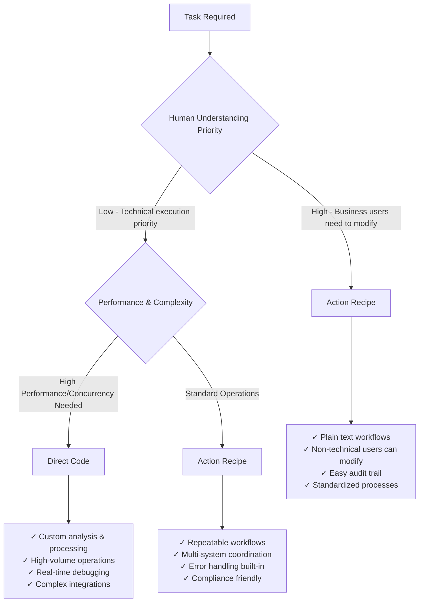

<Info>
  Actions in Cagen are automated operations that connect AI agents to external tools, APIs, and services, enabling them to take real-world actions on your behalf.
</Info>

## What are Actions?

All AI agents in Cagen can perform actions through two mechanisms:

### Action 0: Universal Execution
Every agent has access to **Action 0**—the foundational capability to execute any task using Claude Code as the execution engine. Action 0 provides universal functionality that doesn't require predefined configurations.

### Custom Actions: Specialized Functions
Beyond Action 0, you can create **custom actions**—specialized executable functions that allow AI agents to:

<CardGroup cols={2}>
  <Card title="External Integrations" icon="plug">
    Connect to APIs, databases, and third-party services
    
    **Examples:** Send emails, create GitHub issues, update spreadsheets
  </Card>
  
  <Card title="System Operations" icon="cog">
    Perform system-level tasks and automations
    
    **Examples:** File operations, data processing, workflow triggers
  </Card>
  
  <Card title="Data Processing" icon="chart-bar">
    Transform and analyze data from various sources
    
    **Examples:** Generate reports, analyze metrics, process uploads
  </Card>
  
  <Card title="Workflow Automation" icon="rocket">
    Chain multiple operations together
    
    **Examples:** Deployment pipelines, notification sequences, backup routines
  </Card>
</CardGroup>

## Action Design Philosophy: Natural Language vs Code Orchestration

<Info>
  **Best Practice from Anthropic Teams**: Actions aren't just prompts—they're intelligent systems that can orchestrate workflows through natural language recipes (for human understanding) OR write and execute code directly (for performance and technical precision). The key decision factor is whether humans need to understand and modify the process.
</Info>

### When to Use Action Recipes (Natural Language Orchestration)

**Best for**: Processes that humans need to understand, modify, and audit

<CardGroup cols={2}>
  <Card title="Cross-Team Workflows" icon="workflow">
    ```yaml
    Anthropic Examples:
    
    Finance Data Workflows:
      "Query dashboard → get information → run queries → Excel output"
      Result: "Finance team with no coding experience can execute"
      
    Security Review Process:
      "Terraform plan → security analysis → risk assessment → approval"
      Result: "Faster approvals, eliminated developer bottlenecks"
      
    Legal Team Coordination:
      "Phone tree system to connect with right lawyer"
      Result: "Custom tools without traditional development resources"
    ```
  </Card>
  
  <Card title="Compliance & Audit Requirements" icon="checklist">
    ```yaml
    Anthropic Examples:
    
    Design Implementation Process:
      "Mockup → prototype → review → merge"
      Result: "Clear audit trail for design changes"
      
    Documentation Workflows:
      "Multiple sources → markdown runbooks → troubleshooting guides"
      Result: "Structured outputs for immediate use"
      
    Team Update Automation:
      "Status collection → formatting → distribution"
      Result: "Managers track legal review status with button clicks"
    ```
  </Card>
</CardGroup>

### When to Use Direct Code/Script Execution

**Best for**: High-performance, custom processing requiring technical precision

<CardGroup cols={2}>
  <Card title="Infrastructure & Debugging" icon="code">
    ```yaml
    Anthropic Examples:
    
    Kubernetes Cluster Issues:
      "Screenshots + error logs → diagnosis → exact fix commands"
      Result: "Resolved issues without networking specialists"
      
    Codebase Navigation:
      "Large monorepo → identify relevant files → explain dependencies"
      Result: "New hires contribute meaningfully within days"
      
    Performance Analysis:
      "Unknown data structure → custom analysis → optimization recommendations"
      Result: "Process 200+ dashboards impossible for humans to review"
    ```
  </Card>
  
  <Card title="High-Volume Processing" icon="zap">
    ```yaml
    Anthropic Examples:
    
    Ad Creative Generation:
      "CSV performance data → character limits → hundreds of variations"
      Result: "2 hours → 15 minutes, 10x creative output"
      
    TypeScript Applications:
      "5,000-line React app for model visualization"
      Result: "Built without JavaScript/TypeScript expertise"
      
    Test Generation:
      "Core functionality → comprehensive unit tests + edge cases"
      Result: "Automated testing workflow saves significant time"
    ```
  </Card>
</CardGroup>

## Decision Framework: Recipe vs Code

### Anthropic's Decision Matrix (Based on Real Usage)



### Performance & Team Impact (Anthropic's Findings)

<Tabs>
  <Tab title="Speed & Concurrency Benchmarks">
    ```yaml
    Based on Anthropic's Real Usage:
    
    Action Recipes (Natural Language):
      Finance Workflows: "2 hours → 15 minutes" (8x faster)
      Security Reviews: "1 week → 2x 30-minute calls" (10x faster)
      Marketing Campaigns: "Manual → 10x creative output"
      Best for: Cross-team coordination, compliance workflows
      
    Direct Code Execution:
      Infrastructure Debugging: "10-15 minutes → 5 minutes" (3x faster)
      Ad Generation: "Hundreds of ads in minutes vs hours"
      UI Implementation: "Weeks → hours cycle time" (20x faster)
      Best for: Technical analysis, high-volume processing
      
    Real Example - Google Ads Creative Generation:
      Recipe: "Identify underperforming ads → generate variations → test"
      → Good for workflow understanding
      
      Code: CSV processing + character limits + API integration
      → Necessary for actual execution (strict requirements)
    ```
  </Tab>
  
  <Tab title="Team Capabilities Impact">
    ```yaml
    Non-Technical Teams (Action Recipes):
      Data Infrastructure → Finance: 
        "Employees with no coding experience execute complex workflows"
      
      Legal → Accessibility Tools:
        "1 hour to build communication assistant for family members"
      
      Product Design → Implementation:
        "Designers making state management changes engineers typically do"
    
    Technical Teams (Direct Code):
      Product Development → Feature Building:
        "70% of Vim mode implementation from autonomous Claude work"
      
      Security Engineering → Incident Response:
        "Infrastructure debugging without specialized expertise"
      
      Growth Marketing → Automation:
        "Operating like a much larger team with engineering resources"
    ```
  </Tab>
  
  <Tab title="Maintenance & Iteration Patterns">
    ```yaml
    Action Recipes (Anthropic's Experience):
      Pros:
        - "Plain text files finance team can modify"
        - "Business users understand and iterate"
        - "Built-in audit trail for compliance"
        - "Standardized error handling"
      
      Cons:
        - "Limited to workflow coordination"
        - "Can't handle complex data processing"
        
    Direct Code (Anthropic's Experience):
      Pros:
        - "Custom analysis impossible manually (200 dashboards)"
        - "Handles unique API integrations and data structures"
        - "Can optimize for specific performance requirements"
        
      Cons:
        - "Works on first attempt only 1/3 of the time"
        - "Requires technical checkpoint/rollback workflow"
        - "Needs detailed Claude.md instructions for consistency"
    ```
  </Tab>
</Tabs>

### Real-World Examples from Anthropic Teams

<AccordionGroup>
  <Accordion title="Data Infrastructure: Finance Team Workflows">
    **Scenario**: Enable finance team to execute complex data workflows independently
    
    **Choose Action Recipe Because:**
    - Non-technical users need to understand and modify workflows
    - Standardized reporting processes that repeat regularly
    - Requires coordination between dashboards, queries, and Excel output
    
    ```yaml
    Recipe Implementation (Anthropic's Approach):
      "Monthly Financial Report Generation:
       1. Query revenue dashboard for current month data
       2. Extract user growth metrics from analytics system
       3. Run cost analysis queries on billing database
       4. Cross-reference with budget forecasts
       5. Generate Excel output with standard formatting
       6. Email report to stakeholders with summary
       
       Input prompts: Start date, end date, report type
       
       Result: Finance team with no coding experience 
                can execute entire workflow independently"
    ```
    
    **Impact**: Employees describe steps in plain text, Claude Code executes fully automated workflow
  </Accordion>
  
  <Accordion title="Product Development: Kubernetes Debugging">
    **Scenario**: Diagnose and fix complex infrastructure issues
    
    **Choose Direct Code Because:**
    - Each incident has unique symptoms and requires custom analysis
    - Need to process screenshots, logs, and system states dynamically
    - Rapid iteration and testing of solutions required
    
    ```python
    Code Implementation (Based on Anthropic's Experience):
    # Agent analyzes dashboard screenshots and system state
    def diagnose_k8s_cluster_issue(dashboard_screenshot, error_logs):
        # Parse visual indicators from dashboard
        cluster_state = analyze_dashboard_image(dashboard_screenshot)
        
        # Cross-reference with error patterns
        if "pod scheduling failed" in error_logs:
            if cluster_state.shows_ip_exhaustion_warning:
                # Generate exact fix commands
                return [
                    "gcloud container clusters resize-ip-range",
                    "kubectl apply -f new-ip-pool.yaml",
                    "kubectl drain nodes --force"
                ]
    
    # Result: Resolved cluster issues without networking specialists
    ```
    
    **Impact**: Resolved Kubernetes issues that normally require specialized expertise
  </Accordion>
  
  <Accordion title="Growth Marketing: Ad Creative Generation">
    **Scenario**: Generate hundreds of ad variations with performance optimization
    
    **Choose Direct Code Because:**
    - Need to process CSV files with performance metrics
    - Strict character limits (30 chars headlines, 90 chars descriptions)
    - High-volume generation (hundreds of ads in minutes)
    - Integration with multiple ad platforms APIs
    
    ```python
    Code Implementation (Anthropic's Approach):
    import pandas as pd
    from ad_platforms import GoogleAds, MetaAds
    
    # Agent processes performance data and generates variations
    def generate_ad_variations(performance_csv, target_metrics):
        # Load existing ad performance
        df = pd.read_csv(performance_csv)
        underperforming = df[df['ctr'] < target_metrics['min_ctr']]
        
        # Generate new variations
        new_ads = []
        for ad in underperforming:
            variations = create_ad_variations(
                original=ad['copy'],
                headline_limit=30,
                desc_limit=90,
                count=10
            )
            new_ads.extend(variations)
        
        return new_ads
    
    # Result: 2 hours → 15 minutes, 10x creative output
    ```
    
    **Impact**: Team operates like a much larger marketing organization
  </Accordion>
  
  <Accordion title="Product Design: Visual Polish Implementation">
    **Scenario**: Implement design changes directly without engineering handoff
    
    **Hybrid Approach - Recipe for Process, Code for Implementation:**
    
    ```yaml
    Process Recipe (Human-Understandable):
      "Design Change Implementation:
       1. Designer identifies visual improvement needed
       2. Paste mockup screenshot into Claude Code
       3. Claude generates functional prototype code
       4. Designer reviews and iterates visually
       5. Engineer reviews technical implementation
       6. Merge to production after approval"
    
    Code Implementation (Technical Execution):
      # Agent converts visual designs to working code
      def implement_design_changes(mockup_image, current_codebase):
          # Analyze visual design from screenshot
          design_elements = parse_design_mockup(mockup_image)
          
          # Generate React components with exact styling
          components = generate_react_components(
              design_elements,
              existing_patterns=current_codebase.get_patterns()
          )
          
          # Apply state management changes
          return apply_visual_changes(components)
    ```
    
    **Impact**: Weeks → hours cycle time, designers can implement complex state management changes directly
  </Accordion>
  
  <Accordion title="Security Engineering: Infrastructure Review">
    **Scenario**: Review Terraform changes for security implications
    
    **Choose Action Recipe Because:**
    - Standardized security review process
    - Need audit trail for compliance
    - Business users (security team) need to understand workflow
    
    ```yaml
    Recipe Implementation:
      "Security Review Workflow:
       1. Developer submits Terraform plan for review
       2. Claude Code analyzes plan for security implications
       3. Check against security policy database
       4. Flag potential risks (network exposure, permissions)
       5. Generate review checklist for security engineer
       6. Auto-approve low-risk changes, escalate high-risk
       7. Document approval decision with rationale
       
       Question prompt: 'What's this going to do? Am I going to regret this?'
       
       Result: Faster approvals, reduced developer bottlenecks"
    ```
    
    **Impact**: Tighter feedback loops, eliminated development process bottlenecks
  </Accordion>
</AccordionGroup>

## Action Types

## Action Types

### Built-in Actions

Cagen comes with pre-configured actions for common tasks:

<AccordionGroup>
  <Accordion title="Communication">
    ```yaml
    send_email:
      description: "Send email via configured provider"
      parameters:
        - to: string (required)
        - subject: string (required)  
        - body: string (required)
        - attachments: array (optional)
      
    send_slack:
      description: "Post message to Slack channel"
      parameters:
        - channel: string (required)
        - message: string (required)
        - thread_ts: string (optional)
    ```
  </Accordion>
  
  <Accordion title="File Operations">
    ```yaml
    create_file:
      description: "Create new file with content"
      parameters:
        - path: string (required)
        - content: string (required)
        - encoding: string (optional)
        
    read_file:
      description: "Read file content"
      parameters:
        - path: string (required)
        - encoding: string (optional)
        
    upload_to_s3:
      description: "Upload file to S3 bucket"
      parameters:
        - bucket: string (required)
        - key: string (required)
        - file: binary (required)
    ```
  </Accordion>
  
  <Accordion title="Development Tools">
    ```yaml
    create_github_issue:
      description: "Create issue in GitHub repository"
      parameters:
        - repo: string (required)
        - title: string (required)
        - body: string (optional)
        - labels: array (optional)
        
    run_git_command:
      description: "Execute git command"
      parameters:
        - command: string (required)
        - directory: string (optional)
        
    deploy_to_vercel:
      description: "Trigger Vercel deployment"
      parameters:
        - project: string (required)
        - branch: string (optional)
    ```
  </Accordion>
</AccordionGroup>

### Custom Actions

Create your own actions for specific business needs:

<Steps>
  <Step title="Define Action Schema">
    ```yaml
    # action_schema.yaml
    name: "create_invoice"
    description: "Generate invoice using accounting API"
    
    parameters:
      client_id:
        type: "string"
        required: true
        description: "Client identifier"
        
      amount:
        type: "number"
        required: true
        description: "Invoice amount"
        
      due_date:
        type: "string"
        format: "date"
        description: "Payment due date"
        
    returns:
      invoice_id: "string"
      invoice_url: "string"
    ```
  </Step>
  
  <Step title="Implement Action Logic">
    ```python
    # action_implementation.py
    import requests
    from datetime import datetime
    
    async def create_invoice(client_id: str, amount: float, due_date: str = None):
        """Create invoice via accounting API"""
        
        # Validate parameters
        if amount <= 0:
            raise ValueError("Amount must be positive")
            
        # Set default due date
        if not due_date:
            due_date = (datetime.now() + timedelta(days=30)).isoformat()
            
        # Call external API
        response = requests.post(
            "https://api.accounting.com/invoices",
            headers={"Authorization": f"Bearer {ACCOUNTING_API_KEY}"},
            json={
                "client_id": client_id,
                "amount": amount,
                "due_date": due_date,
                "currency": "USD"
            }
        )
        
        if response.status_code == 201:
            data = response.json()
            return {
                "invoice_id": data["id"],
                "invoice_url": data["public_url"],
                "success": True
            }
        else:
            raise Exception(f"API Error: {response.text}")
    ```
  </Step>
  
  <Step title="Register Action">
    ```yaml
    # Register in Cagen
    POST /api/actions
    
    {
      "name": "create_invoice",
      "schema_url": "https://your-server.com/schemas/create_invoice.yaml",
      "implementation_url": "https://your-server.com/actions/create_invoice",
      "authentication": {
        "type": "api_key",
        "header": "X-API-Key"
      },
      "timeout": 30000,
      "retry_policy": {
        "max_attempts": 3,
        "backoff": "exponential"
      }
    }
    ```
  </Step>
  
  <Step title="Test Action">
    ```yaml
    # Test the action
    POST /api/actions/create_invoice/test
    
    {
      "parameters": {
        "client_id": "client_123",
        "amount": 1500.00,
        "due_date": "2024-02-15"
      }
    }
    ```
  </Step>
</Steps>

## Using Actions with Agents

### Agent Action Integration

Actions become available to AI agents once configured:

```yaml
# Agent can now use actions in conversations
User: "Create an invoice for client ABC for $2,500"

Agent: "I'll create that invoice for you."
[Action: create_invoice]
Parameters: {
  "client_id": "ABC",
  "amount": 2500.00,
  "due_date": "2024-02-20"  
}
Result: {
  "invoice_id": "INV-001",
  "invoice_url": "https://accounting.com/invoice/INV-001"
}

Agent: "Invoice INV-001 created successfully! View it here: [Invoice Link]"
```

### Action Permissions

Control which agents can use which actions:

<Tabs>
  <Tab title="Agent-Level Permissions">
    ```yaml
    agent_permissions:
      @dev-agent:
        allowed_actions:
          - create_github_issue
          - run_git_command
          - deploy_to_vercel
        denied_actions:
          - delete_database
          
      @marketing-agent:
        allowed_actions:
          - send_email
          - create_social_post
          - analyze_metrics
        rate_limits:
          send_email: "10/hour"
    ```
  </Tab>
  
  <Tab title="Role-Based Permissions">
    ```yaml
    role_permissions:
      developer:
        actions: ["development", "deployment"]
        
      marketing:
        actions: ["communication", "analytics"]
        
      admin:
        actions: ["*"]  # All actions
        
      intern:
        actions: ["read_only"]
        approval_required: true
    ```
  </Tab>
  
  <Tab title="Context-Based Permissions">
    ```yaml
    context_permissions:
      - condition: "issue.priority == 'critical'"
        allow: ["emergency_deployment", "alert_oncall"]
        
      - condition: "user.role == 'manager'"
        allow: ["approve_expense", "generate_report"]
        
      - condition: "time.business_hours == false"
        deny: ["deploy_to_production"]
    ```
  </Tab>
</Tabs>

## Action Security & Reliability

### Authentication & Authorization

<CardGroup cols={2}>
  <Card title="API Key Auth" icon="key">
    ```yaml
    authentication:
      type: "api_key"
      header: "X-API-Key"
      key: "${API_KEY_SECRET}"
    ```
  </Card>
  
  <Card title="OAuth 2.0" icon="shield">
    ```yaml
    authentication:
      type: "oauth2"
      client_id: "${CLIENT_ID}"
      client_secret: "${CLIENT_SECRET}"
      scopes: ["read", "write"]
    ```
  </Card>
  
  <Card title="JWT Tokens" icon="id-card">
    ```yaml
    authentication:
      type: "jwt"
      secret: "${JWT_SECRET}"
      algorithm: "HS256"
      expires_in: 3600
    ```
  </Card>
  
  <Card title="Webhook Auth" icon="link">
    ```yaml
    authentication:
      type: "webhook"
      signature_header: "X-Signature"
      secret: "${WEBHOOK_SECRET}"
      algorithm: "sha256"
    ```
  </Card>
</CardGroup>

### Error Handling & Retries

```yaml
action_reliability:
  retry_policy:
    max_attempts: 3
    backoff_strategy: "exponential"  # linear, exponential, fixed
    base_delay: 1000  # milliseconds
    max_delay: 30000
    
  timeout_policy:
    default: 30000  # 30 seconds
    per_action:
      file_upload: 300000  # 5 minutes
      data_export: 600000  # 10 minutes
      
  error_handling:
    on_failure: "log_and_notify"
    fallback_action: "human_intervention"
    
  circuit_breaker:
    failure_threshold: 5
    timeout: 60000  # 1 minute
    reset_timeout: 300000  # 5 minutes
```

### Monitoring & Logging

<Steps>
  <Step title="Action Execution Logs">
    All action executions are logged with:
    ```yaml
    log_entry:
      timestamp: "2024-01-15T10:30:45Z"
      action_name: "create_invoice"
      agent_id: "@billing-agent"
      user_id: "user_123"
      parameters: { /* sanitized params */ }
      result: "success"
      duration_ms: 1245
      cost: 0.02
    ```
  </Step>
  
  <Step title="Performance Metrics">
    Track action performance:
    ```yaml
    metrics:
      success_rate: 98.5%
      avg_duration: 850ms
      p95_duration: 2.1s
      cost_per_execution: $0.018
      executions_per_hour: 45
    ```
  </Step>
  
  <Step title="Alert Configuration">
    Set up alerts for issues:
    ```yaml
    alerts:
      high_failure_rate:
        threshold: "> 5% failures in 10 minutes"
        notify: ["ops-team", "action-owner"]
        
      slow_response:
        threshold: "> 5s avg response time"
        notify: ["performance-team"]
        
      cost_spike:
        threshold: "> $10/hour action costs"
        notify: ["billing-admin"]
    ```
  </Step>
</Steps>

## Action Marketplace

### Using Store Actions

Browse and install actions from the Cagen Store:

<Tabs>
  <Tab title="Popular Actions">
    ```yaml
    store_actions:
      salesforce_integration:
        rating: 4.8/5
        installs: 15.2k
        price: "Free"
        
      advanced_analytics:
        rating: 4.6/5
        installs: 8.7k
        price: "$15/month"
        
      document_generator:
        rating: 4.9/5
        installs: 22.1k
        price: "$0.10/use"
    ```
  </Tab>
  
  <Tab title="Installation">
    ```yaml
    # Install from store
    cagen action install salesforce_integration
    
    # Configure credentials
    cagen action configure salesforce_integration \
      --api-key="YOUR_SF_KEY" \
      --instance-url="https://your-instance.salesforce.com"
      
    # Test installation
    cagen action test salesforce_integration
    ```
  </Tab>
  
  <Tab title="Publishing Actions">
    Share your actions with the community:
    ```yaml
    # action_manifest.yaml
    name: "advanced_email_parser"
    version: "1.2.0"
    description: "Parse complex email structures with AI"
    
    pricing:
      model: "usage_based"
      rate: "$0.05/parse"
      
    metadata:
      category: "communication"
      tags: ["email", "parsing", "ai"]
      author: "your-company"
      license: "MIT"
      
    # Publish to store
    cagen action publish ./action_manifest.yaml
    ```
  </Tab>
</Tabs>

## Best Practices

### Action Design

<AccordionGroup>
  <Accordion title="Idempotency">
    **Make actions safe to retry:**
    ```python
    async def create_user(email: str, name: str):
        # Check if user already exists
        existing = await get_user_by_email(email)
        if existing:
            return {"user_id": existing.id, "created": False}
            
        # Create new user
        user = await create_new_user(email, name)
        return {"user_id": user.id, "created": True}
    ```
  </Accordion>
  
  <Accordion title="Input Validation">
    **Validate all parameters:**
    ```python
    from pydantic import BaseModel, validator
    
    class InvoiceParams(BaseModel):
        client_id: str
        amount: float
        due_date: Optional[str] = None
        
        @validator('amount')
        def amount_must_be_positive(cls, v):
            if v <= 0:
                raise ValueError('Amount must be positive')
            return v
            
        @validator('client_id')
        def client_must_exist(cls, v):
            if not client_exists(v):
                raise ValueError('Client not found')
            return v
    ```
  </Accordion>
  
  <Accordion title="Resource Management">
    **Handle resources properly:**
    ```python
    async def process_file_action(file_path: str):
        try:
            async with aiofiles.open(file_path, 'r') as f:
                content = await f.read()
                result = await process_content(content)
                return result
        except FileNotFoundError:
            raise ActionError(f"File not found: {file_path}")
        finally:
            # Cleanup temporary resources
            await cleanup_temp_files()
    ```
  </Accordion>
</AccordionGroup>

### Cost Optimization

<CardGroup cols={2}>
  <Card title="Rate Limiting" icon="clock">
    Implement sensible rate limits to control costs
    
    Configure per-agent and per-user limits
  </Card>
  
  <Card title="Usage Analytics" icon="chart-line">
    Monitor action usage patterns and costs
    
    Identify optimization opportunities
  </Card>
  
  <Card title="Caching" icon="database">
    Cache action results when appropriate
    
    Reduce redundant API calls
  </Card>
  
  <Card title="Smart Routing" icon="route">
    Route actions to most cost-effective providers
    
    Use fallback providers for resilience
  </Card>
</CardGroup>

## Troubleshooting

<AccordionGroup>
  <Accordion title="Action Not Executing">
    **Common Causes:**
    - Missing permissions for agent
    - Invalid authentication credentials  
    - Rate limit exceeded
    - Action server unreachable
    
    **Debug Steps:**
    1. Check action logs in dashboard
    2. Verify agent has required permissions
    3. Test action manually with same parameters
    4. Review authentication configuration
  </Accordion>
  
  <Accordion title="Slow Action Performance">
    **Optimization Strategies:**
    - Add caching layer
    - Optimize external API calls
    - Implement async processing
    - Use batch operations where possible
    
    **Monitoring:**
    - Track action execution times
    - Set up performance alerts
    - Review resource utilization
  </Accordion>
  
  <Accordion title="High Action Costs">
    **Cost Control:**
    - Implement rate limiting
    - Add usage quotas per user/team
    - Review action necessity
    - Optimize API usage patterns
    
    **Analysis:**
    - Review usage analytics
    - Identify most expensive actions
    - Consider alternative implementations
  </Accordion>
</AccordionGroup>

## Related Features

- [Agent Management](/how-to/agents/create-custom-agent) - Configure agents to use actions
- [MCP Integration](/how-to/mcp/mcp-integration) - Connect external tools and services  
- [Workflow Automation](/how-to/workflows/setup-triggers) - Chain actions into workflows
- [Store Management](/how-to/store/store-management) - Publish and install actions

<Note>
  Actions are the bridge between AI capabilities and real-world operations. Design them to be reliable, secure, and cost-effective for maximum value in your AI-native organization.
</Note>