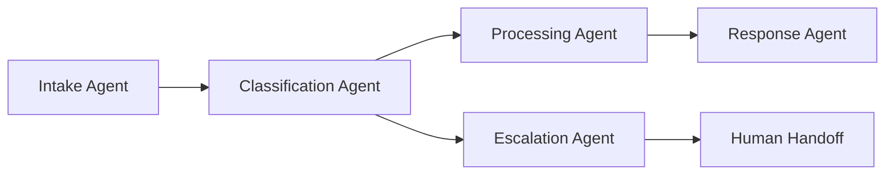

<Info>
  Agents in Cagen are AI assistants powered by Claude Code that can be customized for specific tasks, bound to Memory Banks, Actions, and MCP tools to automate your workflows.
</Info>

## What are Agents?

Agents are AI assistants that execute tasks using Claude Code as their core processing engine. Each Agent consists of three key components:

<CardGroup cols={3}>
  <Card title="Duty" icon="clipboard-list">
    **Public description of the Agent's role**
    
    Visible to both the Agent itself and other users/agents for routing and collaboration
  </Card>
  
  <Card title="System Prompt" icon="cog">
    **Internal instructions and behavior**
    
    Only visible to the Agent itself, contains specific instructions and personality
  </Card>
  
  <Card title="Description" icon="info">
    **External-facing summary**
    
    Visible to others for understanding what the Agent does and when to use it
  </Card>
</CardGroup>

## Creating Your First Agent

### Method 1: Natural Language Description

The simplest way to create an Agent is by describing what you need in natural language:

<Steps>
  <Step title="Describe Your Need">
    Go to **Agents** and describe what you want:
    
    ```
    "I need an agent that monitors our GitHub issues, 
    categorizes them by priority, and notifies the 
    relevant team members in Slack"
    ```
  </Step>
  
  <Step title="Cagen Analyzes and Suggests">
    Cagen will analyze your description and suggest:
    - Appropriate Agent configuration
    - Required Memory Bank connections
    - Necessary Actions to create
    - MCP tools to bind
  </Step>
  
  <Step title="Review and Customize">
    Review the suggested configuration and customize:
    - Refine the Duty description
    - Adjust System Prompt instructions
    - Modify Description for clarity
  </Step>
  
  <Step title="Deploy and Test">
    Save the Agent and test it with real scenarios
  </Step>
</Steps>

### Method 2: Manual Configuration

For more control, configure each component manually:

<Tabs>
  <Tab title="1. Basic Information">
    ```yaml
    Agent Configuration:
      name: "GitHub Issue Triager"
      
      duty: "Monitor GitHub issues, categorize by priority and team, 
             notify appropriate team members via Slack"
      
      description: "Automatically processes new GitHub issues, 
                   assigns priority levels, and routes to correct teams"
      
      system_prompt: |
        You are a GitHub issue triage specialist. When you receive 
        new issues, analyze them for:
        1. Severity (Critical/High/Medium/Low)
        2. Component affected (Frontend/Backend/DevOps/Design)
        3. Estimated effort (Small/Medium/Large)
        
        Always be thorough but concise in your analysis.
    ```
  </Step>
  
  <Tab title="2. Memory Bank Binding">
    Connect relevant Memory Banks for context:
    
    ```yaml
    memory_connections:
      - bank: "Team Structure"
        load_mode: "description_only"  # or "full_text"
        purpose: "Understanding team responsibilities"
        
      - bank: "Issue Templates"
        load_mode: "full_text"
        purpose: "Recognizing issue patterns"
        
      - bank: "Priority Guidelines"
        load_mode: "full_text"
        purpose: "Consistent priority assignment"
    ```
  </Tab>
  
  <Tab title="3. Action Binding">
    Bind Actions the Agent can execute:
    
    ```yaml
    bound_actions:
      - action: "send_slack_notification"
        purpose: "Notify team members of new issues"
        
      - action: "update_github_labels"
        purpose: "Apply priority and team labels"
        
      - action: "create_jira_ticket"
        purpose: "Create tickets for high-priority issues"
    ```
  </Tab>
  
  <Tab title="4. MCP Tool Binding">
    Connect MCP tools for external system access:
    
    ```yaml
    mcp_tools:
      - tool: "github_api"
        purpose: "Read and update GitHub issues"
        
      - tool: "slack_api"
        purpose: "Send notifications to channels"
        
      - tool: "jira_api"
        purpose: "Create and update Jira tickets"
    ```
  </Tab>
</Tabs>

## Agent Components Deep Dive

### Understanding Duty

The Duty is a natural language description that serves multiple purposes:

<AccordionGroup>
  <Accordion title="For the Agent Itself">
    The Agent can see its own Duty and uses it to understand its role and boundaries
    
    **Example Duty:**
    ```
    "Process customer support tickets, determine urgency level, 
    provide initial responses for common issues, and escalate 
    complex problems to human agents"
    ```
  </Accordion>
  
  <Accordion title="For Cagen's Routing System">
    Cagen uses the Duty to route requests to appropriate Agents
    
    **How it works:**
    - User asks: "Can someone help with this support ticket?"
    - Cagen reviews all Agent Duties
    - Routes to Agent with matching Duty
  </Accordion>
  
  <Accordion title="For Other Agents">
    Agents can see each other's Duties for collaboration
    
    **Collaboration example:**
    - Agent A handles initial support
    - Identifies technical issue
    - Routes to Agent B with Duty "Handle technical troubleshooting"
  </Accordion>
</AccordionGroup>

### Crafting System Prompts

The System Prompt contains internal instructions only the Agent can see:

<Steps>
  <Step title="Define Personality and Tone">
    ```
    You are a professional but friendly customer support specialist.
    Always be empathetic and solution-focused. Use clear, jargon-free 
    language that customers can easily understand.
    ```
  </Step>
  
  <Step title="Specify Task Procedures">
    ```
    When processing support tickets:
    1. Read the full ticket description and any attached files
    2. Check the customer's account status and history
    3. Classify urgency: Critical/High/Medium/Low
    4. For common issues, provide immediate solution
    5. For complex issues, gather additional information before escalating
    ```
  </Step>
  
  <Step title="Set Boundaries and Limitations">
    ```
    You cannot:
    - Make refunds over $500 without manager approval
    - Access customer payment information directly
    - Promise features that aren't in development
    
    When unsure, always escalate to human support.
    ```
  </Step>
  
  <Step title="Include Examples">
    ```
    Example response for login issues:
    "I understand you're having trouble logging in. Let me help you with that.
    First, please try resetting your password using the 'Forgot Password' 
    link on the login page. If that doesn't work, I'll check your account 
    status..."
    ```
  </Step>
</Steps>

### Writing Effective Descriptions

The Description helps others understand when to use this Agent:

<CardGroup cols={2}>
  <Card title="Good Description" icon="check">
    **Clear and specific:**
    
    "Handles customer support tickets for billing issues, account problems, and general product questions. Can process refunds up to $500 and escalate complex technical issues."
  </Card>
  
  <Card title="Poor Description" icon="x">
    **Vague and unhelpful:**
    
    "AI assistant that helps with various customer support tasks and other general assistance as needed."
  </Card>
</CardGroup>

## Binding Resources to Agents

### Memory Bank Integration

Connect Memory Banks to give Agents context and knowledge:

<Tabs>
  <Tab title="Description Mode">
    **When to use:** Large Memory Banks where you only need summaries
    
    ```yaml
    memory_binding:
      bank: "Customer Knowledge Base"
      load_mode: "description_only"
      
    # Agent sees only the bank's description:
    # "Contains 500+ articles about product features, 
    #  troubleshooting guides, and FAQ responses"
    ```
    
    **Benefits:**
    - Faster Agent initialization
    - Lower memory usage
    - Good for awareness without full content access
  </Tab>
  
  <Tab title="Full Text Mode">
    **When to use:** Smaller, critical Memory Banks with essential information
    
    ```yaml
    memory_binding:
      bank: "Company Policies"
      load_mode: "full_text"
      
    # Agent loads complete contents of all documents
    # in the Memory Bank for direct reference
    ```
    
    **Benefits:**
    - Complete access to all information
    - Can quote directly from documents
    - Best for critical reference material
    
    **Considerations:**
    - Slower initialization with large banks
    - Higher memory usage
  </Tab>
</Tabs>

### Action Integration

Bind Actions to give Agents capabilities:

<AccordionGroup>
  <Accordion title="Automatic Action Discovery">
    When creating an Agent with natural language, Cagen can automatically suggest Actions:
    
    ```
    User: "Create an agent that sends weekly reports"
    
    Cagen suggests:
    - Create Action: "generate_weekly_report" 
    - Create Action: "send_email_report"
    - Bind both Actions to the new Agent
    ```
  </Accordion>
  
  <Accordion title="Manual Action Binding">
    Bind existing Actions to Agents:
    
    ```yaml
    action_bindings:
      - action_name: "create_jira_ticket"
        trigger_conditions: 
          - "when user mentions 'bug report'"
          - "when issue classified as 'technical'"
          
      - action_name: "send_slack_alert"
        trigger_conditions:
          - "when issue priority is 'critical'"
          - "when customer is on enterprise plan"
    ```
  </Accordion>
  
  <Accordion title="Action Permissions">
    Control when and how Agents can use Actions:
    
    ```yaml
    permissions:
      create_jira_ticket:
        requires_confirmation: false  # Agent can execute directly
        max_uses_per_hour: 10        # Rate limiting
        
      send_email:
        requires_confirmation: true   # Must ask user first
        allowed_recipients: ["@company.com"]  # Domain restrictions
    ```
  </Accordion>
</AccordionGroup>

### MCP Tool Access

MCP tools provide Agents with external system capabilities:

<Steps>
  <Step title="Available MCP Tools">
    Common MCP tools include:
    - **GitHub**: Repository and issue management
    - **Slack**: Channel and direct messaging
    - **Google Drive**: Document access and creation
    - **Postgres**: Database queries and updates
    - **Web Search**: Internet search capabilities
  </Step>
  
  <Step title="Tool Binding">
    ```yaml
    mcp_bindings:
      - tool: "github"
        permissions: ["read_issues", "create_issues", "update_labels"]
        repositories: ["company/main-product", "company/docs"]
        
      - tool: "slack"
        permissions: ["send_messages", "read_channels"]
        channels: ["#support", "#dev-team", "#alerts"]
    ```
  </Step>
  
  <Step title="Security Considerations">
    MCP tools run with limited permissions:
    - Only specified operations allowed
    - Access restricted to designated resources
    - All actions logged for audit
  </Step>
</Steps>

## Agent Management

### Monitoring Agent Performance

<CardGroup cols={2}>
  <Card title="Usage Metrics" icon="chart-bar">
    **Track key performance indicators:**
    - Number of interactions per day
    - Average response time
    - Success rate of task completion
    - User satisfaction ratings
  </Card>
  
  <Card title="Resource Utilization" icon="cpu">
    **Monitor resource consumption:**
    - Claude Code execution time
    - Memory Bank access frequency
    - Action execution count
    - MCP tool usage patterns
  </Card>
</CardGroup>

### Updating Agents

<Steps>
  <Step title="Iterative Improvement">
    Based on usage patterns and feedback:
    - Refine System Prompt instructions
    - Add new Memory Bank connections
    - Bind additional Actions as needed
    - Adjust MCP tool permissions
  </Step>
  
  <Step title="Version Control">
    Cagen automatically tracks Agent changes:
    - Previous configurations saved
    - Easy rollback if updates cause issues
    - Compare performance between versions
  </Step>
  
  <Step title="A/B Testing">
    Test different configurations:
    - Run multiple versions with different users
    - Compare performance metrics
    - Gradually migrate to better-performing version
  </Step>
</Steps>

## Best Practices

### Agent Design Principles

<AccordionGroup>
  <Accordion title="Single Responsibility">
    **Good:** Agent that handles password reset requests
    **Bad:** Agent that handles "all customer issues"
    
    Focused Agents perform better and are easier to maintain.
  </Accordion>
  
  <Accordion title="Clear Communication">
    Write Duties and Descriptions as if explaining to a new team member:
    - Use specific, actionable language
    - Include examples where helpful
    - Avoid technical jargon in Descriptions
  </Accordion>
  
  <Accordion title="Progressive Enhancement">
    Start simple and add complexity gradually:
    1. Basic Agent with core functionality
    2. Add Memory Bank connections
    3. Bind essential Actions
    4. Connect MCP tools as needed
  </Accordion>
</AccordionGroup>

### Common Pitfalls to Avoid

<CardGroup cols={2}>
  <Card title="Over-complexity" icon="exclamation-triangle">
    **Problem:** Trying to build one Agent that does everything
    
    **Solution:** Create specialized Agents that collaborate
  </Card>
  
  <Card title="Vague Instructions" icon="question">
    **Problem:** System Prompts that are too general
    
    **Solution:** Include specific examples and procedures
  </Card>
  
  <Card title="Permission Overload" icon="shield">
    **Problem:** Giving Agents access to everything "just in case"
    
    **Solution:** Grant minimal permissions, expand as needed
  </Card>
  
  <Card title="No Feedback Loop" icon="refresh">
    **Problem:** Creating Agents and never updating them
    
    **Solution:** Regular review and optimization based on usage
  </Card>
</CardGroup>

## Advanced Agent Patterns

### Agent Collaboration

Agents can work together on complex tasks:



### Conditional Behavior

Agents can adapt their behavior based on context:

```yaml
conditional_logic:
  - if: "customer_tier == 'enterprise'"
    then: 
      response_time: "immediate"
      escalation_threshold: "low"
      
  - if: "issue_type == 'billing'"
    then:
      required_memory_banks: ["billing_policies", "pricing_tiers"]
      required_actions: ["check_payment_status", "process_refund"]
```

## Troubleshooting

<AccordionGroup>
  <Accordion title="Agent Not Responding">
    **Check:**
    - System Prompt clarity and completeness
    - Memory Bank connections are working
    - Required Actions are properly bound
    - MCP tools have correct permissions
  </Accordion>
  
  <Accordion title="Unexpected Behavior">
    **Debugging steps:**
    - Review recent interactions in Agent logs
    - Check if System Prompt conflicts with Memory Bank content
    - Verify Action permissions and rate limits
    - Test with simpler scenarios to isolate issues
  </Accordion>
  
  <Accordion title="Performance Issues">
    **Optimization approaches:**
    - Switch large Memory Banks to description-only mode
    - Reduce number of bound Actions if not all are needed
    - Check MCP tool response times
    - Consider splitting complex Agents into specialized ones
  </Accordion>
</AccordionGroup>

## Related Features

- [Memory Bank Management](/how-to/memory/manage-memory-bank) - Store knowledge for Agents
- [Action Creation](/how-to/actions/create-action) - Build capabilities for Agents  
- [MCP Integration](/how-to/mcp/mcp-integration) - Connect external tools
- [Issue Management](/how-to/work/issue-management) - Agents in workflow automation

<Note>
  Remember: Agents are powered by Claude Code and excel at tasks that benefit from intelligent reasoning and decision-making. Start with clear, focused responsibilities and expand capabilities based on real usage patterns.
</Note>