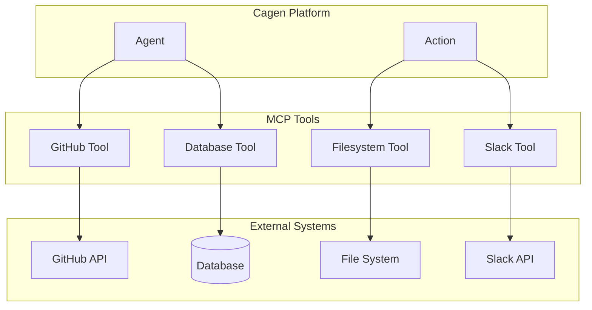

<Info>
  MCP (Model Context Protocol) tools provide Agents and Actions with secure access to external systems like GitHub, databases, and APIs through a standardized interface.
</Info>

## What are MCP Tools?

MCP tools are external capabilities that you can bind to your Agents and Actions to extend their functionality. Each MCP tool provides a secure, standardized way to interact with specific external systems:

<CardGroup cols={2}>
  <Card title="GitHub" icon="github">
    **Repository operations**
    
    Create issues, manage pull requests, search code, trigger workflows
  </Card>
  
  <Card title="Databases" icon="database">
    **Data operations**
    
    Query PostgreSQL, MySQL, read/write records, generate reports
  </Card>
  
  <Card title="File Systems" icon="folder">
    **File operations**
    
    Read, write, organize files within secure directory boundaries
  </Card>
  
  <Card title="Web Services" icon="globe">
    **API integration**
    
    Slack messaging, Google Drive, Stripe payments, custom APIs
  </Card>
</CardGroup>

## How MCP Tools Work in Cagen

### Tool Binding Architecture



### Understanding MCP Tool Binding

When you bind MCP tools to Agents or Actions, you're giving them specific capabilities:

<AccordionGroup>
  <Accordion title="Agent Tool Binding">
    **Agents can use MCP tools for intelligent decision-making:**
    ```yaml
    Example: Customer Support Agent
    Bound MCP Tools:
      - github: Create issues for bug reports
      - database: Look up customer account information
      - slack: Notify team members about escalations
    
    Workflow:
      User: "I found a bug in the login flow"
      Agent: Uses GitHub tool to create detailed issue
      Agent: Uses Slack tool to notify development team
    ```
  </Accordion>
  
  <Accordion title="Action Tool Usage">
    **Actions use MCP tools for specific operations:**
    ```yaml
    Example: Weekly Report Action
    Required MCP Tools:
      - database: Query metrics from last week
      - filesystem: Save report to shared folder
      - slack: Send report to stakeholders
    
    Execution:
      1. Database tool: SELECT metrics FROM analytics WHERE...
      2. Filesystem tool: Write formatted report
      3. Slack tool: Send notification with file link
    ```
  </Accordion>
  
  <Accordion title="Tool Permissions">
    **Fine-grained control over what each tool can do:**
    ```yaml
    Security Model:
      - Tools only access what you explicitly allow
      - Different permissions for different Agents/Actions
      - All tool usage is logged and auditable
      - Rate limiting prevents abuse
    ```
  </Accordion>
</AccordionGroup>

## Adding MCP Tools to Your Workspace

### Available MCP Tools

MCP tools are ready-to-use capabilities you can immediately bind to your Agents and Actions:

<AccordionGroup>
  <Accordion title="Core Development Tools">
    **GitHub Integration**
    - Create and manage issues
    - Review and comment on pull requests
    - Search repositories and code
    - Trigger workflows and actions
    
    **File System Access**
    - Read and write files securely
    - List directory contents
    - Monitor file changes
    - Organize project files
    
    **Database Operations**
    - Query PostgreSQL, MySQL databases
    - Execute safe read/write operations
    - Generate reports from data
    - Monitor database performance
  </Accordion>
  
  <Accordion title="Communication Tools">
    **Slack Integration**
    - Send messages to channels
    - Create channels for projects
    - Schedule reminders
    - Monitor team activity
    
    **Email Operations**
    - Send formatted emails
    - Process incoming mail
    - Manage email lists
    - Track email engagement
  </Accordion>
  
  <Accordion title="Business System Tools">
    **CRM Systems**
    - Create and update customer records
    - Track interaction history
    - Generate sales reports
    - Manage lead pipelines
    
    **Analytics Platforms**  
    - Query business metrics
    - Generate custom reports
    - Create data visualizations
    - Monitor KPIs and alerts
  </Accordion>
</AccordionGroup>

### Binding Tools to Agents and Actions

<Steps>
  <Step title="Navigate to Agent/Action Configuration">
    When creating or editing an Agent or Action, go to the **Tools** section
  </Step>
  
  <Step title="Select Available MCP Tools">
    Choose from the list of available MCP tools:
    ```
    ✓ GitHub - Repository and issue management
    ✓ Database - PostgreSQL query operations  
    ✓ File System - Secure file read/write access
    ✓ Slack - Team communication and notifications
    ✓ Web Search - Internet search capabilities
    ```
  </Step>
  
  <Step title="Configure Tool Permissions">
    Set what each tool can do:
    ```yaml
    GitHub Tool Permissions:
      ✓ Read repositories
      ✓ Create issues
      ✗ Delete repositories (not allowed)
      ✗ Manage organization settings (not allowed)
    
    Database Tool Permissions:
      ✓ SELECT queries
      ✓ INSERT new records
      ✗ DROP tables (not allowed)
      ✗ ALTER schema (not allowed)
    ```
  </Step>
  
  <Step title="Test Tool Binding">
    Use the built-in test interface to verify the tool works correctly with your Agent or Action
  </Step>
</Steps>

## Real-World MCP Tool Usage

### Agent Tool Examples

<AccordionGroup>
  <Accordion title="Customer Support Agent with Multiple Tools">
    **Agent Configuration:**
    ```yaml
    Agent: @customer-support
    Bound MCP Tools:
      - github: Create bug reports from customer issues
      - database: Look up customer account information
      - slack: Notify engineering team of critical issues
    ```
    
    **Real Conversation:**
    ```
    Customer: "I can't log into my account, getting error 500"
    
    Agent: "Let me help you with that login issue."
    [Uses database tool to check account status]
    
    Agent: "I see your account is active. This looks like a server error."
    [Uses github tool to create issue with error details]
    
    Agent: "I've created issue #1247 for our engineering team."
    [Uses slack tool to notify #engineering channel]
    
    Agent: "Engineering has been notified. You should receive an 
    email update within 2 hours when this is resolved."
    ```
  </Accordion>
  
  <Accordion title="Development Agent with Code Access">
    **Agent Configuration:**
    ```yaml
    Agent: @dev-assistant  
    Bound MCP Tools:
      - github: Repository operations and code search
      - filesystem: Read/write project files
      - database: Query application database for context
    ```
    
    **Real Workflow:**
    ```
    User: "Help me debug why user registrations are failing"
    
    Agent: "I'll investigate the registration flow for you."
    [Uses filesystem tool to read registration code]
    
    Agent: "Looking at the registration handler, I see it connects to the users table."
    [Uses database tool to check recent registration attempts]
    
    Agent: "Found the issue - there are 15 failed registrations with 
    'email_unique_constraint' errors in the last hour."
    [Uses github tool to search for recent changes to email validation]
    
    Agent: "The bug was introduced in commit abc123f. The email 
    validation is now case-sensitive but the database constraint isn't."
    ```
  </Accordion>
</AccordionGroup>

### Action Tool Examples

<CardGroup cols={2}>
  <Card title="Weekly Report Action" icon="file-text">
    **Bound Tools:** Database, File System, Slack
    
    **Process:**
    1. Database tool queries weekly metrics
    2. File System tool saves formatted report
    3. Slack tool sends to stakeholders
  </Card>
  
  <Card title="Bug Triage Action" icon="bug">
    **Bound Tools:** GitHub, Database, Slack
    
    **Process:**
    1. GitHub tool reads new issues
    2. Database tool checks similar past issues
    3. Slack tool notifies appropriate team
  </Card>
  
  <Card title="Customer Onboarding Action" icon="user-plus">
    **Bound Tools:** Database, Email, File System
    
    **Process:**
    1. Database tool creates customer record
    2. Email tool sends welcome sequence
    3. File System tool generates account folder
  </Card>
  
  <Card title="Code Review Action" icon="code">
    **Bound Tools:** GitHub, Slack, Database
    
    **Process:**
    1. GitHub tool analyzes pull request
    2. Database tool checks code quality metrics
    3. Slack tool requests reviews from team
  </Card>
</CardGroup>

## MCP Tool Security

### Built-in Safety Features

Cagen handles MCP tool security automatically, so you can focus on building great Agents and Actions:

<CardGroup cols={2}>
  <Card title="Permission Control" icon="shield-check">
    **Automatic restrictions**
    
    - Tools only access what you explicitly allow
    - No ability to exceed granted permissions
    - Rate limiting prevents abuse
    - All tool usage logged for audit
  </Card>
  
  <Card title="Secure Execution" icon="lock">
    **Isolated operations**
    
    - Each tool call runs in secure container
    - No persistent access to external systems
    - Credentials managed automatically
    - Network access strictly controlled
  </Card>
</CardGroup>

### Setting Tool Permissions

When binding tools to Agents or Actions, you control exactly what they can do:

<Tabs>
  <Tab title="Read-Only Access">
    **Safe for most Agents:**
    ```yaml
    GitHub Tool - Read Only:
      ✓ Read repository contents
      ✓ Search issues and pull requests
      ✓ View commit history
      ✗ Create or modify anything
      
    Database Tool - Query Only:
      ✓ SELECT queries for reports
      ✓ Read customer data for support
      ✗ INSERT, UPDATE, or DELETE
      ✗ Schema modifications
    ```
  </Tab>
  
  <Tab title="Limited Write Access">
    **For specific Actions:**
    ```yaml
    GitHub Tool - Issue Management:
      ✓ Create issues from bug reports
      ✓ Comment on existing issues
      ✓ Update issue labels
      ✗ Delete issues or repositories
      ✗ Manage repository settings
      
    Database Tool - Safe Updates:
      ✓ INSERT new customer records
      ✓ UPDATE specific fields
      ✗ DELETE any records
      ✗ DROP or ALTER tables
    ```
  </Tab>
</Tabs>

### Automatic Error Handling

Cagen manages tool reliability automatically:

<Steps>
  <Step title="Automatic Retries">
    **Failed tool calls are retried automatically**
    - Network timeouts: 3 retries with exponential backoff
    - Rate limiting: Intelligent delay and retry
    - Service unavailable: Circuit breaker with graceful fallback
  </Step>
  
  <Step title="Graceful Degradation">
    **When tools are unavailable**
    - Agents explain what they can't do
    - Actions pause and wait for tool recovery
    - Alternative approaches suggested when possible
  </Step>
  
  <Step title="Error Reporting">
    **Clear feedback on tool issues**
    - User-friendly error messages
    - Detailed logs for debugging
    - Automatic escalation for critical failures
  </Step>
</Steps>

## Monitoring Tool Usage

### Built-in Analytics

Cagen provides comprehensive visibility into how your Agents and Actions use MCP tools:

<Tabs>
  <Tab title="Usage Dashboard">
    **See how tools are being used:**
    - Which Agents use which tools most often
    - Success rates for different tool operations
    - Average response times for tool calls
    - Cost breakdown by tool and operation
  </Tab>
  
  <Tab title="Performance Metrics">
    **Optimize tool performance:**
    - Identify slow or failing tool operations
    - Track tool usage patterns over time
    - Monitor rate limiting and quota usage
    - Spot opportunities for efficiency improvements
  </Tab>
  
  <Tab title="Error Analysis">
    **Understand and fix issues:**
    - Common error patterns by tool
    - Failed operations with context
    - Retry success rates
    - User impact of tool failures
  </Tab>
</Tabs>

### Automatic Alerts

Get notified when tool issues affect your workflows:

<CardGroup cols={2}>
  <Card title="Tool Failures" icon="alert-triangle">
    **When tools stop working:**
    - Immediate notification of tool outages
    - Impact assessment on affected Agents/Actions
    - Estimated resolution times
    - Alternative workflow suggestions
  </Card>
  
  <Card title="Usage Limits" icon="gauge">
    **Before you hit quotas:**
    - 80% quota usage warnings
    - Rate limiting notifications
    - Cost threshold alerts
    - Optimization recommendations
  </Card>
</CardGroup>

## Troubleshooting MCP Tools

<AccordionGroup>
  <Accordion title="Tool Not Working">
    **What to check:**
    - Is the tool properly bound to your Agent/Action?
    - Do you have the required permissions for the operation?
    - Is the external service (GitHub, database, etc.) accessible?
    - Have you exceeded any rate limits?
    
    **Quick fixes:**
    - Check the tool binding configuration
    - Review permission settings
    - Test the tool with a simpler operation
    - Wait if rate limited, or increase quotas
  </Accordion>
  
  <Accordion title="Slow Tool Performance">
    **Common causes:**
    - External service is slow or overloaded
    - Tool is making inefficient operations
    - Network latency to external service
    - Too many concurrent tool calls
    
    **Solutions:**
    - Optimize tool operations (better queries, smaller requests)
    - Implement caching where appropriate
    - Limit concurrent tool usage
    - Contact external service if consistently slow
  </Accordion>
  
  <Accordion title="Permission Errors">
    **Understanding permissions:**
    - Each tool has specific permissions you grant
    - Agents/Actions can only do what you allow
    - External services may have their own access controls
    - Some operations require elevated permissions
    
    **Resolution steps:**
    - Review tool permissions in Agent/Action settings
    - Check external service permissions (GitHub tokens, database roles)
    - Test with minimal permissions first, then expand
    - Contact admin if you need elevated access
  </Accordion>
</AccordionGroup>

## Related Features

- [Agent Creation](/how-to/agents/create-custom-agent) - Bind MCP tools to Agents
- [Action Management](/how-to/actions/create-action) - Use MCP tools in Actions
- [Runtime Environment](/reference/system/runtime-environment) - Where MCP tools execute
- [Issue Management](/how-to/work/issue-management) - Tools in issue workflows

<Note>
  MCP tools extend your Agents and Actions with external capabilities while maintaining security and reliability. Start with the core tools (GitHub, Database, File System) and add specialized tools as your workflows grow.
</Note>