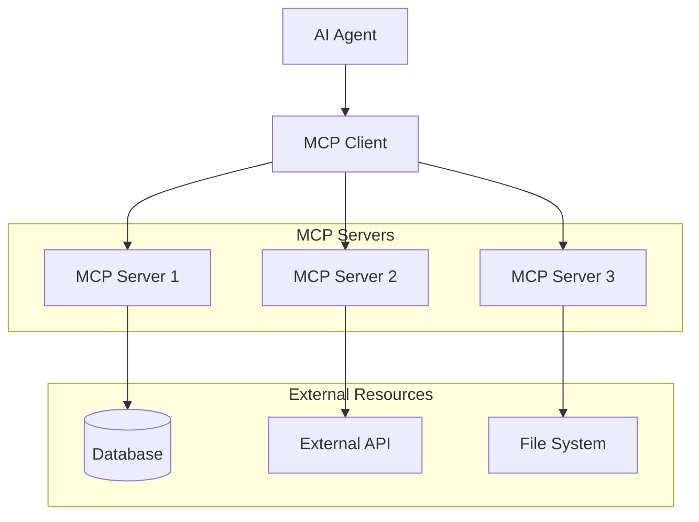

<Info>
  MCP (Model Context Protocol) enables AI agents to securely access and interact with external tools, databases, and services in a standardized way.
</Info>

## What is MCP?

**Model Context Protocol (MCP)** is an open standard that allows AI agents to:

<CardGroup cols={2}>
  <Card title="🔗 External Connections" icon="link">
    Connect to databases, APIs, and third-party services
    
    **Examples:** Slack, GitHub, Google Workspace, CRM systems
  </Card>
  
  <Card title="🛠️ Tool Access" icon="wrench">
    Use external tools and utilities safely
    
    **Examples:** Code editors, terminal access, file systems
  </Card>
  
  <Card title="📊 Data Sources" icon="database">
    Access structured and unstructured data
    
    **Examples:** SQL databases, document stores, search indexes
  </Card>
  
  <Card title="⚡ Real-time Integration" icon="zap">
    Stream data and events from external systems
    
    **Examples:** Live metrics, notifications, webhooks
  </Card>
</CardGroup>

## MCP Architecture

### Protocol Components



### Core Concepts

<AccordionGroup>
  <Accordion title="MCP Client">
    **Built into Cagen agents** - handles protocol communication
    ```yaml
    client_features:
      - Resource discovery
      - Tool invocation
      - Prompt templates
      - Sampling requests
      - Progress tracking
    ```
  </Accordion>
  
  <Accordion title="MCP Server">
    **External service provider** - exposes capabilities via MCP
    ```yaml
    server_responsibilities:
      - Authenticate requests
      - Validate permissions
      - Execute operations
      - Return structured responses
      - Handle errors gracefully
    ```
  </Accordion>
  
  <Accordion title="Resources">
    **Data and content** available through MCP servers
    ```yaml
    resource_types:
      - Files and documents
      - Database records
      - API responses
      - Live streams
      - Generated content
    ```
  </Accordion>
  
  <Accordion title="Tools">
    **Functions and operations** agents can perform
    ```yaml
    tool_categories:
      - Data operations (read, write, update)
      - External API calls
      - File system operations
      - System commands
      - Custom business logic
    ```
  </Accordion>
</AccordionGroup>

## Setting Up MCP Integrations

### Installing MCP Servers

<Tabs>
  <Tab title="From Cagen Store">
    **Popular MCP Servers:**
    ```bash
    # Install from Cagen Store
    cagen mcp install github-integration
    cagen mcp install slack-connector
    cagen mcp install postgresql-server
    cagen mcp install filesystem-server
    
    # View available servers
    cagen mcp browse
    ```
  </Tab>
  
  <Tab title="Official MCP Servers">
    ```bash
    # Install official MCP servers
    npm install -g @modelcontextprotocol/server-filesystem
    npm install -g @modelcontextprotocol/server-github
    npm install -g @modelcontextprotocol/server-postgres
    npm install -g @modelcontextprotocol/server-slack
    
    # Start servers
    mcp-server-filesystem --port 3001 --root-path /workspace
    mcp-server-github --port 3002 --token $GITHUB_TOKEN
    ```
  </Tab>
  
  <Tab title="Custom MCP Servers">
    Create your own MCP server:
    ```python
    # custom_mcp_server.py
    from mcp.server import Server
    from mcp.types import Resource, Tool
    
    app = Server("custom-business-server")
    
    @app.list_resources()
    async def list_resources():
        return [
            Resource(
                uri="crm://contacts",
                name="Customer Contacts",
                description="Access to CRM contacts"
            )
        ]
    
    @app.read_resource()
    async def read_resource(uri: str):
        if uri == "crm://contacts":
            return await get_crm_contacts()
        
    @app.list_tools()
    async def list_tools():
        return [
            Tool(
                name="create_lead",
                description="Create new sales lead",
                inputSchema={
                    "type": "object",
                    "properties": {
                        "name": {"type": "string"},
                        "email": {"type": "string"},
                        "company": {"type": "string"}
                    }
                }
            )
        ]
    
    @app.call_tool()
    async def call_tool(name: str, arguments: dict):
        if name == "create_lead":
            return await create_sales_lead(**arguments)
    
    if __name__ == "__main__":
        app.run(port=3003)
    ```
  </Tab>
</Tabs>

### Configuring MCP Connections

<Steps>
  <Step title="Register MCP Server">
    ```yaml
    # config/mcp_servers.yaml
    servers:
      github:
        transport: "stdio"
        command: "mcp-server-github"
        args: ["--token", "${GITHUB_TOKEN}"]
        env:
          GITHUB_API_URL: "https://api.github.com"
          
      filesystem:
        transport: "http"
        url: "http://localhost:3001"
        auth:
          type: "bearer"
          token: "${FILESYSTEM_TOKEN}"
          
      database:
        transport: "stdio" 
        command: "mcp-server-postgres"
        args: ["--connection", "${DATABASE_URL}"]
        timeout: 30000
    ```
  </Step>
  
  <Step title="Configure Agent Access">
    ```yaml
    # agent_mcp_config.yaml
    agent_permissions:
      @dev-agent:
        allowed_servers: ["github", "filesystem"]
        allowed_tools: 
          github: ["create_issue", "create_pr", "search_repos"]
          filesystem: ["read_file", "write_file", "list_directory"]
          
      @data-agent:
        allowed_servers: ["database"]
        allowed_tools:
          database: ["query", "insert", "update"]
        rate_limits:
          database: "100/hour"
          
      @support-agent:
        allowed_servers: ["crm", "slack"]
        allowed_tools: ["read_only"]
    ```
  </Step>
  
  <Step title="Test Connectivity">
    ```bash
    # Test MCP server connection
    cagen mcp test github
    cagen mcp test filesystem --verbose
    
    # Test agent access
    cagen agent test @dev-agent --mcp github
    
    # View available resources
    cagen mcp resources github
    cagen mcp tools filesystem
    ```
  </Step>
</Steps>

## Common MCP Use Cases

### Development Tools Integration

<AccordionGroup>
  <Accordion title="GitHub Integration">
    ```yaml
    # Enable agents to work with GitHub
    use_cases:
      - Create issues from conversation
      - Review and comment on PRs
      - Search codebase for context
      - Trigger CI/CD workflows
      - Generate release notes
      
    example_conversation:
      User: "Create an issue for the login bug we discussed"
      Agent: "I'll create a GitHub issue with the details from our conversation"
      
      [MCP Tool: github.create_issue]
      Parameters:
        title: "Fix login validation bug"
        body: "Based on conversation with user..."
        labels: ["bug", "authentication"]
        assignees: ["dev-team-lead"]
    ```
  </Accordion>
  
  <Accordion title="Database Operations">
    ```yaml
    # Direct database access for agents
    capabilities:
      - Query customer data for support
      - Generate analytics reports
      - Update records based on conversations
      - Monitor data quality issues
      
    example_usage:
      User: "How many users signed up last month?"
      Agent: "Let me check our user database..."
      
      [MCP Tool: postgres.query]
      Query: |
        SELECT COUNT(*) as new_users 
        FROM users 
        WHERE created_at >= date_trunc('month', CURRENT_DATE - INTERVAL '1 month')
        AND created_at < date_trunc('month', CURRENT_DATE)
      
      Agent: "We had 1,247 new user signups last month."
    ```
  </Accordion>
  
  <Accordion title="File System Access">
    ```yaml
    # Safe file operations
    operations:
      - Read project documentation
      - Update configuration files  
      - Process uploaded files
      - Generate reports and exports
      
    security_controls:
      - Restricted to specific directories
      - File type validation
      - Size limits enforced
      - Audit logging enabled
      
    example_workflow:
      User: "Update the API documentation with the new endpoints"
      Agent: "I'll read the current docs and add the new endpoints"
      
      [MCP Tool: filesystem.read_file]
      Path: "/docs/api/endpoints.md"
      
      [MCP Tool: filesystem.write_file] 
      Path: "/docs/api/endpoints.md"
      Content: [updated documentation]
    ```
  </Accordion>
</AccordionGroup>

### Business System Integration

<CardGroup cols={2}>
  <Card title="📧 Communication Platforms" icon="message-circle">
    **Slack, Teams, Email**
    - Send notifications and updates
    - Create channels for new projects
    - Schedule messages and reminders
    - Monitor team communication
  </Card>
  
  <Card title="📊 Analytics & Reporting" icon="bar-chart">
    **BI Tools, Dashboards**  
    - Generate custom reports
    - Query business metrics
    - Create data visualizations
    - Alert on anomalies
  </Card>
  
  <Card title="💼 CRM & Sales" icon="users">
    **Salesforce, HubSpot**
    - Create and update leads
    - Track customer interactions  
    - Generate sales reports
    - Automate follow-ups
  </Card>
  
  <Card title="⚙️ Operations Tools" icon="cog">
    **Monitoring, Deployment**
    - Check system health
    - Deploy applications
    - Manage infrastructure
    - Handle incident response
  </Card>
</CardGroup>

## Security & Best Practices

### Authentication & Authorization

<Tabs>
  <Tab title="Server Authentication">
    ```yaml
    # MCP Server security
    authentication:
      required: true
      methods:
        - api_key
        - oauth2
        - jwt
        - mutual_tls
        
    authorization:
      rbac_enabled: true
      roles:
        - admin: ["*"]
        - developer: ["read", "write:code"]
        - analyst: ["read:data", "query:database"]
        
    audit_logging:
      enabled: true
      include: ["tool_calls", "resource_access", "auth_events"]
      retention: "90 days"
    ```
  </Tab>
  
  <Tab title="Agent Permissions">
    ```yaml
    # Fine-grained agent access
    permission_model:
      default: "deny_all"
      
      grants:
        by_agent:
          "@dev-agent":
            servers: ["github", "filesystem"]
            max_requests_per_hour: 1000
            
        by_tool:
          "database.query":
            allowed_agents: ["@data-agent"]
            require_approval: false
            
        by_resource:
          "filesystem://secrets/":
            denied_agents: ["*"]
            require_admin: true
    ```
  </Tab>
  
  <Tab title="Network Security">
    ```yaml
    # Network-level protection
    network_security:
      mcp_servers:
        - bind_interface: "127.0.0.1"  # Local only
        - use_tls: true
        - client_cert_required: true
        
      firewall_rules:
        - allow_port: 3000-3010
        - source_restriction: "internal_network"
        
      monitoring:
        - connection_logging: true
        - rate_limit_alerts: true
        - anomaly_detection: enabled
    ```
  </Tab>
</Tabs>

### Error Handling & Reliability

```yaml
reliability_measures:
  retry_policy:
    max_attempts: 3
    backoff: "exponential"
    jitter: true
    
  timeout_handling:
    default: 30000  # 30 seconds
    long_operations: 300000  # 5 minutes
    
  circuit_breaker:
    failure_threshold: 5
    recovery_timeout: 60000
    
  fallback_strategies:
    - graceful_degradation: true
    - cached_responses: "when_available"  
    - human_escalation: "on_critical_failure"
    
  health_checks:
    interval: 30000
    endpoints: ["/health", "/status"]
    auto_disable_unhealthy: true
```

## Monitoring & Observability

### MCP Metrics Dashboard

<Steps>
  <Step title="Connection Health">
    Monitor MCP server connectivity:
    ```yaml
    health_metrics:
      - server_uptime
      - connection_count
      - response_time_p95
      - error_rate
      - request_volume
    ```
  </Step>
  
  <Step title="Usage Analytics">
    Track tool and resource usage:
    ```yaml
    usage_metrics:
      - tools_called_per_hour
      - most_used_resources
      - agent_activity_patterns
      - cost_per_operation
    ```
  </Step>
  
  <Step title="Performance Monitoring">
    Optimize MCP operations:
    ```yaml
    performance_metrics:
      - tool_execution_time
      - resource_fetch_latency
      - concurrent_connections
      - memory_usage
      - cpu_utilization
    ```
  </Step>
</Steps>

### Alerting Rules

```yaml
alerts:
  high_error_rate:
    condition: "error_rate > 5% for 5 minutes"
    severity: "warning"
    notify: ["ops-team"]
    
  server_down:
    condition: "server_uptime == 0"
    severity: "critical"  
    notify: ["ops-team", "on-call"]
    escalate_after: "2 minutes"
    
  slow_responses:
    condition: "p95_response_time > 10s"
    severity: "warning"
    notify: ["performance-team"]
    
  quota_exceeded:
    condition: "requests_per_hour > quota * 0.9"
    severity: "info"
    notify: ["agent-owners"]
```

## Troubleshooting

<AccordionGroup>
  <Accordion title="Connection Issues">
    **Common Problems:**
    - MCP server not responding
    - Authentication failures
    - Network connectivity issues
    - Version incompatibilities
    
    **Debugging Steps:**
    1. Check server logs: `cagen mcp logs [server-name]`
    2. Test connectivity: `cagen mcp ping [server-name]`
    3. Verify credentials: `cagen mcp auth test [server-name]`
    4. Check firewall rules and network access
  </Accordion>
  
  <Accordion title="Permission Denied">
    **Causes:**
    - Agent lacks required permissions
    - Server-side authorization failure
    - Resource access restrictions
    - Rate limiting
    
    **Resolution:**
    1. Review agent permissions configuration
    2. Check server-side access controls
    3. Verify resource availability
    4. Monitor rate limit usage
  </Accordion>
  
  <Accordion title="Performance Issues">
    **Symptoms:**
    - Slow tool execution
    - Timeouts on resource access
    - High memory usage
    - Connection pool exhaustion
    
    **Optimization:**
    1. Implement caching strategies
    2. Optimize query patterns
    3. Add connection pooling
    4. Scale MCP servers horizontally
  </Accordion>
</AccordionGroup>

## Related Features

- [Action Management](/how-to/actions/create-action) - Create automated actions using MCP
- [Agent Configuration](/how-to/agents/create-custom-agent) - Configure agents to use MCP
- [Store Integration](/how-to/store/store-management) - Install MCP servers from store
- [Runtime Environment](/how-to/runtime/runtime-environment) - MCP server execution environment

<Note>
  MCP enables powerful integrations while maintaining security and reliability. Start with well-tested MCP servers from the store, then gradually add custom integrations as your needs grow.
</Note>