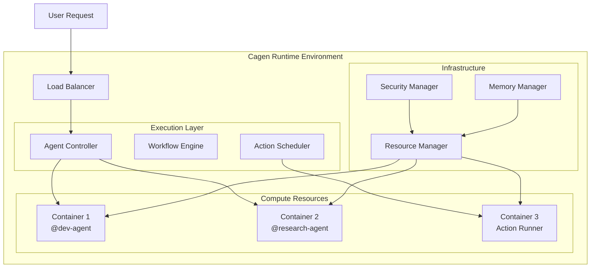

<Info>
  Cagen's Runtime Environment provides a secure, scalable execution context where AI agents perform tasks, execute actions, and interact with external systems.
</Info>

## Runtime Architecture

### Execution Environment Overview

<CardGroup cols={2}>
  <Card title="🔒 Secure Sandboxes" icon="shield">
    **Isolated execution environments**
    
    Each agent and action runs in isolated containers with strict resource limits and security boundaries
  </Card>
  
  <Card title="⚡ Auto-scaling" icon="zap">
    **Dynamic resource allocation**
    
    Runtime automatically scales compute resources based on workload demands and performance requirements
  </Card>
  
  <Card title="🌐 Multi-region" icon="globe">
    **Global deployment**
    
    Runtime environments distributed across regions for low-latency execution and data compliance
  </Card>
  
  <Card title="📊 Monitoring & Observability" icon="chart-bar">
    **Real-time insights**
    
    Complete visibility into execution performance, resource usage, and error tracking
  </Card>
</CardGroup>

### Runtime Components



## Runtime Environments

### Agent Runtime

<Tabs>
  <Tab title="Agent Execution Context">
    ```yaml
    agent_runtime:
      container_specs:
        cpu: "2 cores"
        memory: "4 GB"
        disk: "10 GB SSD"
        network: "isolated_vpc"
        
      security:
        user: "non-root"
        filesystem: "read-only (except /tmp)"
        network_access: "restricted_egress"
        system_calls: "filtered"
        
      runtime_limits:
        execution_time: "300 seconds"
        memory_usage: "3.5 GB"
        network_requests: "1000/minute"
        file_operations: "10000/hour"
    ```
  </Tab>
  
  <Tab title="Agent Lifecycle">
    ```yaml
    lifecycle_stages:
      initialization:
        - Load agent configuration
        - Initialize model context
        - Setup tool connections
        - Verify permissions
        
      execution:
        - Process user requests
        - Execute actions and tools
        - Maintain conversation state
        - Handle errors gracefully
        
      scaling:
        - Monitor resource usage
        - Auto-scale based on demand
        - Load balance across instances
        - Optimize resource allocation
        
      termination:
        - Save execution state
        - Clean up resources
        - Archive logs and metrics
        - Release compute resources
    ```
  </Tab>
</Tabs>

### Action Runtime

<AccordionGroup>
  <Accordion title="Action Execution Environment">
    ```yaml
    action_runtime:
      isolation_level: "container"
      
      resource_limits:
        cpu: "1 core"
        memory: "2 GB"
        timeout: "60 seconds"
        
      network_policies:
        outbound_allowed:
          - "*.api.allowed-domains.com"
          - "internal.services:8080-8090"
        blocked_destinations:
          - "169.254.169.254"  # AWS metadata
          - "10.0.0.0/8"       # Internal networks
          
      filesystem_access:
        read_write: ["/tmp", "/app/workspace"]
        read_only: ["/app/config", "/usr/share"]
        denied: ["/proc", "/sys", "/dev"]
    ```
  </Accordion>
  
  <Accordion title="Runtime Security">
    ```yaml
    security_measures:
      code_signing:
        enabled: true
        certificate_validation: "strict"
        
      vulnerability_scanning:
        container_images: "daily"
        dependencies: "on_build"
        runtime_monitoring: "continuous"
        
      access_controls:
        rbac_enforcement: true
        api_key_rotation: "automatic"
        audit_logging: "comprehensive"
        
      data_protection:
        encryption_at_rest: true
        encryption_in_transit: true
        secret_management: "vault_integration"
    ```
  </Accordion>
</AccordionGroup>

### Workflow Runtime

<Steps>
  <Step title="Workflow Orchestration">
    ```yaml
    workflow_engine:
      scheduler: "kubernetes_jobs"
      
      execution_modes:
        sequential: "step_by_step_execution"
        parallel: "concurrent_task_execution" 
        conditional: "branch_based_logic"
        loop: "iterative_processing"
        
      state_management:
        persistence: "redis_cluster"
        checkpointing: "automatic"
        recovery: "automatic_retry"
    ```
  </Step>
  
  <Step title="Resource Orchestration">
    ```yaml
    resource_management:
      auto_scaling:
        min_instances: 1
        max_instances: 100
        scale_metric: "cpu_utilization"
        target_utilization: "70%"
        
      load_balancing:
        algorithm: "least_connections"
        health_checks: "every_30_seconds"
        failover: "automatic"
        
      resource_pooling:
        agent_pool: "warm_instances"
        action_pool: "on_demand"
        gpu_pool: "shared_scheduling"
    ```
  </Step>
</Steps>

## Performance & Optimization

### Runtime Performance Metrics

<CardGroup cols={3}>
  <Card title="⚡ Execution Speed" icon="zap">
    **Response time optimization**
    
    - Cold start: < 2 seconds
    - Warm execution: < 200ms
    - P99 latency: < 5 seconds
  </Card>
  
  <Card title="🎯 Resource Efficiency" icon="target">
    **Compute utilization**
    
    - CPU utilization: 60-80%
    - Memory efficiency: > 85%
    - Container density: Optimized
  </Card>
  
  <Card title="📈 Scalability" icon="chart-line">
    **Handling demand spikes**
    
    - Auto-scale: 0-1000 instances
    - Scale-up time: < 30 seconds
    - Cost optimization: Dynamic
  </Card>
</CardGroup>

### Optimization Strategies

<Tabs>
  <Tab title="Cold Start Optimization">
    ```yaml
    cold_start_mitigation:
      warm_pools:
        maintain_warm_instances: 10
        agent_types: ["@dev-agent", "@support-agent"]
        refresh_interval: "5_minutes"
        
      preloading:
        model_weights: "cached"
        dependencies: "prebundled"
        configuration: "precompiled"
        
      optimization_techniques:
        - "lazy_loading"
        - "dependency_bundling"
        - "jit_compilation"
        - "memory_mapping"
    ```
  </Tab>
  
  <Tab title="Resource Pooling">
    ```yaml
    resource_pools:
      agent_pool:
        type: "pre_warmed"
        size: "dynamic"
        max_idle_time: "10_minutes"
        
      gpu_pool:
        sharing_strategy: "time_slicing"
        queue_management: "priority_based"
        utilization_target: "90%"
        
      memory_pool:
        shared_memory: "enabled"
        garbage_collection: "generational"
        memory_pressure_handling: "graceful_degradation"
    ```
  </Tab>
  
  <Tab title="Caching Strategies">
    ```yaml
    caching_layers:
      model_cache:
        strategy: "lru"
        size: "10GB"
        ttl: "24_hours"
        
      response_cache:
        strategy: "semantic_similarity"
        threshold: "0.95"
        max_entries: "100000"
        
      dependency_cache:
        level: "container_image"
        replication: "multi_region"
        compression: "enabled"
    ```
  </Tab>
</Tabs>

## Security & Compliance

### Runtime Security Model

<AccordionGroup>
  <Accordion title="Container Security">
    ```yaml
    container_security:
      base_images:
        source: "official_distroless"
        scanning: "continuous"
        patching: "automated"
        
      runtime_protection:
        seccomp: "enabled"
        apparmor: "enforced"
        selinux: "enabled"
        capabilities: "minimal_set"
        
      network_security:
        service_mesh: "istio"
        mTLS: "enforced"
        network_policies: "default_deny"
    ```
  </Accordion>
  
  <Accordion title="Data Protection">
    ```yaml
    data_security:
      encryption:
        at_rest: "AES-256"
        in_transit: "TLS 1.3"
        key_management: "hsm_backed"
        
      access_control:
        authentication: "mTLS + RBAC"
        authorization: "policy_based"
        audit_trail: "comprehensive"
        
      data_handling:
        pii_detection: "automatic"
        data_masking: "dynamic"
        retention_policies: "configurable"
    ```
  </Accordion>
  
  <Accordion title="Compliance Features">
    ```yaml
    compliance_support:
      standards:
        - "SOC 2 Type II"
        - "GDPR"
        - "HIPAA"
        - "FedRAMP"
        
      features:
        audit_logging: "immutable"
        data_residency: "configurable"
        access_controls: "granular"
        encryption: "FIPS_140-2_Level_3"
    ```
  </Accordion>
</AccordionGroup>

### Runtime Monitoring

<Steps>
  <Step title="Health Monitoring">
    ```yaml
    health_checks:
      runtime_health:
        endpoint: "/health"
        interval: "10s"
        timeout: "5s"
        
      resource_monitoring:
        cpu_usage: "continuous"
        memory_usage: "continuous" 
        disk_usage: "every_minute"
        network_io: "continuous"
        
      agent_health:
        response_time: "per_request"
        error_rate: "real_time"
        success_rate: "windowed"
    ```
  </Step>
  
  <Step title="Performance Monitoring">
    ```yaml
    performance_metrics:
      execution_metrics:
        - request_duration
        - queue_depth
        - throughput
        - error_rate
        
      resource_metrics:
        - cpu_utilization
        - memory_usage
        - disk_io
        - network_bandwidth
        
      business_metrics:
        - agent_interactions
        - successful_completions
        - user_satisfaction
        - cost_per_operation
    ```
  </Step>
  
  <Step title="Alerting & Notifications">
    ```yaml
    alerting_rules:
      critical_alerts:
        - name: "runtime_down"
          condition: "health_check_failures > 3"
          notify: ["ops_team", "on_call"]
          
        - name: "high_error_rate"
          condition: "error_rate > 5% for 2 minutes"
          notify: ["dev_team"]
          
      warning_alerts:
        - name: "high_latency"
          condition: "p95_latency > 10s"
          notify: ["performance_team"]
          
        - name: "resource_pressure"
          condition: "cpu_usage > 80% for 5 minutes"
          notify: ["ops_team"]
    ```
  </Step>
</Steps>

## Debugging & Troubleshooting

### Runtime Debugging Tools

<CardGroup cols={2}>
  <Card title="🔍 Execution Tracing" icon="search">
    **Detailed execution tracking**
    
    - Request flow visualization
    - Performance bottleneck identification
    - Resource usage analysis
    - Error propagation tracking
  </Card>
  
  <Card title="📊 Real-time Metrics" icon="chart-bar">
    **Live performance monitoring**
    
    - Runtime performance dashboards
    - Resource utilization graphs
    - Error rate monitoring
    - Alert management interface
  </Card>
  
  <Card title="📝 Comprehensive Logging" icon="file-text">
    **Structured log analysis**
    
    - Centralized log aggregation
    - Searchable log interfaces
    - Log correlation and analysis
    - Custom log filtering and alerts
  </Card>
  
  <Card title="🐛 Interactive Debugging" icon="bug">
    **Development and testing tools**
    
    - Runtime environment simulation
    - Step-through debugging
    - Variable inspection
    - Performance profiling
  </Card>
</CardGroup>

### Common Issues & Solutions

<AccordionGroup>
  <Accordion title="Performance Issues">
    **Symptoms:**
    - Slow agent responses
    - High latency in actions
    - Resource exhaustion
    - Timeout errors
    
    **Debugging:**
    1. Check resource utilization metrics
    2. Analyze execution traces
    3. Review performance bottlenecks
    4. Optimize resource allocation
    
    **Solutions:**
    - Increase resource limits
    - Optimize agent configurations
    - Implement caching strategies
    - Scale runtime resources
  </Accordion>
  
  <Accordion title="Security Violations">
    **Symptoms:**
    - Access denied errors
    - Security policy violations
    - Unauthorized resource access
    - Audit trail anomalies
    
    **Investigation:**
    1. Review security audit logs
    2. Check permission configurations
    3. Verify authentication tokens
    4. Analyze network access patterns
    
    **Remediation:**
    - Update permission policies
    - Rotate compromised credentials
    - Implement additional security controls
    - Enhance monitoring and alerting
  </Accordion>
  
  <Accordion title="Scalability Problems">
    **Symptoms:**
    - Auto-scaling failures
    - Resource allocation errors
    - Load balancing issues
    - Queue backlog buildup
    
    **Analysis:**
    1. Monitor auto-scaling metrics
    2. Review resource allocation policies
    3. Check load balancer health
    4. Analyze queue performance
    
    **Optimization:**
    - Adjust scaling parameters
    - Optimize resource allocation
    - Implement load balancing improvements
    - Enhance queue management
  </Accordion>
</AccordionGroup>

## Configuration & Customization

### Runtime Configuration

<Tabs>
  <Tab title="Environment Settings">
    ```yaml
    runtime_config:
      environment: "production"  # development, staging, production
      
      resource_limits:
        default_cpu: "2 cores"
        default_memory: "4 GB"
        max_execution_time: "300s"
        
      scaling_policy:
        min_instances: 5
        max_instances: 500
        scale_factor: 1.5
        cooldown_period: "60s"
        
      security_settings:
        enforce_tls: true
        require_authentication: true
        audit_logging: "verbose"
    ```
  </Tab>
  
  <Tab title="Agent-Specific Settings">
    ```yaml
    agent_runtime_overrides:
      "@dev-agent":
        cpu: "4 cores"
        memory: "8 GB"
        timeout: "600s"
        tools_enabled: ["github", "slack", "aws"]
        
      "@research-agent":
        cpu: "2 cores"
        memory: "16 GB"  # High memory for large context
        timeout: "1200s"
        gpu_enabled: true
        
      "@support-agent":
        cpu: "1 core"
        memory: "2 GB"
        timeout: "60s"
        response_caching: "aggressive"
    ```
  </Tab>
  
  <Tab title="Regional Deployment">
    ```yaml
    multi_region_config:
      regions:
        us_east_1:
          primary: true
          instance_types: ["c5.large", "c5.xlarge"]
          availability_zones: 3
          
        eu_west_1:
          backup: true
          instance_types: ["c5.large"]
          data_residency: "eu_only"
          
        ap_southeast_1:
          edge: true
          instance_types: ["t3.medium"]
          latency_optimization: true
          
      routing_policy:
        strategy: "latency_based"
        failover: "automatic"
        health_checks: "enabled"
    ```
  </Tab>
</Tabs>

## Best Practices

<CardGroup cols={2}>
  <Card title="🚀 Performance Optimization" icon="rocket">
    **Maximize execution efficiency**
    
    - Use warm pools for frequently accessed agents
    - Implement aggressive caching strategies
    - Optimize resource allocation based on usage patterns
    - Monitor and tune performance regularly
  </Card>
  
  <Card title="🔒 Security Best Practices" icon="shield">
    **Maintain runtime security**
    
    - Follow principle of least privilege
    - Implement defense in depth
    - Regular security audits and updates
    - Monitor for anomalous behavior
  </Card>
  
  <Card title="💰 Cost Optimization" icon="dollar-sign">
    **Manage runtime costs effectively**
    
    - Right-size resource allocations
    - Use spot instances where appropriate
    - Implement auto-scaling policies
    - Monitor cost attribution and optimization opportunities
  </Card>
  
  <Card title="📊 Operational Excellence" icon="chart-line">
    **Maintain reliable operations**
    
    - Comprehensive monitoring and alerting
    - Regular performance testing
    - Capacity planning and forecasting
    - Incident response procedures
  </Card>
</CardGroup>

## Related Features

- [Agent Management](/how-to/agents/create-custom-agent) - Configure agents for optimal runtime performance
- [Action Management](/how-to/actions/create-action) - Deploy actions in the runtime environment
- [MCP Integration](/how-to/mcp/mcp-integration) - Connect external services to runtime
- [Workflow Automation](/how-to/workflows/setup-triggers) - Execute workflows in runtime environment

<Note>
  The Runtime Environment is designed for security, performance, and scalability. Understanding its architecture and capabilities helps you optimize agent performance and ensure reliable operation of your AI-native organization.
</Note>