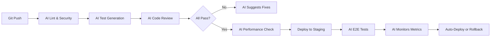

A solo developer just shipped a SaaS product that competitors built with 10 engineers. Another reduced their bug rate by 90% while tripling deployment frequency. 

They're not 10x developers. They have 10x tools.

## Your Reality Check

- **Current pain**: Context switching, repetitive tasks, documentation debt
- **Hidden cost**: 60% of your time isn't coding
- **Dream state**: Flow state all day, ship quality code fast
- **The truth**: AI can handle the 60% so you can focus on the 40% that matters

## Day 1: Your AI Development Squad

### Pick Your First Agent Based on Your Biggest Pain

<Tabs>
  <Tab title="🐛 Bug Warrior">
    **If you spend hours debugging:**
    
    ```python
    # You write:
    "Getting TypeError in production, here's the stack trace..."
    
    # AI returns:
    - Root cause analysis
    - Similar issues from codebase history
    - Suggested fix with explanation
    - Test cases to prevent recurrence
    - Performance impact assessment
    ```
    
    **Setup time**: 15 minutes
    **Time saved**: 5+ hours/week
    **Accuracy**: 85% on first try
  </Tab>
  
  <Tab title="👀 Code Reviewer">
    **If PRs pile up or reviews are shallow:**
    
    ```yaml
    AI Review Covers:
      - Style violations
      - Security vulnerabilities  
      - Performance issues
      - Test coverage gaps
      - Architecture concerns
      - Suggestions with examples
      
    Response time: < 2 minutes
    Thoroughness: Better than tired humans
    ```
    
    **Real impact**: PRs merged 10x faster
  </Tab>
  
  <Tab title="✍️ Doc Generator">
    **If documentation is always outdated:**
    
    ```javascript
    // Your code changes
    function processPayment(user, amount, method) {
      // new implementation
    }
    
    // AI automatically updates:
    - API documentation
    - README examples
    - Migration guide
    - Changelog
    - Type definitions
    ```
    
    **Never again**: "The docs are wrong"
  </Tab>
  
  <Tab title="🧪 Test Writer">
    **If test coverage is a joke:**
    
    ```typescript
    // You write the function
    // AI writes comprehensive tests:
    - Happy path (5 scenarios)
    - Edge cases (10 scenarios)
    - Error handling (8 scenarios)
    - Performance benchmarks
    - Integration tests
    
    Coverage: 95%+ guaranteed
    ```
    
    **Achievement unlocked**: Actually enjoy TDD
  </Tab>
</Tabs>

## Week 1: From Chaos to Control

<Steps>
  <Step title="Day 1-2: Deploy Core Agents">
    The Essential Dev Stack:
    
    1. **Code Review Bot** - Instant PR feedback
    2. **Test Generator** - 95% coverage automatically
    3. **Doc Updater** - Always in sync
    4. **Debug Assistant** - Your rubber duck on steroids
    
    ```bash
    # One command setup
    cagen init --developer-pack
    ```
  </Step>
  
  <Step title="Day 3-4: Integrate Your Workflow">
    ```yaml
    Your IDE:
      - VS Code Cagen Extension ✓
      - IntelliJ Plugin ✓
      - Vim Integration ✓
      
    Your Pipeline:
      - GitHub Actions ✓
      - GitLab CI ✓
      - Jenkins ✓
      
    Your Stack:
      - Any language ✓
      - Any framework ✓
      - Any architecture ✓
    ```
  </Step>
  
  <Step title="Day 5-7: Customize and Optimize">
    Train on YOUR codebase:
    - Coding standards
    - Architecture patterns
    - Domain knowledge
    - Team conventions
    
    **Result**: AI that codes like your best developer
  </Step>
</Steps>

## Real Developer Workflows

### The "Never Break Prod" Pipeline



Every step automated. Every deploy confident.

### The "10x Feature Shipping" Setup

<CardGroup cols={2}>
  <Card title="Morning Standup">
    ```yaml
    AI Prepares:
      - What you shipped (from commits)
      - What's blocking you (from TODOs)
      - Today's priorities (from tickets)
      - Performance alerts
      - Interesting code patterns
    ```
  </Card>
  
  <Card title="Feature Development">
    ```python
    # You type:
    # TODO: Add user authentication
    
    # AI generates:
    - Complete auth system
    - Database migrations
    - API endpoints
    - Frontend components
    - Tests
    - Documentation
    ```
  </Card>
  
  <Card title="Code Refactoring">
    ```javascript
    // You: "This feels messy"
    
    // AI analyzes and suggests:
    - Design pattern applicable
    - Step-by-step refactor plan
    - Impact analysis
    - Safe migration path
    ```
  </Card>
  
  <Card title="Learning Accelerator">
    ```rust
    // You: "How do I do X in Rust?"
    
    // AI provides:
    - Idiomatic Rust solution
    - Why it's best practice
    - Common pitfalls
    - Performance implications
    ```
  </Card>
</CardGroup>

## Month 1: Your New Development Reality

### What Changes

| Task | Before AI | With AI | Multiplier |
|------|-----------|---------|------------|
| Code Reviews | 2-3 days | 5 minutes | 576x |
| Writing Tests | 2 hours | 5 minutes | 24x |
| Debugging | 3 hours | 20 minutes | 9x |
| Documentation | Never | Automatic | ∞ |
| Refactoring | Scary | Confident | Priceless |

### What You Build

<Tabs>
  <Tab title="Week 1">
    - Basic automation working
    - 50% less context switching
    - First "wow" moment
    - Team asking questions
  </Tab>
  
  <Tab title="Week 2-3">
    - Full pipeline automated
    - Shipping daily
    - Documentation always current
    - Other devs copying setup
  </Tab>
  
  <Tab title="Week 4+">
    - Complex features in hours
    - Near-zero bug rate
    - Became the "10x developer"
    - Teaching others
  </Tab>
</Tabs>

## Developer Success Stories

### "From Burnout to Joy"
> "I was ready to quit coding. Spending 80% of time on BS, 20% on actual problems. Now it's flipped. I love my job again. Ship 5x more, work 20% less." - Jamie, Full-Stack Dev

### "Solo Founder Superpower"
> "Built an app that usually needs 5 developers. AI handles tests, docs, reviews, deploys. I just architect and create. Competitors can't understand how I ship so fast." - Alex, Indie Hacker

### "Enterprise Game Changer"
> "Our team went from 2-week sprints with 50% completion to 1-week sprints with 95% completion. Management thinks we hired ninjas. Nope, just AI." - Pat, Tech Lead

## Advanced Developer Patterns

<AccordionGroup>
  <Accordion title="AI Pair Programming">
    ```python
    # Real-time collaboration
    You: "I need to optimize this algorithm"
    AI: "Here are 3 approaches with trade-offs..."
    
    You: "Let's go with approach 2"
    AI: "Implementing... here's the code with benchmarks"
    
    You: "Can we parallelize this part?"
    AI: "Yes, here's how with 4x speedup..."
    ```
    
    It's like pairing with a senior dev who never gets tired
  </Accordion>
  
  <Accordion title="Architecture Assistant">
    ```yaml
    You describe: "Building a real-time chat system"
    
    AI provides:
      - System design diagram
      - Tech stack recommendations
      - Scalability considerations
      - Code structure
      - Database schema
      - Deployment architecture
      - Cost estimates
    ```
    
    Skip the 10 blog posts, get expert advice instantly
  </Accordion>
  
  <Accordion title="Legacy Code Whisperer">
    ```javascript
    // That 10-year-old spaghetti code?
    
    AI can:
      - Map dependencies
      - Explain what it does
      - Suggest safe refactors
      - Generate tests first
      - Modernize gradually
      - Document as it goes
    ```
    
    Finally tackle that technical debt
  </Accordion>
</AccordionGroup>

## Your 30-Day Transformation

<Steps>
  <Step title="Days 1-7: Foundation">
    - Set up core agents
    - Integrate with workflow
    - Experience first wins
    - Measure baseline metrics
  </Step>
  
  <Step title="Days 8-14: Acceleration">
    - Customize for your stack
    - Add specialized agents
    - Automate repetitive tasks
    - Share wins with team
  </Step>
  
  <Step title="Days 15-21: Mastery">
    - Advanced workflows running
    - Shipping at new velocity
    - Teaching others
    - Building custom agents
  </Step>
  
  <Step title="Days 22-30: Innovation">
    - Tackle impossible projects
    - Open source contributions
    - Thought leadership
    - Next level unlocked
  </Step>
</Steps>

## Developer Tools & Resources

<CardGroup cols={2}>
  <Card 
    title="CLI Tools" 
    icon="terminal"
    href="/developers/cli"
  >
    Command line power user kit
  </Card>
  
  <Card 
    title="IDE Plugins" 
    icon="code"
    href="/developers/ide"
  >
    Deep editor integration
  </Card>
  
  <Card 
    title="API Reference" 
    icon="book"
    href="/developers/api"
  >
    Build custom integrations
  </Card>
  
  <Card 
    title="Dev Community" 
    icon="discord"
    href="https://discord.gg/cagen-devs"
  >
    10k+ developers sharing wins
  </Card>
</CardGroup>

## The Developer's Truth

You didn't become a developer to:
- Write boilerplate
- Update documentation
- Fix linting errors
- Write repetitive tests
- Debug type mismatches

You became a developer to:
- Solve interesting problems
- Build amazing products
- Learn new technologies
- Create value
- Have fun

AI handles the first list so you can focus on the second.

<div style={{backgroundColor: '#fef3c7', padding: '24px', borderRadius: '8px', marginTop: '24px'}}>
  <h3>⚡ Limited Time: Developer Launch Special</h3>
  
  - 3 months free for open source contributors
  - 50% off for indie developers
  - Team licenses with collaboration features
  - Priority support from dev team
  
  [Claim your developer discount →](https://app.cagen.ai/signup?utm=developer-special)
</div>

<Note>
**Real talk**: Every day you wait is another day of repetitive tasks, context switching, and missed flow states. Your competition might already be using this. Time to level up.
</Note>

---

*Ready to code at the speed of thought? [Start your dev transformation](https://app.cagen.ai/signup?utm=developer) →*