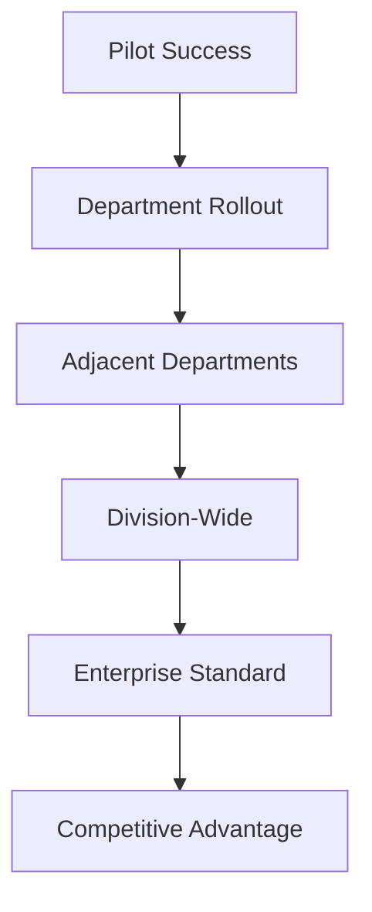

Last quarter, a Fortune 500 company's innovation team deployed Cagen in their customer service department. Result: $2M annual savings, 40% efficiency gain, and a promotion for the team lead who championed it.

Here's the enterprise playbook that actually works.

## Your Situation

- **Organization**: 500+ employees, established processes
- **Challenge**: Innovation vs. risk, ROI pressure, change resistance
- **Opportunity**: Massive efficiency gains, competitive advantage
- **Reality**: If you don't do this, your competitors will

## The Enterprise AI Playbook

### Week 1: Pilot Program Setup

<Steps>
  <Step title="Choose Your Beachhead">
    Start where you'll win fast:
    
    | Department | Why It Works | Typical Win |
    |------------|--------------|-------------|
    | Customer Service | High volume, clear metrics | 50% cost reduction |
    | IT Help Desk | Repetitive tickets | 70% auto-resolution |
    | HR Inquiries | Policy questions | 24/7 availability |
    | Sales Ops | Lead processing | 3x throughput |
    
    **Pro tip**: Pick a department with an innovation-friendly leader
  </Step>
  
  <Step title="Build Your Business Case">
    ```yaml
    Pilot Proposal Template:
      Scope: 
        - 1 department
        - 30-day trial
        - 3-5 use cases
        
      Investment:
        - Software: $399/month
        - Implementation: 40 hours
        - Training: 20 hours
        
      Expected Return:
        - Hours saved: 200/month
        - Cost savings: $15k/month
        - Quality improvement: 30%
        - ROI: 3,600%
    ```
    
    **Key**: Start small, prove value, expand
  </Step>
  
  <Step title="Assemble Your Tiger Team">
    You need:
    - Executive sponsor (VP level+)
    - Department champion
    - Technical lead
    - Change management rep
    - 2-3 power users
    
    **Meeting cadence**: Daily standup for week 1
  </Step>
</Steps>

### Week 2-4: Pilot Execution

<Tabs>
  <Tab title="Technical Setup">
    **Enterprise Requirements**:
    
    ```yaml
    Security:
      - SOC2 compliance ✓
      - Data encryption ✓
      - GDPR ready ✓
      - SSO integration ✓
      - Audit logs ✓
      
    Integration:
      - Salesforce ✓
      - ServiceNow ✓
      - Slack/Teams ✓
      - SAP ✓
      - Custom APIs ✓
      
    Governance:
      - Role-based access
      - Approval workflows
      - Usage monitoring
      - Cost controls
    ```
  </Tab>
  
  <Tab title="Change Management">
    **The ADKAR Model for AI**:
    
    **Awareness**: "AI augments, doesn't replace"
    - Town halls
    - Success stories
    - Address fears directly
    
    **Desire**: "What's in it for me?"
    - Less mundane work
    - Skill development
    - Career growth
    
    **Knowledge**: Training program
    - Role-specific training
    - Hands-on workshops
    - Certification path
    
    **Ability**: Practical application
    - Sandboxes
    - Mentoring
    - Quick wins
    
    **Reinforcement**: Make it stick
    - Recognition
    - Metrics
    - Continuous improvement
  </Tab>
  
  <Tab title="Success Metrics">
    **Week 1 Baseline**:
    - Current ticket volume
    - Resolution times
    - Employee satisfaction
    - Cost per transaction
    
    **Week 2-3 Tracking**:
    - AI handling rate
    - Accuracy scores
    - Time savings
    - User feedback
    
    **Week 4 Results**:
    - ROI calculation
    - Productivity gains
    - Quality improvements
    - Expansion potential
  </Tab>
</Tabs>

## Month 1-3: Scale Success

### The Expansion Framework



### Enterprise Success Patterns

<CardGroup cols={2}>
  <Card title="Financial Services">
    **MegaBank's Journey**:
    - Started: Compliance inquiries
    - Expanded: All customer service
    - Now: 500 agents across org
    - Savings: $50M annually
    
    [Read case study →](/cases/megabank)
  </Card>
  
  <Card title="Healthcare">
    **HealthSystem Inc**:
    - Started: Appointment scheduling
    - Expanded: Insurance verification
    - Now: Patient care coordination
    - Satisfaction: +45 NPS
    
    [Read case study →](/cases/healthsystem)
  </Card>
  
  <Card title="Manufacturing">
    **GlobalManufacturing**:
    - Started: Supply chain queries
    - Expanded: Quality control
    - Now: Predictive maintenance
    - Efficiency: +60%
    
    [Read case study →](/cases/manufacturing)
  </Card>
  
  <Card title="Technology">
    **TechGiant Corp**:
    - Started: IT help desk
    - Expanded: Developer tools
    - Now: Product development
    - Velocity: 3x faster
    
    [Read case study →](/cases/techgiant)
  </Card>
</CardGroup>

## Enterprise Implementation Roadmap

### Quarter 1: Prove Value
- [ ] Run 2-3 pilots
- [ ] Document ROI
- [ ] Build internal champions
- [ ] Secure expansion budget

### Quarter 2: Scale Success  
- [ ] Roll out to 5-10 departments
- [ ] Establish center of excellence
- [ ] Create governance framework
- [ ] Train 100+ users

### Quarter 3: Enterprise Integration
- [ ] Connect all major systems
- [ ] Deploy advanced workflows
- [ ] Implement predictive capabilities
- [ ] Measure enterprise impact

### Quarter 4: Competitive Advantage
- [ ] Custom AI solutions
- [ ] Industry-specific agents
- [ ] External customer deployment
- [ ] Innovation leadership

## Overcoming Enterprise Challenges

<AccordionGroup>
  <Accordion title="Security concerns">
    **Challenge**: "Our data is too sensitive"
    
    **Solution**:
    - Enterprise security features
    - On-premise deployment option
    - Data residency controls
    - Compliance certifications
    
    **Result**: Banks and healthcare firms use Cagen
  </Accordion>
  
  <Accordion title="Change resistance">
    **Challenge**: "Employees fear job loss"
    
    **Solution**:
    - Position as augmentation
    - Upskill programs
    - New role creation
    - Success celebrations
    
    **Result**: 95% employee satisfaction after deployment
  </Accordion>
  
  <Accordion title="Integration complexity">
    **Challenge**: "We have legacy systems"
    
    **Solution**:
    - API-first approach
    - Middleware options
    - Phased integration
    - Partner ecosystem
    
    **Result**: Integrates with 200+ enterprise systems
  </Accordion>
  
  <Accordion title="ROI justification">
    **Challenge**: "Need proven returns"
    
    **Solution**:
    - Pilot program data
    - Industry benchmarks
    - ROI calculator
    - Peer references
    
    **Result**: Average ROI: 500% in year 1
  </Accordion>
</AccordionGroup>

## The Executive Presentation

<div style={{backgroundColor: '#eff6ff', padding: '24px', borderRadius: '8px'}}>

**Your 10-Slide Deck**:

1. **The Opportunity**: $10M+ efficiency gain
2. **The Solution**: AI-powered workforce augmentation
3. **Pilot Results**: 300% ROI in 30 days
4. **Security**: Enterprise-grade, compliant
5. **Integration**: Works with existing systems
6. **Change Plan**: Proven adoption framework
7. **Timeline**: Value in 30 days, scale in 90
8. **Investment**: $50k pilot, $500k full rollout
9. **Returns**: $5M year 1, $15M by year 3
10. **Next Steps**: Approve pilot program

[Download template →](/templates/executive-deck)

</div>

## Your Enterprise Transformation Team

<Steps>
  <Step title="Week 1">
    Identify pilot opportunity and build coalition
  </Step>
  
  <Step title="Month 1">
    Run pilot, prove value, secure buy-in
  </Step>
  
  <Step title="Quarter 1">
    Scale to multiple departments
  </Step>
  
  <Step title="Year 1">
    Enterprise-wide transformation
  </Step>
</Steps>

## Enterprise Resources

<CardGroup cols={2}>
  <Card 
    title="Pilot Playbook" 
    icon="rocket"
    href="/enterprise/pilot-guide"
  >
    30-day success blueprint
  </Card>
  
  <Card 
    title="ROI Calculator" 
    icon="calculator"
    href="/enterprise/roi-calculator"
  >
    Build your business case
  </Card>
  
  <Card 
    title="Security Docs" 
    icon="shield"
    href="/enterprise/security"
  >
    Compliance and certifications
  </Card>
  
  <Card 
    title="Executive Network" 
    icon="handshake"
    href="/enterprise/leaders"
  >
    Connect with peers
  </Card>
</CardGroup>

## Words from Enterprise Leaders

> "We started with a small pilot in customer service. 18 months later, AI is core to our digital transformation. Cagen gave us first-mover advantage." - CTO, Fortune 500 Retailer

> "The pilot results were so compelling, the board approved enterprise rollout in record time. ROI is tracking at 800%." - VP Innovation, Global Bank

> "Change management was our biggest concern. Cagen's approach made employees champions, not victims. Adoption exceeded all expectations." - CHRO, Healthcare System

<Note>
**Enterprise Truth**: Your competitors are already piloting AI. The question isn't if, but how fast you can catch up and surpass them.
</Note>

---

*Ready to lead your enterprise transformation? [Schedule executive briefing](https://cagen.ai/enterprise-contact) →*