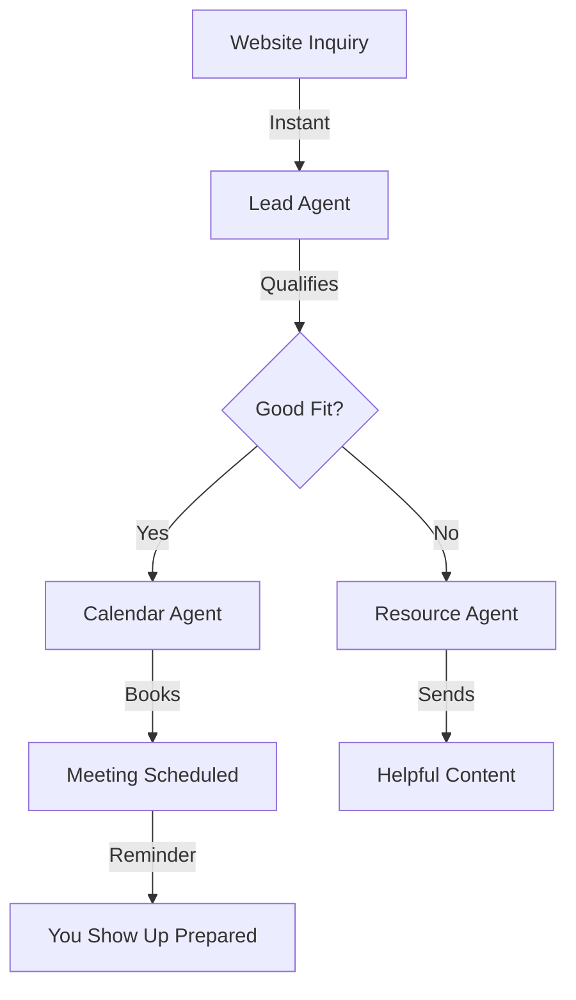

Meet Sarah. She runs a $30k/month consulting business. Alone. While traveling. Working 4 hours a day. Her secret? 6 Cagen agents handle everything else.

This can be you.

## Your Reality Check

- **Current situation**: You ARE the business
- **Biggest challenge**: Can't scale yourself
- **Hidden cost**: Missing opportunities while sleeping
- **Dream outcome**: Business runs without you

## Day 1: Your First Virtual Assistant

Forget complex strategies. You need immediate relief.

<Steps>
  <Step title="Install your Email Guardian (30 min)">
    1. Create Email Assistant agent
    2. Teach it your communication style (upload 10 best emails)
    3. Set rules:
       - Draft responses to inquiries
       - Flag urgent items
       - Archive newsletters/spam
       - Schedule meetings
    
    **Instant win**: Wake up to drafted responses, not overwhelming inbox
  </Step>
  
  <Step title="Test with real scenarios (30 min)">
    Forward these to your agent:
    - Client inquiry
    - Meeting request  
    - Invoice question
    - Random newsletter
    
    Review how it handles each. Adjust instructions.
  </Step>
</Steps>

**By tonight**: You'll save 1-2 hours on email tomorrow. Guaranteed.

## Week 1: The Essential Solo Stack

### Your 4-Agent Dream Team

<Tabs>
  <Tab title="Email Assistant">
    **Handles**: All inbox management
    **Setup time**: 1 hour
    **Time saved**: 10 hours/week
    
    ```yaml
    Rules:
    - Client emails: Draft thoughtful response
    - Invoices: Flag for immediate attention
    - Prospects: Warm response + calendar link
    - Spam: Auto-archive
    ```
  </Tab>
  
  <Tab title="Social Media Manager">
    **Handles**: Content scheduling and engagement
    **Setup time**: 2 hours
    **Impact**: 3x more visibility
    
    ```yaml
    Daily tasks:
    - 9am: Share valuable content
    - 12pm: Engage with comments
    - 3pm: Post original thought
    - 6pm: Respond to DMs
    ```
  </Tab>
  
  <Tab title="Bookkeeper Bot">
    **Handles**: Invoice tracking and basic finances
    **Setup time**: 2 hours
    **Peace of mind**: Priceless
    
    ```yaml
    Automation:
    - Track incoming payments
    - Send invoice reminders
    - Categorize expenses
    - Monthly P&L summary
    ```
  </Tab>
  
  <Tab title="Content Creator">
    **Handles**: Blog posts, newsletters, course material
    **Setup time**: 1 hour
    **Output**: 10x more content
    
    ```yaml
    Weekly output:
    - 2 blog posts (from your voice notes)
    - 5 social media posts
    - 1 newsletter
    - Course module drafts
    ```
  </Tab>
</Tabs>

## Month 1: From Hustle to System

### Week-by-Week Transformation

**Week 1**: Emergency relief (email + scheduling)
**Week 2**: Revenue protection (client management + invoicing)
**Week 3**: Growth engine (content + social media)
**Week 4**: Scale preparation (systems + documentation)

### The Compound Effect

| Task | Before (hrs/week) | After (hrs/week) | Time Saved |
|------|------------------|------------------|------------|
| Email management | 10 | 2 | 8 hours |
| Content creation | 8 | 1 | 7 hours |
| Social media | 5 | 0.5 | 4.5 hours |
| Admin tasks | 7 | 1 | 6 hours |
| **Total** | **30** | **4.5** | **25.5 hours** |

That's 3 full work days back. Every. Single. Week.

## Solopreneur-Specific Workflows

### The "Never Miss a Lead" System



This runs 24/7. You sleep. Leads don't wait.

### The "Content Machine" Workflow

<CardGroup cols={2}>
  <Card title="Voice Note → Blog Post">
    Record 5-min thoughts → Agent transcribes → Writes full post → Schedules publication
  </Card>
  
  <Card title="Blog → Social Campaign">
    Published post → Agent creates 10 social variations → Schedules across platforms
  </Card>
  
  <Card title="Client Win → Case Study">
    Success metric → Agent drafts story → Creates social proof → Updates website
  </Card>
  
  <Card title="FAQ → Content Ideas">
    Common questions → Agent identifies patterns → Suggests content calendar
  </Card>
</CardGroup>

## Real Solopreneur Wins

### "I Take Real Vacations Now"
> "First time in 5 years, I took 2 weeks off. Completely offline. Business grew 15% while I was gone. My agents handled 200+ emails, booked 5 sales calls, published 8 blog posts. Game changer." - Mark, Marketing Consultant

### "Scaled Without Hiring"
> "Was turning down work because I couldn't handle more. Now my agents do 70% of the work. Went from $5k to $30k/month. Still just me." - Lisa, Designer

### "Work-Life Balance Exists!"
> "Used to work 60-hour weeks. Now it's 20. Income doubled. Stress halved. My agents are better employees than I ever was." - James, Coach

## Common Solo Mistakes (Don't Do These)

<AccordionGroup>
  <Accordion title="Perfectionism paralysis">
    **Mistake**: Spending days perfecting agent instructions
    **Fix**: 80% accurate is good enough to start. Improve weekly.
  </Accordion>
  
  <Accordion title="Not trusting the agents">
    **Mistake**: Reviewing and editing everything
    **Fix**: Let them run for a week. Review patterns, not individual tasks.
  </Accordion>
  
  <Accordion title="Forgetting you're the CEO">
    **Mistake**: Still doing tasks agents could handle
    **Fix**: Weekly audit - "Did I do anything an agent could do?"
  </Accordion>
  
  <Accordion title="Working in isolation">
    **Mistake**: Not connecting with other solopreneurs
    **Fix**: Join our community. Share wins and workflows.
  </Accordion>
</AccordionGroup>

## Your Toolbox

### Templates Built for One

<Tabs>
  <Tab title="Service Business">
    - Client onboarding agent
    - Project management agent
    - Invoice and payment agent
    - Testimonial collector agent
  </Tab>
  
  <Tab title="Content Creator">
    - Research assistant agent
    - Writing amplifier agent
    - Distribution agent
    - Community manager agent
  </Tab>
  
  <Tab title="E-commerce">
    - Customer service agent
    - Order tracking agent
    - Review response agent
    - Inventory alert agent
  </Tab>
  
  <Tab title="Coach/Consultant">
    - Discovery call agent
    - Session notes agent
    - Follow-up agent
    - Content repurpose agent
  </Tab>
</Tabs>

## The 90-Day Solo Transformation

### Days 1-30: Survival Mode → Breathing Room
- Set up core 4 agents
- Reclaim 20+ hours/week
- Stop drowning in operations
- Start thinking strategically again

### Days 31-60: Systems & Scale
- Add specialized agents for your business
- Create multi-agent workflows
- Document everything
- Test scaling capacity

### Days 61-90: Empire Building
- Running on autopilot
- Focus only on high-value work
- Consider raising prices (you can deliver more)
- Plan expansion or enjoy freedom

## Start Your Solo Revolution

<Steps>
  <Step>
    **Right now**: Write down your 3 biggest time drains
  </Step>
  
  <Step>
    **In 5 minutes**: Start free trial and create first agent
  </Step>
  
  <Step>
    **In 1 hour**: See your first task completed automatically
  </Step>
  
  <Step>
    **Tomorrow**: Wake up to work already done
  </Step>
</Steps>

## Resources for the Solo Journey

<CardGroup cols={2}>
  <Card 
    title="Solo Stack Calculator" 
    icon="calculator"
    href="/tools/solo-roi"
  >
    See how much time you'll save
  </Card>
  
  <Card 
    title="Community Forum" 
    icon="comments"
    href="https://community.cagen.ai/solo"
  >
    6,000+ solopreneurs sharing wins
  </Card>
  
  <Card 
    title="Weekly Solo Meetup" 
    icon="video"
    href="/events/solo-wednesday"
  >
    Virtual coffee with fellow solos
  </Card>
  
  <Card 
    title="Emergency Templates" 
    icon="first-aid"
    href="/templates/solo-quick-start"
  >
    When you need relief NOW
  </Card>
</CardGroup>

<Note>
**Remember**: You started solo for freedom, not to become a slave to your business. Cagen gives you both growth AND life back.
</Note>

---

*Ready to reclaim your life? [Start your free trial](https://app.cagen.ai/signup?utm=solo-path) →*