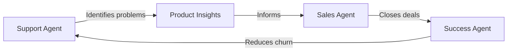

Last month, a YC startup used Cagen to handle customer support for 10,000 users with just 2 people. Another raised Series A after showing investors their 5-person team outperforming competitors with 50.

This is your playbook.

## Your Situation

- **Team size**: 1-10 people wearing multiple hats
- **Challenge**: Everything is on fire, all the time
- **Goal**: Achieve product-market fit without burning out
- **Budget**: Every dollar counts

## Week 1: Instant Impact

<Steps>
  <Step title="Day 1: Customer Support Agent">
    **Why this first**: Every minute on support is a minute not building product
    
    1. Use the [Customer Support template](/templates/customer-support)
    2. Feed it your FAQs and product docs
    3. Connect to your support email
    4. Watch it handle 70% of inquiries
    
    **Real result**: "Went from 3 hours/day on support to 30 minutes" - Alex, SaaS founder
  </Step>
  
  <Step title="Day 3: Lead Qualification">
    **Why this next**: Bad leads waste precious time
    
    1. Clone your support agent
    2. Teach it your ideal customer profile
    3. Connect to your contact forms
    4. Let it score and route leads
    
    **Real result**: "3x more demos, all qualified" - Sarah, B2B startup
  </Step>
  
  <Step title="Day 5: Sales Follow-up">
    **The multiplier**: Never drop a hot lead again
    
    1. Create Sales Assistant agent
    2. Set follow-up sequences
    3. Connect to CRM (or spreadsheet)
    4. Automated but personalized outreach
    
    **Real result**: "25% higher close rate" - Mike, marketplace founder
  </Step>
</Steps>

## Week 2-4: Build Your AI Co-founder

### The Power Combo: Support + Sales + Analytics



This loop runs 24/7 while you sleep.

### Essential Workflows for Startups

<CardGroup cols={2}>
  <Card 
    title="User Onboarding Flow" 
    icon="user-plus"
  >
    New user → Welcome sequence → Feature education → Activation tracking → Churn prevention
  </Card>
  
  <Card 
    title="Content Engine" 
    icon="pencil"
  >
    Keyword research → Blog drafts → Social posts → Newsletter → SEO optimization
  </Card>
  
  <Card 
    title="Investor Updates" 
    icon="chart-line"
  >
    Metric collection → Narrative drafting → Formatting → Distribution → Follow-up
  </Card>
  
  <Card 
    title="Product Feedback Loop" 
    icon="comments"
  >
    Support tickets → Feature requests → Priority scoring → Roadmap updates → User notification
  </Card>
</CardGroup>

## Month 1: Metrics That Matter

Track these to show investors (and yourself) the impact:

| Metric | Before Cagen | After 30 Days | Impact |
|--------|--------------|---------------|---------|
| Support response time | 24 hours | 5 minutes | 288x faster |
| Leads contacted | 20/week | 200/week | 10x more |
| Customer satisfaction | 3.5/5 | 4.6/5 | 31% increase |
| Founder hours saved | 0 | 25/week | $250k/year value |

## Startup-Specific Templates

<Tabs>
  <Tab title="YC Application Helper">
    ```yaml
    Agent: YC Application Assistant
    Capabilities:
      - Analyze your metrics
      - Draft application answers
      - Suggest improvements
      - Mock interview prep
    ```
  </Tab>
  
  <Tab title="Product Hunt Launch">
    ```yaml
    Agent: Launch Day Coordinator
    Capabilities:
      - Schedule posts across timezones
      - Respond to comments
      - Track competitor launches
      - Coordinate team updates
    ```
  </Tab>
  
  <Tab title="User Research Bot">
    ```yaml
    Agent: Customer Interview Bot
    Capabilities:
      - Schedule user calls
      - Conduct initial surveys
      - Transcribe and analyze
      - Extract key insights
    ```
  </Tab>
</Tabs>

## Common Founder Mistakes (Avoid These)

<AccordionGroup>
  <Accordion title="Trying to automate everything at once">
    **Problem**: Spending weeks building the perfect system
    **Solution**: One agent, one problem, one week. Then expand.
  </Accordion>
  
  <Accordion title="Over-engineering for scale you don't have">
    **Problem**: Building for 1M users when you have 100
    **Solution**: Optimize for next 10x, not 1000x
  </Accordion>
  
  <Accordion title="Ignoring agent mistakes">
    **Problem**: Customers get wrong info, trust erodes
    **Solution**: Review daily in week 1, weekly after. Fix immediately.
  </Accordion>
  
  <Accordion title="Not measuring ROI">
    **Problem**: Can't justify cost or show progress
    **Solution**: Track time saved, revenue impacted from day 1
  </Accordion>
</AccordionGroup>

## Real Founder Stories

### "From Burnout to Break-even"
> "I was doing customer support until 2am every night. Set up Cagen on a Sunday. By Wednesday, I was sleeping 8 hours again. By month 2, we hit profitability because I could focus on sales." - Jennifer, EdTech founder

### "Our Secret Scaling Weapon"
> "Competitors think we have 20 people. It's just me, my co-founder, and 8 Cagen agents. We're growing faster than funded companies." - David, DevTools startup

### "Investor Magnet"
> "Showed our Cagen setup during YC interview. They loved our capital efficiency. Got in." - Anonymous, YC W24

## Your 90-Day Roadmap

### Month 1: Foundation
- Week 1: Support + Sales agents
- Week 2: Add Analytics + Content
- Week 3: Build custom workflows
- Week 4: Optimize and document

### Month 2: Growth
- Scale agent team to 10-15
- Integrate all tools
- Train on your voice/brand
- Measure everything

### Month 3: Competitive Advantage
- Custom agents for your unique needs
- Complex multi-agent workflows
- Predictive analytics
- 24/7 global operations

## Founder Resources

<CardGroup cols={2}>
  <Card 
    title="ROI Calculator" 
    icon="calculator"
    href="/tools/startup-roi-calculator"
  >
    Show investors (and yourself) the numbers
  </Card>
  
  <Card 
    title="Fundraising Deck Template" 
    icon="presentation"
    href="/templates/fundraising-with-ai"
  >
    How to pitch your AI-native advantage
  </Card>
  
  <Card 
    title="Founder Community" 
    icon="users"
    href="https://discord.gg/cagen-founders"
  >
    Connect with 500+ founders using Cagen
  </Card>
  
  <Card 
    title="Office Hours" 
    icon="calendar"
    href="/events/founder-office-hours"
  >
    Weekly calls with founders who've done this
  </Card>
</CardGroup>

## Start Now (Seriously)

Your competitors are drowning in operational work while you're reading this. Every day you wait is a day they might discover Cagen first.

<Steps>
  <Step>
    **Right now**: Start your [14-day free trial](https://app.cagen.ai/signup?utm=founder-path)
  </Step>
  
  <Step>
    **In 1 hour**: Have your first agent handling real work
  </Step>
  
  <Step>
    **By tomorrow**: Sleep 8 hours while agents work
  </Step>
  
  <Step>
    **Next week**: Show your co-founder/investors the metrics
  </Step>
</Steps>

<Note>
**The truth**: AI won't replace founders. But founders using AI will replace founders who don't. Which one will you be?
</Note>

---

*Next: [Week 1 Detailed Plan](/tutorials/startup-founder/week-1) →*