<Info>
  Cagen's conversation system supports three distinct types of communication: private chats for one-on-one discussions, group chats for team collaboration, and topics for focused, archivable discussions.
</Info>

## Types of Conversations

### Private Chats (DMs)
<Card title="💬 Direct Messages" icon="message">
  **One-on-one conversations** between you and another person (human or AI agent)
  
  **Best for:**
  - Personal discussions
  - Sensitive information sharing  
  - Agent consultations
  - Quick questions and clarifications
  
  **Features:**
  - End-to-end context preservation
  - File sharing and screen sharing
  - Agent integration for assistance
  - Auto-archive when inactive
</Card>

### Group Chats
<Card title="👥 Group Conversations" icon="users">
  **Multi-participant conversations** for ongoing team collaboration
  
  **Best for:**
  - Team coordination
  - Project discussions
  - Ongoing collaboration
  - Regular check-ins
  
  **Features:**
  - Up to 50 participants
  - @mention notifications
  - Shared file repository
  - Persistent conversation history
</Card>

### Topics
<Card title="📋 Topic Discussions" icon="hashtag">
  **Focused, archivable discussions** around specific subjects with multiple participants
  
  **Best for:**
  - Specific decision-making
  - Temporary project discussions
  - Brainstorming sessions
  - Issue resolution
  
  **Features:**
  - Automatic archiving when resolved
  - Clear start and end points
  - Integration with Memory Bank
  - Connection to Work Issues
</Card>

## Creating Conversations

<Tabs>
  <Tab title="Private Chat">
    **From Command Launcher:**
    ```
    ⌘K → "chat with @alice"
    ⌘K → "new dm @bob"
    ```
    
    **From Profile:**
    - Visit any team member's profile
    - Click **Send Message** button
    
    **From Mentions:**
    - Click on any @mention
    - Select **Send Direct Message**
  </Tab>
  
  <Tab title="Group Chat">
    **From Command Launcher:**
    ```
    ⌘K → "new chat @alice @bob @charlie"
    ⌘K → "group chat frontend team"
    ```
    
    **Manual Creation:**
    1. Click **New Conversation** → **Group Chat**
    2. Add participants using @mentions
    3. Set group name and description
    4. Configure notification settings
  </Tab>
  
  <Tab title="Topic Discussion">
    **From Command Launcher:**
    ```
    ⌘K → "new topic API redesign"
    ⌘K → "topic about user feedback"
    ```
    
    **From Issue Creation:**
    - Topics are automatically created when you create a Work Issue
    - Related team members are auto-invited
    
    **Manual Creation:**
    1. Click **New Conversation** → **Topic**
    2. Set topic title and description
    3. Add relevant participants
    4. Link to related issues or memory items
  </Tab>
</Tabs>

## Conversation Features

### Participants Management

<Steps>
  <Step title="Adding Participants">
    **In conversation:** Type `@` and select from dropdown
    
    **Bulk add:** Use Command Launcher with `add @alice @bob to current chat`
  </Step>
  
  <Step title="Removing Participants">
    **Conversation settings:** Click gear icon → Manage Participants
    
    **Quick remove:** Right-click participant → Remove from conversation
  </Step>
  
  <Step title="Role Management">
    **Admin roles:** Can modify conversation settings and participant list
    
    **Participant roles:** Can view and contribute to conversation
  </Step>
</Tabs>

### Message Features

#### Rich Text & Formatting
```markdown
**Bold text** and *italic text*
`code snippets` and ```code blocks```
> Quote blocks for references
- Bulleted lists
1. Numbered lists
[Links](https://example.com)
```

#### @Mentions & Notifications  
```
@alice - Mention team member (sends notification)
@research-agent - Mention AI agent (brings into conversation)
@everyone - Mention all participants (use sparingly)
@channel - Mention all in group chat
```

#### File & Media Sharing
- **Documents**: PDF, Word, Google Docs
- **Images**: JPG, PNG, GIF with inline preview
- **Code**: Syntax-highlighted code blocks
- **Links**: Auto-preview for URLs
- **Screen recordings**: Built-in screen capture

### Agent Integration

<AccordionGroup>
  <Accordion title="Bringing Agents into Conversations">
    **Method 1:** @mention any agent
    ```
    @research-agent can you analyze this user feedback?
    ```
    
    **Method 2:** Use slash commands
    ```
    /agent research-agent analyze feedback
    /agent qa-agent review code
    ```
    
    **Method 3:** Command Launcher
    ```
    ⌘K → "add @research-agent to conversation"
    ```
  </Accordion>
  
  <Accordion title="Agent Responses">
    - **Contextual**: Agents understand full conversation history
    - **Collaborative**: Multiple agents can participate together
    - **Actionable**: Agents can create issues, save to memory, trigger workflows
    - **Learning**: Agent responses improve based on team interactions
  </Accordion>
  
  <Accordion title="Agent Commands in Chat">
    ```
    @agent summarize conversation
    @agent create issue from this discussion  
    @agent save key points to memory
    @agent schedule follow-up meeting
    ```
  </Accordion>
</AccordionGroup>

## Conversation States & Management

### Private Chat States
```yaml
Active: Currently exchanging messages
Idle: No messages for 24 hours  
Archived: Manually archived or 30+ days inactive
```

### Group Chat States  
```yaml
Active: Recent activity from any participant
Idle: No activity for 7 days
Archived: Manually archived or all members leave
```

### Topic States
```yaml
Open: Active discussion ongoing
Resolved: Decision made or issue solved
Archived: Completed and moved to history
```

## Advanced Features

### Conversation Threading
```
Main conversation
├── Thread 1: "API endpoint discussion"
├── Thread 2: "Timeline concerns" 
└── Thread 3: "Budget considerations"
```

**Benefits:**
- Keep main conversation focused
- Parallel discussions on sub-topics
- Easy to follow specific threads
- Auto-merge insights back to main topic

### Search & Discovery

<CardGroup cols={2}>
  <Card title="Content Search" icon="magnifying-glass">
    Search within conversation for specific messages, files, or decisions
  </Card>
  
  <Card title="Global Search" icon="globe">
    Find conversations across your entire workspace
  </Card>
  
  <Card title="Participant Search" icon="user-group">
    Find all conversations with specific people or agents
  </Card>
  
  <Card title="Date Range Search" icon="calendar">
    Search conversations within specific time periods
  </Card>
</CardGroup>

### Integration with Work Issues

When you create a Work Issue, Cagen automatically:

1. **Creates Related Topic** - Discussion space for the issue
2. **Invites Stakeholders** - People assigned or mentioned in issue
3. **Links Conversations** - Connects issue updates to topic discussion
4. **Syncs Status** - Issue completion can auto-archive topic

```mermaid
graph LR
    A[Create Issue] --> B[Auto-create Topic]
    B --> C[Invite Stakeholders]  
    C --> D[Link Issue ↔ Topic]
    D --> E[Sync Status Updates]
```



## Notifications & Inbox Integration

Conversations automatically appear in your [Inbox (⌘J)](/how-to/interface/inbox) when:

- You receive a direct message
- You're @mentioned in group chat or topic
- An agent responds to your message
- A conversation status changes (e.g., topic resolved)

### Notification Preferences

<Tabs>
  <Tab title="Direct Messages">
    ```yaml
    Real-time: ✅ Immediate notification
    Mobile Push: ✅ For all DMs
    Email Digest: ✅ If missed for 2+ hours
    ```
  </Tab>
  
  <Tab title="Group Chats">
    ```yaml
    Mentions Only: ✅ Only when @mentioned  
    All Messages: ⚠️ Optional for critical groups
    Digest Mode: ✅ Daily summary for large groups
    ```
  </Tab>
  
  <Tab title="Topics">
    ```yaml
    Participant: ✅ All updates if you're involved
    Watcher: ⚠️ Major updates only
    Archived: 🔕 No notifications
    ```
  </Tab>
</Tabs>

## Best Practices

### Choosing the Right Conversation Type

<AccordionGroup>
  <Accordion title="Use Private Chats When:">
    - Discussing sensitive or personal matters
    - One-on-one mentoring or feedback
    - Quick questions that don't need group input
    - Working with AI agents on personal tasks
  </Accordion>
  
  <Accordion title="Use Group Chats When:">
    - Ongoing team coordination
    - Regular project updates
    - Social team interactions
    - Persistent collaboration needs
  </Accordion>
  
  <Accordion title="Use Topics When:">
    - Making specific decisions
    - Time-bounded discussions
    - Problem-solving sessions
    - Discussions that should be archived when complete
  </Accordion>
</AccordionGroup>

### Communication Efficiency

<CardGroup cols={2}>
  <Card title="Be Contextual" icon="context">
    Reference previous messages and provide background
  </Card>
  
  <Card title="Use Threads" icon="comments">
    Keep side discussions in threads to avoid cluttering main conversation
  </Card>
  
  <Card title="Involve Agents" icon="robot">
    Use AI agents for research, analysis, and documentation
  </Card>
  
  <Card title="Archive Regularly" icon="archive">
    Complete topics and archive inactive conversations
  </Card>
</CardGroup>

## Keyboard Shortcuts

<AccordionGroup>
  <Accordion title="Navigation">
    **⌘Enter** - Send message
    **⌘↑/↓** - Navigate through conversations
    **⌘Shift+F** - Search in conversation
    **Escape** - Close conversation
  </Accordion>
  
  <Accordion title="Formatting">
    **⌘B** - Bold text
    **⌘I** - Italic text  
    **⌘Shift+C** - Code block
    **⌘K** - Insert link
  </Accordion>
  
  <Accordion title="Actions">
    **⌘R** - Reply to specific message
    **⌘E** - Edit last message
    **⌘D** - Delete message
    **⌘Shift+A** - Add participants
  </Accordion>
</AccordionGroup>

## Related Features

- [Inbox (⌘J)](/how-to/interface/inbox) - Manage conversation notifications
- [Work Issues](/how-to/work/issue-management) - Link conversations to tasks
- [Memory Bank](/how-to/memory/manage-memory-bank) - Save important conversations
- [Agent Interactions](/how-to/agents/agent-interaction) - Work with AI in conversations

<Note>
  Conversations in Cagen are designed to be contextual and purposeful. Use the right type for your needs, involve AI agents for enhanced productivity, and keep discussions organized with proper archiving.
</Note>