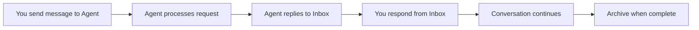

<Info>
  Press `⌘J` (Cmd+J) on Mac or `Ctrl+J` on Windows/Linux to open your Inbox instantly from anywhere in Cagen.
</Info>

## What is the Inbox?

Your Inbox is the central hub for all notifications and messages requiring your attention in Cagen. It aggregates messages from three main sources:

- **Issue-Related Notifications** - When you're mentioned in issue progression or stage items are assigned to you
- **Private Agent Messages** - Direct communications from AI agents, including scheduled tasks and responses
- **Channel Activity** - When you're mentioned or added to group conversations and channels

## Message Sources

### Issue-Related Notifications

When an issue moves from backlog to in-progress status, Cagen automatically creates a dedicated channel containing all relevant people (issue creator, assignees, mentioned users). You'll receive inbox notifications when:

<CardGroup cols={2}>
  <Card title="Stage Assignment" icon="user-check">
    When a specific stage item in an issue workflow is assigned to you, you'll be @ mentioned and receive an inbox notification
    
    **Actions Available:**
    - Jump to the issue channel
    - View stage details and requirements
    - Update stage progress
    - Communicate with issue stakeholders
  </Card>
  
  <Card title="Issue Mentions" icon="at">
    When you're mentioned in issue discussions or comments
    
    **Actions Available:**
    - Jump to related channel
    - Reply in context
    - View full issue thread
    - Mark notification as handled
  </Card>
</CardGroup>

### Private Agent Communications

Direct messages between you and AI agents, including:

<Tabs>
  <Tab title="Scheduled Agent Tasks">
    **Automated messages from agents with scheduled tasks:**
    ```
    @research-agent: Daily market analysis complete
    @scheduler-agent: Meeting reminder: Team standup in 15 minutes  
    @monitor-agent: Server usage alert: CPU at 85%
    ```
    
    **Response Options:**
    - Reply to continue conversation
    - Acknowledge and dismiss
    - Create follow-up task
    - Forward to team member
  </Tab>
  
  <Tab title="Agent Responses">
    **Replies to your previous messages to agents:**
    ```
    You: "Analyze competitor pricing for Q2"
    @research-agent: "Analysis complete. Found 15% average price increase..."
    
    You: "Schedule team meeting for project review"
    @scheduler-agent: "Meeting scheduled for Thursday 2pm..."
    ```
    
    **Conversation Flow:**
    - Continue private conversation
    - Share results with team
    - Create tasks from agent recommendations
    - Archive completed exchanges
  </Tab>
  
  <Tab title="Proactive Agent Messages">
    **Unsolicited messages when agents detect important events:**
    ```
    @security-agent: "Unusual login detected from new location"
    @budget-agent: "Project Alpha approaching 90% budget limit"
    @qa-agent: "New code deployment ready for review"
    ```
    
    **Immediate Actions:**
    - Investigate alert details
    - Take recommended actions
    - Set up monitoring rules
    - Escalate to relevant team
  </Tab>
</Tabs>

### Channel and Group Activity

Notifications from group conversations and project channels:

<AccordionGroup>
  <Accordion title="Channel Mentions">
    When you're @ mentioned in group channels or project discussions
    
    **Context Provided:**
    - Who mentioned you
    - Which channel/thread
    - Conversation preview
    - Related issue or project
    
    **Quick Actions:**
    - Jump to channel conversation
    - Reply without leaving inbox
    - React with emoji
    - Mute channel notifications
  </Accordion>
  
  <Accordion title="Channel Additions">
    When you're added to new channels (often automatically when issues progress)
    
    **Information Shown:**
    - Channel purpose and context
    - Current participants
    - Recent conversation history
    - Related issues or projects
    
    **Onboarding Options:**
    - Read channel backlog
    - Introduce yourself
    - Set notification preferences
    - Leave channel if not relevant
  </Accordion>
</AccordionGroup>

## Inbox Interface

### Message States and Actions

<CardGroup cols={4}>
  <Card title="Unread" icon="circle" color="#ef4444">
    New messages requiring attention
    
    **Actions:** Read, Reply, Archive
  </Card>
  
  <Card title="Read" icon="circle-check" color="#22c55e">
    Messages you've viewed but not archived
    
    **Actions:** Reply, Archive, Snooze
  </Card>
  
  <Card title="Snoozed" icon="clock" color="#f59e0b">
    Messages hidden until specified time
    
    **Actions:** Unsnooze, Archive
  </Card>
  
  <Card title="Archived" icon="archive" color="#6b7280">
    Completed or resolved messages
    
    **Actions:** Unarchive, Delete
  </Card>
</CardGroup>

### Navigation Between Inbox and Channels

The Inbox provides seamless navigation to full conversations:

<Steps>
  <Step title="View in Inbox">
    See notification summary and preview
  </Step>
  
  <Step title="Jump to Context">
    Click "View in Channel" to see full conversation thread
  </Step>
  
  <Step title="Reply in Context">
    Participate in the full channel discussion
  </Step>
  
  <Step title="Return to Inbox">
    Use ⌘J or navigate back to process other notifications
  </Step>
</Steps>

## Notification Management

### Quick Actions

Hover over any inbox message for instant actions:

| Action | Shortcut | Description |
|--------|----------|-------------|
| **Reply** | `R` | Respond directly or jump to channel |
| **Archive** | `A` | Mark as handled and remove from inbox |
| **Snooze** | `S` | Hide until specified time |
| **Mark Read** | `M` | Toggle read status |
| **Go to Channel** | `G` | Jump to related conversation |

### Bulk Operations

Process multiple notifications efficiently:

<Tabs>
  <Tab title="Selection">
    - **Click checkboxes** to select individual messages
    - **Shift+Click** to select ranges
    - **⌘A** to select all visible messages
  </Tab>
  
  <Tab title="Bulk Actions">
    Available actions for selected messages:
    - Mark all as read/unread  
    - Archive selected notifications
    - Snooze all until tomorrow
    - Mute notifications from specific sources
  </Tab>
</Tabs>

### Filtering and Search

<Tabs>
  <Tab title="Source Filters">
    ```
    🎯 Issue Updates     - Notifications from issue progression
    🤖 Agent Messages    - Private communications with agents  
    💬 Channel Activity  - Group mentions and channel additions
    🔔 System Alerts     - Platform and security notifications
    ```
  </Tab>
  
  <Tab title="Search Syntax">
    ```bash
    # Search by source
    from:@research-agent
    channel:#project-alpha
    issue:234
    
    # Search by type  
    type:mention
    type:assignment
    type:alert
    
    # Search by date
    today
    yesterday
    last_week
    
    # Content search
    "budget review" AND urgent
    ```
  </Tab>
</Tabs>

## Best Practices

### Efficient Inbox Management

<Steps>
  <Step title="Regular Processing">
    Check inbox 2-3 times daily rather than constantly monitoring
  </Step>
  
  <Step title="Immediate Action Rule">
    If a notification requires less than 2 minutes, handle it immediately
  </Step>
  
  <Step title="Context Switching">
    Use "Jump to Channel" for complex discussions, return to inbox for quick actions
  </Step>
  
  <Step title="Archive Aggressively">
    Keep inbox clean by archiving handled notifications immediately
  </Step>
</Steps>

### Notification Preferences

Configure notifications to match your workflow:

<CardGroup cols={2}>
  <Card title="Issue Notifications" icon="clipboard-list">
    **Recommended Settings:**
    - Enable for issues you created or are assigned to
    - Disable for issues you're only mentioned in occasionally
    - Set digest mode for low-priority project updates
  </Card>
  
  <Card title="Agent Communications" icon="robot">
    **Recommended Settings:**
    - Immediate notifications for scheduled reports
    - Enable push notifications for critical alerts
    - Batch non-urgent agent responses
  </Card>
  
  <Card title="Channel Activity" icon="comments">
    **Recommended Settings:**
    - Always notify for direct @ mentions
    - Digest mode for high-volume channels
    - Mute channels after you've contributed
  </Card>
  
  <Card title="Quiet Hours" icon="moon">
    **Recommended Settings:**
    - Set work hours (9am-6pm) for regular notifications
    - Allow critical alerts outside hours
    - Weekend digest mode unless urgent
  </Card>
</CardGroup>

## Integration with Cagen Features

### Issue Workflow Integration

Your inbox reflects the natural flow of issue progression:

1. **Issue Creation** → Notification to stakeholders
2. **Backlog to In-Progress** → Channel created, participants notified
3. **Stage Assignment** → Assignee receives inbox notification
4. **Stage Completion** → Next assignee notified, stakeholders updated
5. **Issue Resolution** → Final notifications, channel archived

### Agent Communication Flow

Seamless integration between inbox and agent interactions:



## Troubleshooting

<AccordionGroup>
  <Accordion title="Missing Notifications">
    **Check notification settings** for the specific message type
    
    **Verify channel membership** - you must be in a channel to receive notifications
    
    **Review muted conversations** - you may have accidentally muted important channels
  </Accordion>
  
  <Accordion title="Too Many Notifications">
    **Adjust issue notification settings** - only get notified for issues you actively work on
    
    **Use agent notification scheduling** - batch non-urgent agent messages
    
    **Mute high-volume channels** after you've participated
  </Accordion>
  
  <Accordion title="Can't Find Context">
    **Use "Jump to Channel"** to see full conversation history
    
    **Check related issues** - notifications often reference broader project context
    
    **Ask for clarification** using reply feature
  </Accordion>
</AccordionGroup>

## Related Features

- [Command Launcher (⌘K)](/reference/interface/command-launcher) - Quick navigation and actions
- [Issue Management](/how-to/work/issue-management) - Understanding issue workflows  
- [Agent Communication](/how-to/agents/create-custom-agent) - Working with AI agents
- [Channel Conversations](/reference/communication/conversations) - Group discussion features

<Note>
  The Inbox is designed around actual work patterns - issue progression, agent collaboration, and team communication. Focus on processing notifications that require your specific input or action.
</Note>