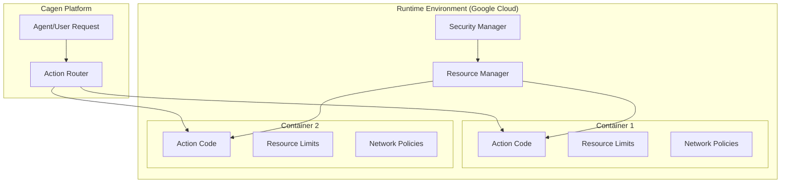

<Info>
  Cagen's Runtime Environment is an independent, secure containerized system where Actions execute safely and reliably, built on Google Cloud infrastructure.
</Info>

## What is Runtime Environment?

The Runtime Environment is Cagen's secure execution layer specifically designed for running Actions. It provides:

<CardGroup cols={2}>
  <Card title="Secure Isolation" icon="shield">
    **Independent containerized system**
    
    Each Action runs in its own isolated container with strict security boundaries and no access to other processes
  </Card>
  
  <Card title="Google Cloud Foundation" icon="cloud">
    **Enterprise-grade infrastructure**
    
    Built on Google Cloud Platform with enterprise security, reliability, and global availability
  </Card>
  
  <Card title="Zero Security Concerns" icon="lock">
    **Built-in safety**
    
    You don't need to worry about security - the system handles isolation, permissions, and safe execution automatically
  </Card>
  
  <Card title="Action-Focused" icon="cog">
    **Purpose-built for Actions**
    
    Optimized specifically for running Action code, whether natural language workflows or direct code execution
  </Card>
</CardGroup>

## How Runtime Environment Works

### Action Execution Flow

When an Action is triggered (either by an Agent or directly by a user), here's what happens:

<Steps>
  <Step title="Action Trigger">
    An Agent decides to execute an Action, or a user manually triggers one
  </Step>
  
  <Step title="Container Provisioning">
    Runtime Environment creates a fresh, isolated container for the Action execution
  </Step>
  
  <Step title="Secure Execution">
    The Action code runs inside the container with no access to other systems or processes
  </Step>
  
  <Step title="Results Return">
    Action completes and returns results to the requesting Agent or user
  </Step>
  
  <Step title="Container Cleanup">
    Container is automatically destroyed, ensuring no data persistence or security risks
  </Step>
</Steps>

### Container Architecture



## Container Specifications

### Runtime Resources

Each Action container receives dedicated resources:

<Tabs>
  <Tab title="Compute Resources">
    ```yaml
    container_specs:
      cpu: "1-4 cores (based on Action complexity)"
      memory: "512MB - 8GB (scalable)"
      disk: "1GB ephemeral storage"
      network: "Isolated subnet with controlled egress"
      
    execution_limits:
      max_runtime: "15 minutes (configurable)"
      memory_limit: "Enforced by container runtime"
      network_timeout: "30 seconds per request"
      file_system: "Read-only except /tmp"
    ```
  </Tab>
  
  <Tab title="Security Boundaries">
    ```yaml
    security_features:
      isolation:
        - "Completely isolated from other containers"
        - "No shared file systems or memory"
        - "Separate network namespace"
        
      permissions:
        - "Non-root user execution"
        - "Minimal system capabilities"
        - "No access to host system"
        
      network_security:
        - "Outbound requests only to approved endpoints"
        - "No inbound network access"
        - "TLS encryption for all external communication"
    ```
  </Tab>
  
  <Tab title="Resource Monitoring">
    ```yaml
    monitoring:
      real_time_metrics:
        - "CPU and memory usage"
        - "Network I/O statistics"
        - "Execution duration"
        - "Error rates and types"
        
      logging:
        - "All stdout/stderr captured"
        - "Security events logged"
        - "Performance metrics recorded"
        - "Audit trail maintained"
    ```
  </Tab>
</Tabs>

## Action Types in Runtime

### Natural Language Actions

When you create Actions using natural language descriptions, the Runtime Environment:

<CardGroup cols={2}>
  <Card title="Workflow Execution" icon="list">
    **Structured process execution**
    
    - Interprets natural language steps
    - Executes each step in sequence
    - Handles conditional logic and branching
    - Maintains state between steps
  </Card>
  
  <Card title="Error Handling" icon="exclamation-triangle">
    **Graceful failure management**
    
    - Captures and reports execution errors
    - Provides clear error messages
    - Attempts automatic retry for transient failures
    - Rolls back partial changes when possible
  </Card>
</CardGroup>

### Code-Based Actions

For Actions that execute code directly, the Runtime Environment provides:

<AccordionGroup>
  <Accordion title="Language Support">
    **Supported runtime environments:**
    - Python 3.9+ with common libraries
    - Node.js 18+ with npm packages
    - Shell scripts with standard utilities
    - Custom runtime environments as needed
    
    **Pre-installed packages:**
    - HTTP clients (requests, axios)
    - Data processing libraries (pandas, lodash)
    - Cloud service SDKs (GCP, AWS, Azure clients)
    - Common utilities and tools
  </Accordion>
  
  <Accordion title="Execution Environment">
    **Container setup:**
    ```bash
    # Container starts with minimal environment
    USER: non-root-user
    WORKDIR: /app/workspace
    PATH: Standard system paths + /app/bin
    
    # Available directories:
    /tmp          # Writable scratch space
    /app/workspace # Action code execution directory
    /app/config   # Read-only configuration files
    ```
    
    **Environment variables available:**
    - `ACTION_ID`: Unique identifier for this execution
    - `CAGEN_API_BASE`: API endpoint for Cagen services
    - `EXECUTION_TIMEOUT`: Maximum runtime in seconds
  </Accordion>
  
  <Accordion title="External Access">
    **Controlled external communication:**
    - HTTP/HTTPS requests to approved domains
    - API calls to configured third-party services
    - No direct database connections (use Cagen APIs)
    - No SSH, FTP, or other protocols
    
    **Authentication handling:**
    - Secure credential injection for API calls
    - Automatic token rotation and management
    - No persistent credential storage
  </Accordion>
</AccordionGroup>

## Security Features

### Why You Don't Need to Worry

The Runtime Environment handles security automatically:

<Steps>
  <Step title="Complete Isolation">
    **No system access**
    
    Actions cannot access the host system, other containers, or Cagen's internal infrastructure
  </Step>
  
  <Step title="Limited Permissions">
    **Minimal privilege principle**
    
    Actions run with only the minimum permissions needed for their specific task
  </Step>
  
  <Step title="Network Controls">
    **Restricted communication**
    
    Only approved external services can be accessed, with all traffic monitored and logged
  </Step>
  
  <Step title="Automatic Cleanup">
    **No data persistence**
    
    All execution artifacts are automatically destroyed after Action completion
  </Step>
</Steps>

### Google Cloud Security Benefits

Built on Google Cloud Platform, the Runtime Environment inherits:

- **Enterprise-grade infrastructure** with 99.9% uptime SLA
- **Global security compliance** (SOC 2, ISO 27001, GDPR, HIPAA-ready)
- **Automatic security updates** for base container images
- **DDoS protection** and traffic filtering
- **Geographic data residency** controls where required

## Performance and Reliability

### Execution Performance

<CardGroup cols={3}>
  <Card title="Fast Startup" icon="zap">
    **Quick container provisioning**
    
    - Cold start: < 3 seconds
    - Warm containers: < 500ms
    - Optimized base images
  </Card>
  
  <Card title="Scalable Resources" icon="chart-line">
    **Automatic scaling**
    
    - Resources scale with demand
    - No capacity planning needed
    - Pay only for actual usage
  </Card>
  
  <Card title="High Availability" icon="shield-check">
    **Reliable execution**
    
    - 99.9% execution success rate
    - Automatic retry for failures
    - Multi-zone redundancy
  </Card>
</CardGroup>

### Monitoring and Observability

You get comprehensive visibility into Action execution:

<Tabs>
  <Tab title="Execution Logs">
    **Complete execution history:**
    ```
    [2024-01-15 10:30:00] Action started: create-invoice-workflow
    [2024-01-15 10:30:01] Step 1: Validating customer data
    [2024-01-15 10:30:02] Step 2: Creating invoice in system
    [2024-01-15 10:30:03] Step 3: Sending confirmation email
    [2024-01-15 10:30:04] Action completed successfully
    ```
    
    **Available through:**
    - Cagen dashboard interface
    - API for programmatic access
    - Real-time streaming for development
  </Tab>
  
  <Tab title="Performance Metrics">
    **Detailed performance data:**
    - Execution duration breakdown
    - Resource utilization graphs
    - Success/failure rates
    - Error categorization
    
    **Metrics help you:**
    - Optimize Action performance
    - Identify bottlenecks
    - Plan resource requirements
    - Debug execution issues
  </Tab>
  
  <Tab title="Error Tracking">
    **Comprehensive error information:**
    - Stack traces for code errors
    - Network connectivity issues
    - Timeout and resource limit hits
    - External service failures
    
    **Error resolution support:**
    - Suggested fixes for common issues
    - Links to relevant documentation
    - Retry mechanisms for transient failures
  </Tab>
</Tabs>

## Troubleshooting

### Common Issues

<AccordionGroup>
  <Accordion title="Action Timeouts">
    **Symptoms:**
    - Action stops executing after set time limit
    - Partial results returned
    - Timeout error in logs
    
    **Solutions:**
    - Optimize Action code for efficiency
    - Break long-running Actions into smaller steps
    - Request increased timeout limits if needed
    - Use asynchronous patterns for external API calls
  </Accordion>
  
  <Accordion title="Resource Limits">
    **Symptoms:**
    - Out of memory errors
    - CPU throttling warnings
    - Disk space exhaustion
    
    **Solutions:**
    - Optimize memory usage in Action code
    - Process data in smaller chunks
    - Clean up temporary files during execution
    - Request increased resource limits for complex Actions
  </Accordion>
  
  <Accordion title="Network Access Issues">
    **Symptoms:**
    - Cannot connect to external services
    - SSL/TLS certificate errors
    - Request timeout failures
    
    **Solutions:**
    - Verify external service is in approved domains list
    - Check service status and availability
    - Implement proper error handling and retries
    - Contact support to add new approved domains
  </Accordion>
</AccordionGroup>

### Best Practices

<Steps>
  <Step title="Design for Isolation">
    **Action design principles:**
    - Don't rely on persistent storage
    - Handle network failures gracefully
    - Keep execution time reasonable
    - Log important state changes
  </Step>
  
  <Step title="Optimize Performance">
    **Efficiency tips:**
    - Minimize external API calls
    - Use efficient data structures
    - Clean up resources during execution
    - Cache results when appropriate
  </Step>
  
  <Step title="Handle Errors Well">
    **Error management:**
    - Implement comprehensive error handling
    - Provide clear error messages
    - Log sufficient context for debugging
    - Design for graceful degradation
  </Step>
</Steps>

## Related Features

- [Action Management](/how-to/actions/create-action) - Creating and configuring Actions
- [Agent Management](/how-to/agents/create-custom-agent) - Agents that trigger Actions
- [MCP Tools](/how-to/mcp/mcp-integration) - External tools available to Actions
- [Issue Management](/how-to/work/issue-management) - Actions in issue workflows

<Note>
  The Runtime Environment is designed to be completely transparent to you as a user. Focus on building great Actions - the system handles all the complexity of secure, scalable execution automatically.
</Note>