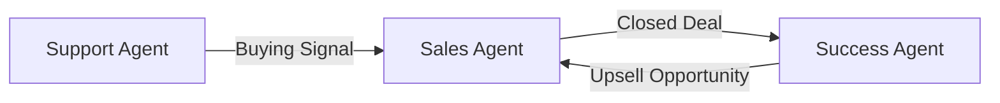
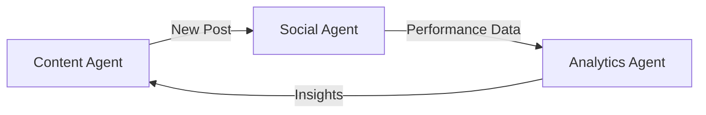

Remember when you added your second monitor and suddenly couldn't work with just one? That's what happens when you add agent #2.

## Why Agent #2 Changes Everything

Your first agent solved one problem. But your business has interconnected problems:
- Customer asks question → needs answer → becomes sales lead
- Bug report → needs fix → needs customer update → needs documentation
- Content idea → needs writing → needs publishing → needs promotion

Two agents working together handle these chains automatically.

## The Most Powerful Combinations

Based on real usage data, these pairs deliver immediate ROI:

<CardGroup cols={2}>
  <Card title="Support + Sales">
    When support agent spots buying signal, sales agent follows up. Conversion rate: 3x higher.
  </Card>
  
  <Card title="Content + Social">
    Content agent writes, social agent promotes across channels. Reach: 5x broader.
  </Card>
  
  <Card title="Data + Reports">
    Data agent analyzes, report agent creates summaries. Time saved: 10 hours/week.
  </Card>
  
  <Card title="QA + DevOps">
    QA finds bugs, DevOps creates tickets and alerts team. Fix time: 50% faster.
  </Card>
</CardGroup>

## Let's Build: Support + Sales Combo

This is the most popular second agent. Here's exactly how to set it up:

<Steps>
  <Step title="Create Your Sales Agent">
    From your dashboard:
    1. Click "New Agent"
    2. Choose "Sales Assistant" template
    3. Name it "Sales Scout" (or whatever)
    
    <Info>
    The template comes pre-configured with sales frameworks like BANT and MEDDIC. You can customize later.
    </Info>
  </Step>

  <Step title="Connect Your Agents">
    Now for the magic - making them talk:
    
    1. Go to Support Agent settings
    2. Click "Connections" tab
    3. Add trigger: "When customer shows buying intent"
    4. Action: "Notify Sales Scout"
    
    What counts as buying intent? The agent knows:
    - "What's the price for..."
    - "Do you have enterprise plans?"
    - "Can we schedule a demo?"
    - "How does billing work?"
  </Step>

  <Step title="Set Sales Agent Actions">
    Your Sales Scout needs to know what to do when notified:
    
    ```yaml
    When receiving lead from Support:
    1. Check CRM for existing contact
    2. Score lead based on criteria
    3. If score > 70: Create follow-up task
    4. If score > 85: Alert human sales rep
    5. Draft personalized follow-up email
    ```
    
    <Warning>
    Always require human approval for actual outreach. Agents prepare, humans execute.
    </Warning>
  </Step>

  <Step title="Test the Handoff">
    Send a test email to support with buying signals:
    
    ```
    "Your product looks great! We're a team of 50 people. 
    What would pricing look like for us? Also, do you 
    integrate with Salesforce?"
    ```
    
    Watch the magic:
    1. Support Agent identifies buying intent
    2. Passes context to Sales Scout
    3. Sales Scout checks CRM, scores lead (high!)
    4. Creates task for human rep
    5. Drafts personalized follow-up
    
    Total time: 45 seconds
  </Step>

  <Step title="Add Intelligence Layer">
    After basic handoff works, add smarts:
    
    **Support Agent learns**:
    - Which questions indicate serious buyers
    - Customer's technical sophistication
    - Urgency signals
    
    **Sales Agent learns**:
    - Best follow-up timing
    - Which features to highlight
    - Pricing discussions that convert
  </Step>
</Steps>

## Real Results: Case Study

**Company**: B2B SaaS startup
**Before**: 30% of sales leads lost in support tickets
**After 2 weeks**: 
- 100% of buying signals captured
- 3.5x response speed to qualified leads  
- 22% increase in demo bookings
- Support team freed from "sales mode"

## Advanced: Three-Agent Workflows

Once two agents are working smoothly (usually week 2), consider adding a third:

### Support → Sales → Success


### Content → Social → Analytics


## Troubleshooting Multi-Agent Setup

<AccordionGroup>
  <Accordion title="Agents aren't communicating">
    Check connection settings. Most common issue: trigger conditions too narrow. Broaden them and filter later.
  </Accordion>
  
  <Accordion title="Too many handoffs">
    Add cooldown periods. Example: "Only notify Sales Scout once per customer per day"
  </Accordion>
  
  <Accordion title="Lost context in handoff">
    Enable "Full Context Transfer" in connection settings. Includes entire conversation history.
  </Accordion>
  
  <Accordion title="Agents contradicting each other">
    Create shared knowledge base. Both agents read from same source of truth.
  </Accordion>
</AccordionGroup>

## Week 1 Checkpoint

By end of week 1, you should have:
- ✅ First agent handling routine tasks
- ✅ One integration feeding real data
- ✅ Second agent collaborating
- ✅ 5-10 hours saved already

If you're not there yet, that's normal. Some teams take 10 days. The key is consistent progress.

## What's Next?

<Tabs>
  <Tab title="Week 2: Scale">
    - Add agents 3-5
    - Create complex workflows
    - Integrate more tools
    - See [Week 2 Guide →](/tutorials/week-2/scaling)
  </Tab>
  
  <Tab title="Go Deep">
    - Advanced agent training
    - Custom knowledge bases
    - API integrations
    - See [Advanced Tutorials →](/tutorials/advanced)
  </Tab>
  
  <Tab title="Get Help">
    - Join office hours (Thursdays)
    - Book 1-on-1 setup help
    - Browse community workflows
    - Visit [Support Center →](/how-to/get-help)
  </Tab>
</Tabs>

<Note>
**Pro tip from power users**: Week 1 is about proof of concept. Week 2 is where you'll see exponential returns. Don't optimize too early - just keep building.
</Note>