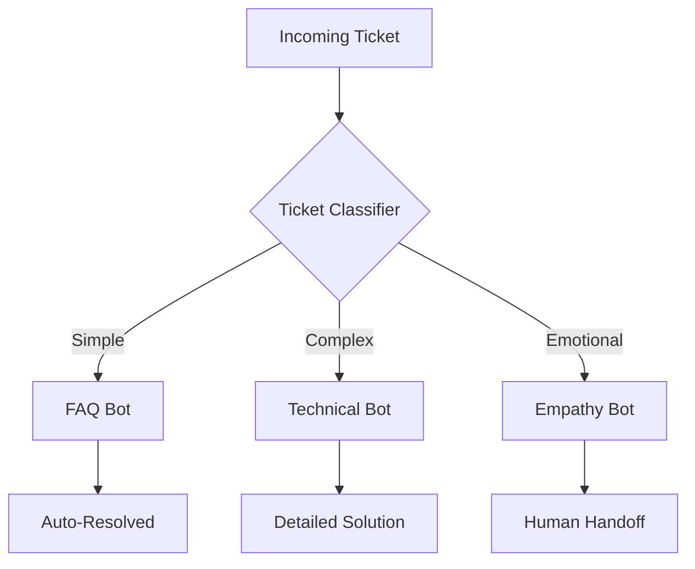

Last quarter, Shopify store owner reduced support tickets by 73% while increasing CSAT from 3.2 to 4.7. Their secret? 3 AI agents and this exact playbook.

## The Support Crisis You're Facing

- **Ticket volume**: Growing faster than your team
- **Response time**: Customers expect instant, you deliver hours
- **Repetitive questions**: 60% are the same 20 issues
- **Burnout**: Your best agents are exhausted
- **Coverage**: Customers shop 24/7, you work 9-5

Sound familiar? Here's your escape route.

## Week 1: Immediate Relief

### Day 1-2: Deploy Your First Responder

<Steps>
  <Step title="Create FAQ Agent">
    **What it does**: Handles tier-1 tickets instantly
    
    1. Use the Support Template
    2. Feed it your top 50 FAQs
    3. Connect to help desk (Zendesk, Intercom, etc.)
    4. Set auto-response for common categories
    
    **Real result**: "60% ticket reduction overnight" - Emma, DTC brand
  </Step>
  
  <Step title="Train on Your Voice">
    Upload 20 of your best support responses:
    ```yaml
    Training data:
    - Friendly but professional tone
    - Empathy-first approach
    - Solution-oriented
    - Your specific phrases/style
    ```
    
    **Pro tip**: Include responses that got "thank you" replies
  </Step>
  
  <Step title="Set Smart Routing">
    Not everything should be automated:
    ```yaml
    Auto-handle:
    - Order status
    - Return policy
    - Shipping info
    - Basic troubleshooting
    
    Escalate to human:
    - Angry customers (sentiment < -0.5)
    - Complex technical issues
    - VIP customers
    - Legal/compliance matters
    ```
  </Step>
</Steps>

**By Day 3**: Your team wakes up to 50% fewer tickets

### Day 3-5: Add Intelligence Layer

<Tabs>
  <Tab title="Sentiment Analyzer">
    ```yaml
    Agent: Customer Mood Detector
    
    Function: 
    - Scan all incoming tickets
    - Score sentiment (-1 to +1)
    - Priority flag angry customers
    - Alert team lead for fires
    
    Impact: Catch problems before they explode
    ```
  </Tab>
  
  <Tab title="Language Translator">
    ```yaml
    Agent: Global Support Bot
    
    Function:
    - Detect customer language
    - Translate query to English
    - Process response
    - Translate back to customer language
    
    Impact: Support 50+ languages instantly
    ```
  </Tab>
  
  <Tab title="Product Expert">
    ```yaml
    Agent: Technical Support Specialist
    
    Function:
    - Deep product knowledge
    - Troubleshooting trees
    - Video/image recognition
    - Step-by-step guides
    
    Impact: Resolve complex issues without engineers
    ```
  </Tab>
</Tabs>

### Day 6-7: Measure and Optimize

Key metrics after Week 1:

| Metric | Before | After | Industry Benchmark |
|--------|--------|-------|-------------------|
| First Response Time | 3 hours | 5 minutes | 1 hour |
| Resolution Time | 24 hours | 2 hours | 12 hours |
| CSAT Score | 3.2/5 | 4.1/5 | 3.8/5 |
| Ticket Volume | 500/day | 200/day | - |
| Agent Utilization | 95% | 60% | 70% |

## Month 1: Build Your AI Support Team

### The Power Trio Setup



### Week 2: Specialized Agents

<CardGroup cols={2}>
  <Card title="Refund & Return Specialist">
    - Process return requests
    - Calculate refunds
    - Generate shipping labels
    - Update inventory
    
    **Saves**: 5 hours/day
  </Card>
  
  <Card title="Order Tracker Pro">
    - Real-time shipping updates
    - Proactive delay notifications
    - Carrier coordination
    - Delivery confirmation
    
    **Prevents**: 30% of "where's my order" tickets
  </Card>
  
  <Card title="Technical Troubleshooter">
    - Step-by-step diagnostics
    - Screen recording analysis
    - Bug report creation
    - Workaround suggestions
    
    **Reduces**: Engineering interruptions by 70%
  </Card>
  
  <Card title="VIP Concierge">
    - Identify high-value customers
    - Personalized responses
    - Priority routing
    - Proactive check-ins
    
    **Increases**: Customer lifetime value by 40%
  </Card>
</CardGroup>

### Week 3-4: Advanced Capabilities

<AccordionGroup>
  <Accordion title="Proactive Support">
    **Setup**: Monitor for issues before customers complain
    
    ```yaml
    Triggers:
    - Order delayed > 2 days: Send apology + discount
    - Failed payment: Offer payment help
    - High product returns: Check for quality issue
    - Feature confusion: Send tutorial
    ```
    
    **Result**: 40% fewer incoming tickets
  </Accordion>
  
  <Accordion title="Omnichannel Coverage">
    **Connect everywhere customers are**:
    - Email → Unified inbox
    - Chat → Live agent backup
    - Social → Twitter/FB monitoring
    - SMS → Text support
    - Phone → Call transcription
    
    **Result**: True 24/7 coverage across all channels
  </Accordion>
  
  <Accordion title="Knowledge Base AI">
    **Auto-generate and update help docs**:
    1. Analyze resolved tickets
    2. Identify knowledge gaps
    3. Draft new articles
    4. Update outdated info
    
    **Result**: Self-service resolution up 60%
  </Accordion>
</AccordionGroup>

## Real Success Stories

### E-commerce: From Chaos to Calm
> "Black Friday used to be hell. Last year, our 3-person team + 5 agents handled 10x normal volume. Customers got faster service than regular days. Revenue up 40%, stress down 90%." - James, Fashion Brand

### SaaS: Support Becomes Sales
> "Our support agents now identify upsell opportunities. They've generated $200k in expansion revenue this quarter alone." - Priya, B2B Platform

### Marketplace: Global Overnight
> "Launched in 12 new countries without hiring. AI handles support in local languages, follows local customs. International revenue now 45% of total." - Carlos, Marketplace Founder

## Implementation Roadmap

### Phase 1: Foundation (Week 1-2)
- [ ] Deploy FAQ bot
- [ ] Connect primary channel
- [ ] Train on your tone
- [ ] Set routing rules
- [ ] Measure baseline metrics

### Phase 2: Expansion (Week 3-4)
- [ ] Add specialized agents
- [ ] Connect all channels
- [ ] Implement proactive support
- [ ] Create internal dashboard
- [ ] Train human team on AI collaboration

### Phase 3: Excellence (Month 2+)
- [ ] Advanced personalization
- [ ] Predictive support
- [ ] Cross-functional integration
- [ ] Continuous optimization
- [ ] Scale to new markets/products

## ROI Calculator

<div style={{backgroundColor: '#f3f4f6', padding: '20px', borderRadius: '8px'}}>

**Your numbers**:
- Average ticket volume: 500/day
- Time per ticket: 10 minutes  
- Agent hourly cost: $25
- Current team size: 5 agents

**With Cagen**:
- Tickets handled by AI: 70% (350/day)
- Time saved: 58 hours/day
- Cost saved: $1,450/day
- Monthly savings: **$43,500**
- Cagen cost: $399/month
- **ROI: 10,900%**

</div>

## Common Pitfalls & Solutions

<Tabs>
  <Tab title="Over-automation">
    **Problem**: Customers feel like they're talking to robots
    
    **Solution**: 
    - Keep 20-30% human touch
    - Easy escalation options
    - Personality in responses
    - Name your bots
  </Tab>
  
  <Tab title="Poor handoffs">
    **Problem**: Context lost when escalating
    
    **Solution**:
    - Full conversation history passed
    - Summary for human agent
    - Customer sentiment noted
    - Suggested solutions included
  </Tab>
  
  <Tab title="Rigid responses">
    **Problem**: Bot can't handle edge cases
    
    **Solution**:
    - Weekly response audits
    - Continuous training
    - Fallback to "I'll find out"
    - Regular model updates
  </Tab>
</Tabs>

## Your Next 24 Hours

<Steps>
  <Step title="Right Now">
    List your top 20 support tickets from yesterday
  </Step>
  
  <Step title="In 1 Hour">
    Create your first FAQ bot with those answers
  </Step>
  
  <Step title="By Tomorrow">
    Wake up to 50% fewer tickets in queue
  </Step>
</Steps>

## Resources & Templates

<CardGroup cols={2}>
  <Card 
    title="Support Playbook" 
    icon="book"
    href="/templates/support-playbook"
  >
    Complete implementation guide
  </Card>
  
  <Card 
    title="Response Templates" 
    icon="message"
    href="/templates/support-responses"
  >
    100+ proven responses
  </Card>
  
  <Card 
    title="Metrics Dashboard" 
    icon="chart-line"
    href="/templates/support-metrics"
  >
    Track what matters
  </Card>
  
  <Card 
    title="Team Training" 
    icon="graduation-cap"
    href="/guides/support-team-training"
  >
    Get your team ready
  </Card>
</CardGroup>

<Note>
**Support Leader Tip**: "Start with your highest volume, simplest tickets. Get wins fast, then tackle complex stuff. Your team needs to see this works." - Rachel, VP Support at scaling startup
</Note>

---

*Next: [Sales & Revenue Automation](/use-cases/sales) →*