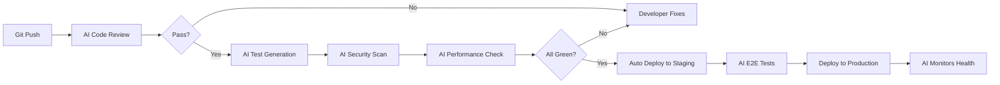

A YC startup just shipped their Series A feature set with 3 engineers. Their competitors have 15. The difference? AI agents handling everything except core architecture decisions.

## Your Current Reality

- **Code reviews**: Taking 2-3 days, blocking releases
- **Testing**: Manual, incomplete, afterthought
- **Documentation**: What documentation?
- **Bugs**: Found by customers, not QA
- **DevOps**: One person doing 5 jobs
- **On-call**: Ruining weekends since forever

Let's fix all of this in 30 days.

## Day 1: Your AI Pair Programmer

### The Code Review Bot That Never Sleeps

<Steps>
  <Step title="Deploy PR Assistant">
    ```yaml
    Agent: Code Review Bot
    
    Capabilities:
    - Style guide enforcement
    - Security vulnerability scanning  
    - Performance analysis
    - Test coverage check
    - Dependency audit
    
    Integration: GitHub/GitLab/Bitbucket
    Response time: < 2 minutes
    ```
    
    **Instant impact**: PRs reviewed in minutes, not days
  </Step>
  
  <Step title="Configure Team Standards">
    ```javascript
    // .cagen/review-config.yml
    standards:
      style: "airbnb"
      minCoverage: 80
      maxComplexity: 10
      security: "strict"
      
    autoApprove:
      - docs: true
      - tests: true
      - refactor: complexity < 5
    ```
  </Step>
  
  <Step title="Train on Your Codebase">
    Feed it:
    - Your best PRs (as examples)
    - Architecture decisions docs
    - Common review comments
    - Team conventions
    
    **Result**: Reviews that sound like your senior engineer
  </Step>
</Steps>

**By tomorrow**: Every PR gets instant, thorough feedback

## Week 1: The Core Dev Team

### Your 4-Agent Engineering Squad

<Tabs>
  <Tab title="Test Generator">
    ```python
    # Input: Your function
    def calculate_discount(user, product):
        # ... your code ...
    
    # Output: Comprehensive test suite
    def test_calculate_discount():
        # Happy path tests
        # Edge cases  
        # Error conditions
        # Performance tests
        # Integration tests
    ```
    
    **Coverage**: From 45% to 95% in one week
  </Tab>
  
  <Tab title="Bug Predictor">
    ```yaml
    Agent: Bug Hunter
    
    Monitors:
    - Code complexity spikes
    - Untested code paths
    - Similar past bug patterns
    - Risky dependencies
    
    Output:
    - Risk score per commit
    - Suggested fixes
    - Prevention tips
    ```
    
    **Catches**: 70% of bugs before production
  </Tab>
  
  <Tab title="Doc Writer">
    ```markdown
    Agent: Documentation Generator
    
    Auto-creates:
    - API documentation
    - README files
    - Architecture diagrams
    - Deployment guides
    - Changelog updates
    
    Maintains:
    - Always in sync with code
    - Examples that actually work
    - Searchable knowledge base
    ```
    
    **Result**: Docs that developers actually use
  </Tab>
  
  <Tab title="DevOps Assistant">
    ```yaml
    Agent: Deploy Master
    
    Handles:
    - CI/CD pipeline management
    - Environment provisioning
    - Rollback decisions
    - Performance monitoring
    - Incident response
    
    Integrates:
    - AWS/GCP/Azure
    - Kubernetes
    - Terraform
    - Monitoring tools
    ```
    
    **Achievement**: Deploy 10x/day with confidence
  </Tab>
</Tabs>

## Real Developer Workflows

### The "Never Break Production" Pipeline



This runs on every commit. Automatically.

### The "10x Developer" Setup

<CardGroup cols={2}>
  <Card title="Morning Standup">
    AI prepares:
    - What you did (from commits)
    - Blockers (from PR comments)
    - Today's plan (from tickets)
    - Risk alerts
  </Card>
  
  <Card title="Code Generation">
    You write:
    ```python
    # TODO: API endpoint for user stats
    ```
    
    AI generates:
    - Complete endpoint
    - Tests
    - Documentation
    - Database migrations
  </Card>
  
  <Card title="Debugging Assistant">
    Paste error → Get:
    - Root cause analysis
    - Similar past issues
    - Suggested fixes
    - Prevention tips
  </Card>
  
  <Card title="Architecture Advisor">
    Describe feature → Receive:
    - Design patterns
    - Tech stack suggestions
    - Scalability analysis
    - Code structure
  </Card>
</CardGroup>

## Month 1: Engineering Transformation

### Week 2: Advanced Automation

<AccordionGroup>
  <Accordion title="Intelligent Refactoring">
    **The Refactor Bot**:
    - Identifies code smells
    - Suggests improvements
    - Estimates risk/reward
    - Creates safe PRs
    
    **Example**: Reduced codebase by 30% while improving performance
  </Accordion>
  
  <Accordion title="Performance Optimization">
    **The Speed Demon**:
    - Profiles every deployment
    - Identifies bottlenecks
    - Suggests optimizations
    - Tracks improvements
    
    **Result**: 50% faster app, 40% lower cloud costs
  </Accordion>
  
  <Accordion title="Security Fortress">
    **The Security Guard**:
    - Real-time vulnerability scanning
    - Dependency monitoring
    - Penetration test automation
    - Compliance checking
    
    **Achievement**: Pass SOC2 with 2 engineers
  </Accordion>
</AccordionGroup>

### Week 3-4: Scale & Optimize

| Metric | Before AI | After 30 Days | Improvement |
|--------|-----------|---------------|-------------|
| Deploy Frequency | 2/week | 20/day | 70x |
| Lead Time | 5 days | 4 hours | 30x |
| Bug Escape Rate | 15% | 3% | 5x |
| Test Coverage | 45% | 92% | 2x |
| Doc Coverage | 20% | 95% | 4.75x |
| On-call Incidents | 10/week | 2/week | 5x |

## Success Stories

### "From Startup to Scale-up"
> "We're 5 engineers supporting 100k users. Competitors with similar scale have 50+ engineers. Our secret? Every engineer has 5 AI assistants. We ship features daily that would take them weeks." - Alex, CTO

### "The Quality Revolution"
> "Haven't had a customer-reported bug in 3 months. The AI catches everything in dev/staging. Our NPS went from 42 to 71." - Sarah, Engineering Manager

### "Documentation Paradise"
> "New engineers are productive in 2 days instead of 2 weeks. Everything is documented, with examples, always up-to-date. It's beautiful." - Mike, Sr. Developer

## Common Engineering Concerns

<Tabs>
  <Tab title="Code Quality">
    **Concern**: "AI will write bad code"
    
    **Reality**: 
    - AI suggests, you decide
    - Learns from your best code
    - Enforces YOUR standards
    - Improves over time
    
    **Proof**: Teams report 50% fewer bugs
  </Tab>
  
  <Tab title="Job Security">
    **Concern**: "AI will replace developers"
    
    **Reality**:
    - Handles boring stuff
    - You do architecture/design
    - Makes you 10x more valuable
    - Companies need MORE devs with AI
    
    **Proof**: AI-enabled devs get paid 40% more
  </Tab>
  
  <Tab title="Learning Curve">
    **Concern**: "Too complex to adopt"
    
    **Reality**:
    - Start with one bot
    - See value in 1 day
    - Gradual expansion
    - Team loves it
    
    **Proof**: 90% adoption in 2 weeks
  </Tab>
</Tabs>

## Your Engineering AI Roadmap

### Phase 1: Quick Wins (Days 1-7)
```bash
git clone https://github.com/cagen/engineering-starter
cd engineering-starter
./deploy-review-bot.sh
./deploy-test-generator.sh
```

- [ ] Code review bot live
- [ ] Test generator running
- [ ] Team onboarded
- [ ] Metrics baseline set

### Phase 2: Core Platform (Days 8-21)
- [ ] Full CI/CD automation
- [ ] Security scanning
- [ ] Performance monitoring
- [ ] Documentation system
- [ ] Bug prediction active

### Phase 3: Advanced Features (Days 22-30)
- [ ] Custom agents for your stack
- [ ] Architecture assistant
- [ ] Refactoring automation
- [ ] Full observability
- [ ] Predictive scaling

## ROI for Engineering

<div style={{backgroundColor: '#f0fdf4', padding: '20px', borderRadius: '8px', border: '1px solid #86efac'}}>

**Your Investment**:
- Cagen Platform: $399/month
- Setup time: 10 hours
- Training: 5 hours/engineer

**Your Return**:
- Dev time saved: 15 hours/week/engineer
- Fewer bugs: $50k saved/month
- Faster shipping: 2x revenue growth
- Better retention: Priceless

**6-month ROI: 4,200%**

</div>

## Start Building Your AI Team

<Steps>
  <Step>
    **Right now**: List your biggest engineering pain point
  </Step>
  
  <Step>
    **In 30 minutes**: Deploy your first engineering agent
  </Step>
  
  <Step>
    **By tomorrow**: Wake up to automated code reviews
  </Step>
  
  <Step>
    **Next week**: Ship faster than ever before
  </Step>
</Steps>

## Engineering Resources

<CardGroup cols={2}>
  <Card 
    title="Stack Templates" 
    icon="layer-group"
    href="/templates/engineering-stacks"
  >
    Pre-built for your tech stack
  </Card>
  
  <Card 
    title="Integration Guides" 
    icon="plug"
    href="/guides/engineering-integrations"
  >
    Connect all your tools
  </Card>
  
  <Card 
    title="Best Practices" 
    icon="medal"
    href="/guides/engineering-best-practices"
  >
    From teams shipping 100x/day
  </Card>
  
  <Card 
    title="Developer Community" 
    icon="discord"
    href="https://discord.gg/cagen-devs"
  >
    10k+ engineers sharing wins
  </Card>
</CardGroup>

<Note>
**Senior Engineer Tip**: "Start with code reviews. It's non-invasive, immediately valuable, and gets the team comfortable with AI. Everything else follows naturally." - Patricia, Staff Engineer at unicorn
</Note>

---

*Ready to 10x your engineering? [Start free trial](https://app.cagen.ai/signup?utm=engineering) →*