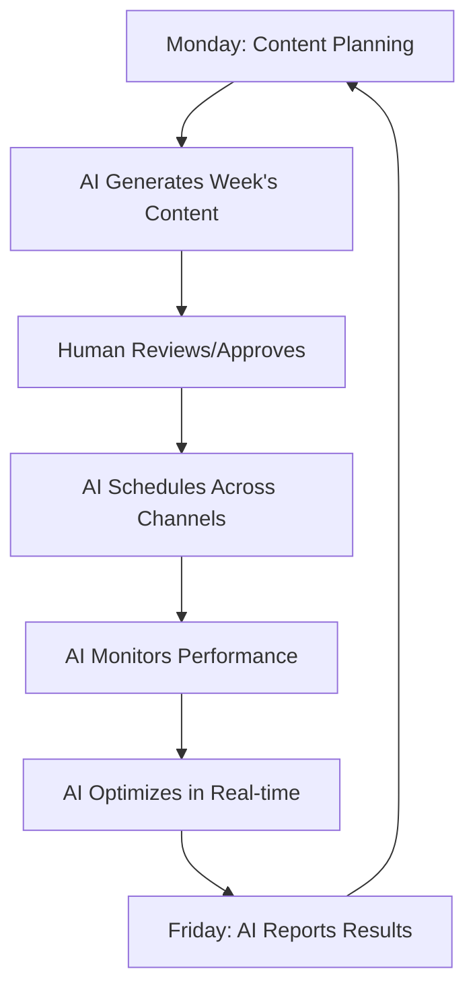

A solo marketer just generated 10,000 leads in 30 days. Another increased organic traffic 400% while cutting paid ad spend in half. They didn't hire anyone. They hired AI.

## The Marketing Struggle Is Real

- **Content bottleneck**: "We need to post more" (posts once a week)
- **Channel chaos**: Managing 10 platforms badly
- **Attribution nightmare**: "Where did this lead come from?" ¯\_(ツ)_/¯
- **Creative burnout**: Same recycled ideas
- **Budget black hole**: Spending more, getting less

Sound familiar? Let's fix all of it.

## Day 1: Your Content Factory

### From "I'll Post Tomorrow" to "Posted Everywhere"

<Steps>
  <Step title="The 10-Minute Content Explosion">
    **You provide**: One idea or voice note
    
    **AI creates**:
    ```yaml
    From one idea:
      - Blog post (2000 words, SEO optimized)
      - LinkedIn article (professional tone)
      - Twitter thread (10 tweets + hook)
      - Instagram carousel (5 slides)
      - TikTok script (60 seconds)
      - Email newsletter section
      - YouTube description
      
    Time: 10 minutes
    Quality: Better than rushing
    ```
  </Step>
  
  <Step title="The Always-On Publisher">
    **Set it once**:
    - Optimal posting times per platform
    - Audience-specific variations
    - A/B test automatically
    - Reshare evergreen content
    
    **Wake up to**:
    - 20+ posts published
    - Engagement happening
    - Leads flowing in
    - You still sleeping
  </Step>
  
  <Step title="The Engagement Army">
    **AI monitors and responds**:
    - Comments requiring response
    - DMs with buying intent
    - Mentions to amplify
    - Trends to jump on
    
    **Human touch**: You set the voice, AI maintains it 24/7
  </Step>
</Steps>

## Week 1: The Complete Marketing Stack

<Tabs>
  <Tab title="✍️ Content Creator">
    **Your Writing Team in a Box**
    
    Creates:
    - SEO-optimized blog posts
    - Social media content
    - Email campaigns
    - Landing page copy
    - Ad variations
    - Video scripts
    
    Style matching: Learns your brand voice perfectly
    
    **Output**: 50+ pieces/week (was 5)
  </Tab>
  
  <Tab title="🎨 Design Assistant">
    **Your Creative Department**
    
    Generates:
    - Social media graphics
    - Infographics
    - Banner ads
    - Email headers
    - Presentation slides
    - Brand variations
    
    Tools: Integrates with Canva, Figma, Adobe
    
    **Speed**: 5 min/design (was 1 hour)
  </Tab>
  
  <Tab title="📊 Analytics Brain">
    **Your Data Scientist**
    
    Tracks and reports:
    - Multi-touch attribution
    - Content performance
    - Channel ROI
    - Audience insights
    - Competitor analysis
    - Predictive trends
    
    **Finally**: Know what actually works
  </Tab>
  
  <Tab title="🎯 Campaign Optimizer">
    **Your Performance Marketer**
    
    Optimizes:
    - Ad targeting
    - Budget allocation
    - Bid strategies
    - Creative testing
    - Landing pages
    - Conversion paths
    
    **Result**: 3x ROAS improvement
  </Tab>
</Tabs>

## The Content Machine Workflow



## Real Marketing Transformations

### From Zero to Viral
> "I'm not creative. Never was. But I can explain our product. AI turns my rambling voice notes into viral LinkedIn posts. 50k followers in 6 months." - B2B Founder

### The One-Person Marketing Team
> "Used to manage 3 agencies. Now it's me + AI. Better results, 80% less cost, 100% less drama. We're outmarketing competitors with 20x our budget." - Marketing Director

### Local Business Domination
> "Every local competitor has bigger budgets. But we post 10x more, respond instantly, and our content actually helps people. AI made us the obvious choice." - Restaurant Owner

## Month 1: Your Marketing Metrics

<div style={{display: 'grid', gridTemplateColumns: '1fr 1fr', gap: '20px'}}>
  <div style={{backgroundColor: '#fee2e2', padding: '20px', borderRadius: '8px'}}>
    **Before AI**
    - Content pieces: 20/month
    - Channels active: 2-3
    - Response time: Hours
    - Lead attribution: "No idea"
    - Team stress: Maximum
    - ROI: Unclear
  </div>
  
  <div style={{backgroundColor: '#dcfce7', padding: '20px', borderRadius: '8px'}}>
    **After 30 Days**
    - Content pieces: 200+/month
    - Channels active: 8-10
    - Response time: Minutes
    - Lead attribution: Crystal clear
    - Team stress: Minimal
    - ROI: 400%+
  </div>
</div>

## Advanced Marketing Plays

<AccordionGroup>
  <Accordion title="The SEO Domination Strategy">
    **AI-Powered Content Clusters**
    
    1. AI researches your topic landscape
    2. Identifies 50+ related keywords
    3. Creates pillar + cluster content
    4. Interlinks automatically
    5. Updates based on rankings
    
    **Result**: Own entire topic areas, not just keywords
  </Accordion>
  
  <Accordion title="The Viral Hook Generator">
    **Never Run Out of Ideas**
    
    AI analyzes:
    - Trending topics in your niche
    - Competitor viral posts
    - Audience pain points
    - Seasonal opportunities
    
    Suggests: 20 hooks daily with predicted engagement
    
    **Hit rate**: 10x improvement
  </Accordion>
  
  <Accordion title="The Conversion Optimizer">
    **Landing Pages That Convert**
    
    AI continuously:
    - Tests headlines
    - Optimizes CTAs
    - Adjusts layouts
    - Personalizes content
    - Improves load speed
    
    **Conversion lift**: Average 35%
  </Accordion>
  
  <Accordion title="The Influencer Outreach Machine">
    **Scale Partnerships**
    
    AI handles:
    - Influencer discovery
    - Personalized outreach
    - Negotiation support
    - Content collaboration
    - Performance tracking
    
    **Success rate**: 5% → 25%
  </Accordion>
</AccordionGroup>

## Marketing Channel Mastery

<CardGroup cols={3}>
  <Card title="Email Marketing">
    - Segmentation on steroids
    - Personalization at scale
    - Optimal send times
    - Subject line testing
    - Re-engagement campaigns
    
    **Open rate**: +40%
  </Card>
  
  <Card title="Social Media">
    - Platform-specific content
    - Trend jumping
    - Community management
    - Influencer tracking
    - Viral monitoring
    
    **Engagement**: +250%
  </Card>
  
  <Card title="Paid Advertising">
    - Creative generation
    - Audience testing
    - Budget optimization
    - Cross-channel tracking
    - Fraud detection
    
    **ROAS**: +200%
  </Card>
  
  <Card title="Content Marketing">
    - Topic research
    - SEO optimization
    - Distribution planning
    - Repurposing engine
    - Performance tracking
    
    **Traffic**: +400%
  </Card>
  
  <Card title="Video Marketing">
    - Script writing
    - Subtitle generation
    - Thumbnail creation
    - Platform optimization
    - Engagement boosting
    
    **Views**: +600%
  </Card>
  
  <Card title="Podcast Marketing">
    - Show notes creation
    - Clip identification
    - Guest outreach
    - Distribution automation
    - Audience growth
    
    **Downloads**: +300%
  </Card>
</CardGroup>

## Your 30-Day Marketing Transformation

<Steps>
  <Step title="Week 1: Content Foundation">
    - Deploy content creator AI
    - Set up publishing calendar
    - Create brand voice guide
    - Launch first campaigns
    - See immediate output boost
  </Step>
  
  <Step title="Week 2: Channel Expansion">
    - Activate dormant channels
    - Set up engagement automation
    - Launch testing protocols
    - Connect analytics
    - Watch metrics climb
  </Step>
  
  <Step title="Week 3: Optimization Engine">
    - Implement A/B testing
    - Set up attribution tracking
    - Launch retargeting campaigns
    - Optimize top performers
    - Scale what works
  </Step>
  
  <Step title="Week 4: Full Automation">
    - Complete workflow automation
    - Predictive content calendar
    - AI-driven optimization
    - Team focuses on strategy
    - Marketing runs itself
  </Step>
</Steps>

## ROI Reality Check

<div style={{backgroundColor: '#f0f9ff', padding: '24px', borderRadius: '8px'}}>

**Solo Marketer Example**:
- Time saved: 30 hours/week
- Content output: 10x increase
- Lead generation: +400%
- Cost per lead: -60%
- Stress level: -90%

**Marketing Team Example**:
- Team productivity: 5x
- Campaign velocity: 10x
- Attribution accuracy: 95%
- Budget efficiency: +300%
- Creative quality: Consistent excellence

**Investment**: $399/month
**Return**: $50k+/month in value

</div>

## Marketing Resources Hub

<CardGroup cols={2}>
  <Card 
    title="Content Templates" 
    icon="file-alt"
    href="/templates/marketing-content"
  >
    50+ proven templates
  </Card>
  
  <Card 
    title="Campaign Playbooks" 
    icon="book"
    href="/playbooks/marketing-campaigns"
  >
    Copy successful campaigns
  </Card>
  
  <Card 
    title="Tool Integrations" 
    icon="plug"
    href="/integrations/marketing-tools"
  >
    Connect your stack
  </Card>
  
  <Card 
    title="Marketing Community" 
    icon="users"
    href="https://community.cagen.ai/marketing"
  >
    5k+ marketers sharing wins
  </Card>
</CardGroup>

## The Marketing Truth

Your competitors are either:
1. Spending 10x more on agencies
2. Already using AI and dominating

Which side do you want to be on?

<Note>
**Marketing Reality**: The best content, campaign, or strategy means nothing if you can't execute consistently at scale. AI makes execution effortless. Finally focus on strategy instead of scrambling.
</Note>

---

*Ready to market like a media company? [Start your content transformation](https://app.cagen.ai/signup?utm=marketing) →*