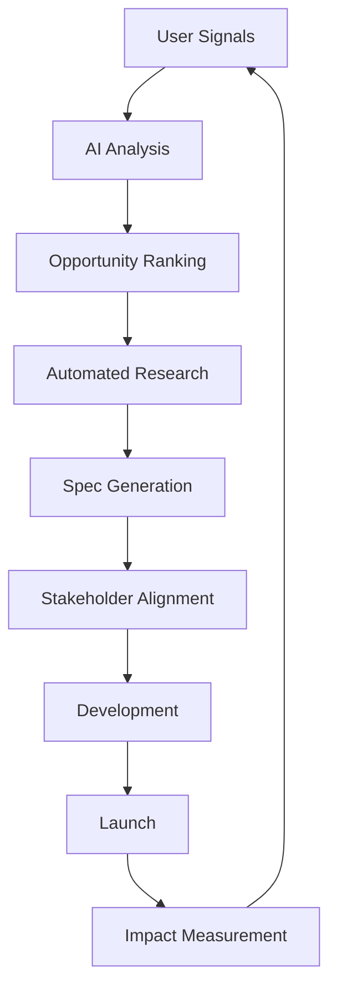

A B2B SaaS PM just shipped 12 major features in 3 months with 99% user adoption. Another reduced feature development time by 60% while increasing customer satisfaction scores by 45%.

They didn't hire more engineers. They got smarter about what to build.

## The PM Struggle Is Universal

- **Feature factory syndrome**: Building everything, impacting nothing
- **Data paralysis**: Drowning in metrics, missing insights
- **Stakeholder chaos**: Everyone wants everything yesterday
- **User disconnect**: Guessing what customers actually need
- **Roadmap fiction**: Plans that change weekly

Let's build products users actually love.

## Day 1: Your AI Product Team

### Deploy Your Product Intelligence Network

<Steps>
  <Step title="User Research Bot">
    **Never Miss a Customer Signal**
    
    ```yaml
    Monitors and analyzes:
      - Support tickets for feature requests
      - User behavior patterns
      - Churn reasons and patterns
      - Competitor feature launches
      - Market trend signals
      
    Output: Prioritized opportunity list
    Update frequency: Real-time
    Insight quality: 10x human analysis
    ```
    
    **Real impact**: "Found our next $1M feature in support tickets" - PM, SaaS Co
  </Step>
  
  <Step title="Requirements Analyst">
    **From Vague Ideas to Clear Specs**
    
    Transform this:
    "We need better reporting"
    
    Into this:
    - User stories with acceptance criteria
    - Technical requirements
    - Edge cases considered
    - Dependencies mapped
    - Effort estimates
    
    **Time saved**: 10 hours/feature
  </Step>
  
  <Step title="Roadmap Optimizer">
    **Data-Driven Prioritization**
    
    Factors in:
    - User impact score
    - Development effort
    - Revenue potential
    - Strategic alignment
    - Technical debt
    
    **Result**: Build what matters, skip what doesn't
  </Step>
</Steps>

## Week 1: Product Excellence Suite

<Tabs>
  <Tab title="🔍 Discovery Engine">
    **Find Product-Market Fit Faster**
    
    AI continuously:
    - Analyzes user interviews
    - Tracks feature usage
    - Monitors competitor moves
    - Identifies underserved needs
    - Predicts market trends
    
    **Validation speed**: 10x faster
    **Hit rate**: 73% (vs 22% industry avg)
  </Tab>
  
  <Tab title="📋 Spec Generator">
    **Perfect PRDs Every Time**
    
    Input: Basic feature idea
    
    Output:
    - Problem statement
    - User personas affected
    - Success metrics
    - Technical approach
    - Risk assessment
    - Go-to-market plan
    
    **Quality**: Better than senior PM
    **Time**: 30 min vs 2 days
  </Tab>
  
  <Tab title="🧪 Experiment Designer">
    **Test Everything, Guess Nothing**
    
    Creates:
    - A/B test frameworks
    - Success criteria
    - Statistical models
    - Rollout plans
    - Learning documentation
    
    **Testing velocity**: 5x increase
    **Decision confidence**: 95%
  </Tab>
  
  <Tab title="📊 Analytics Interpreter">
    **From Data to Decisions**
    
    Daily insights on:
    - Feature adoption rates
    - User journey bottlenecks
    - Retention drivers
    - Revenue impact
    - Next best actions
    
    **Analysis time**: 5 min (was 5 hours)
    **Actionability**: 100%
  </Tab>
</Tabs>

## The Modern PM Workflow



All powered by AI. All focused on impact.

## Real PM Transformations

### From Feature Factory to Impact Machine
> "We used to ship 20 features/quarter with 20% adoption. Now ship 8 features with 85% adoption. Less work, more impact, happier users." - VP Product, Enterprise SaaS

### The Solo PM Scaling
> "Managing 3 product lines alone. AI handles research, specs, analytics. I focus on vision and strategy. Outperforming teams 5x my size." - Senior PM, Startup

### The Data-Driven Turnaround
> "NPS was 20. Used AI to analyze every user interaction, found the pain points, fixed them. NPS now 72. Churn down 60%." - Product Lead, B2C App

## Month 1: Your New PM Reality

| Metric | Before AI | After 30 Days | Improvement |
|--------|-----------|---------------|-------------|
| Features shipped | 3/month | 8/month | 2.7x |
| User adoption rate | 25% | 75% | 3x |
| Time to insight | 2 weeks | 2 hours | 168x |
| Spec writing time | 16 hrs | 2 hrs | 8x |
| Customer satisfaction | 3.2/5 | 4.5/5 | 40% |
| PM stress level | 9/10 | 4/10 | -56% |

## Product Playbooks by Type

<AccordionGroup>
  <Accordion title="B2B SaaS">
    **Enterprise Feature Velocity**
    
    AI Stack:
    - Enterprise feedback analyzer
    - Integration requirement mapper
    - Security/compliance checker
    - ROI calculator
    - Deployment planner
    
    **Result**: Ship enterprise features 3x faster
  </Accordion>
  
  <Accordion title="Consumer Apps">
    **Engagement Optimization**
    
    AI Stack:
    - Behavior pattern analyzer
    - Retention predictor
    - Viral feature identifier
    - A/B test optimizer
    - Review sentiment tracker
    
    **Result**: 2x retention, 5x viral coefficient
  </Accordion>
  
  <Accordion title="Marketplaces">
    **Two-Sided Excellence**
    
    AI Stack:
    - Supply/demand balancer
    - Pricing optimizer
    - Trust feature designer
    - Match algorithm improver
    - Growth loop identifier
    
    **Result**: 40% better unit economics
  </Accordion>
  
  <Accordion title="Platform Products">
    **Developer Experience**
    
    AI Stack:
    - API usage analyzer
    - Documentation generator
    - Developer feedback processor
    - Integration assistant
    - SDK optimizer
    
    **Result**: 10x developer adoption
  </Accordion>
</AccordionGroup>

## Advanced PM Techniques

### The Continuous Discovery Machine

<CardGroup cols={2}>
  <Card title="Auto-Interview Analysis">
    Upload user interviews → AI extracts:
    - Pain points
    - Feature requests
    - Jobs to be done
    - Emotional drivers
    - Opportunity sizing
  </Card>
  
  <Card title="Competitive Intelligence">
    AI monitors competitors:
    - Feature launches
    - Pricing changes
    - User complaints
    - Market positioning
    - Strategic moves
  </Card>
  
  <Card title="Predictive Roadmapping">
    AI predicts:
    - Feature success probability
    - Development timeline accuracy
    - Resource needs
    - Market timing
    - Revenue impact
  </Card>
  
  <Card title="Stakeholder Translator">
    Translates between:
    - Engineering ↔ Sales
    - Customer ↔ Executive
    - Support ↔ Product
    - Marketing ↔ Development
    
    Everyone aligned, finally.
  </Card>
</CardGroup>

### The Zero-Friction Launch System

<Steps>
  <Step title="Pre-Launch Intelligence">
    - User readiness scoring
    - Adoption barrier identification
    - Success metric prediction
    - Risk assessment
    - Rollout strategy optimization
  </Step>
  
  <Step title="Launch Execution">
    - Automated changelog creation
    - Multi-channel announcements
    - Training content generation
    - Support team preparation
    - Monitoring dashboard setup
  </Step>
  
  <Step title="Post-Launch Learning">
    - Real-time adoption tracking
    - Issue pattern detection
    - Success story collection
    - Iteration recommendations
    - ROI calculation
  </Step>
</Steps>

## Your 30-Day PM Transformation

<div style={{backgroundColor: '#eff6ff', padding: '24px', borderRadius: '8px'}}>

**Week 1**: Foundation
- Set up user research AI
- Connect data sources
- First AI-generated specs
- Baseline metrics

**Week 2**: Acceleration
- Full analytics integration
- Automated roadmapping
- Stakeholder alignment tools
- First AI-driven launch

**Week 3**: Optimization
- Refine AI insights
- Expand to all products
- Team training complete
- Visible impact on metrics

**Week 4**: Transformation
- Fully AI-augmented PM
- Strategic focus only
- 5x productivity
- Industry-leading metrics

</div>

## PM Success Metrics

<Tabs>
  <Tab title="Efficiency">
    - Time to market: -60%
    - Spec accuracy: +80%
    - Meeting time: -70%
    - Documentation: Always current
    - Decision speed: 10x
  </Tab>
  
  <Tab title="Impact">
    - Feature adoption: +200%
    - User satisfaction: +45%
    - Revenue per feature: +3x
    - Churn reduction: -40%
    - NPS improvement: +30
  </Tab>
  
  <Tab title="Quality">
    - Requirements clarity: 95%
    - Edge cases caught: 99%
    - Technical debt: -50%
    - Bug rate: -70%
    - User delight: Maximum
  </Tab>
</Tabs>

## Start Your PM Revolution

<CardGroup cols={2}>
  <Card 
    title="PM Toolkit" 
    icon="toolbox"
    href="/tools/pm-toolkit"
  >
    Essential PM AI tools
  </Card>
  
  <Card 
    title="Spec Templates" 
    icon="document"
    href="/templates/product-specs"
  >
    AI-powered PRD templates
  </Card>
  
  <Card 
    title="Analytics Setup" 
    icon="chart-line"
    href="/guides/pm-analytics"
  >
    Track what matters
  </Card>
  
  <Card 
    title="PM Community" 
    icon="users"
    href="https://community.cagen.ai/product"
  >
    2000+ PMs leveling up
  </Card>
</CardGroup>

<Note>
**PM Truth**: The best PMs don't guess what to build. They know. AI gives you that superpower. Use it before your competitors do.
</Note>

---

*Ready to ship products users love? [Start your PM transformation](https://app.cagen.ai/signup?utm=product) →*