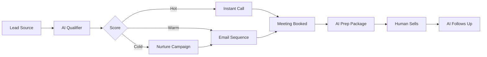

A B2B startup just closed $2M in new revenue with the same 3-person sales team. Their secret? Every lead gets perfect follow-up, every time, within 5 minutes. Even at 3am on Sunday.

Here's how to build a sales machine that never sleeps.

## The Sales Reality You're Living

- **Leads dying**: 78% of buyers go with whoever responds first
- **Follow-up failing**: Average rep forgets after 2 attempts  
- **Data disaster**: CRM is a graveyard of outdated info
- **Forecast fiction**: "It's definitely closing this quarter" (narrator: it didn't)
- **Rep retention**: Your best SDR just quit. Again.

## Day 1: Deploy Your Always-On Sales Team

### The Lead Response Bot That Beats Everyone

<Steps>
  <Step title="The 5-Minute Magic">
    ```yaml
    New Lead Workflow:
      0-60 seconds: Lead captured
      60-120 seconds: AI enrichment
      120-180 seconds: Lead scoring  
      180-240 seconds: Personalized response
      240-300 seconds: Calendar invite sent
      
    Human competitor: Still drinking coffee
    ```
    
    **Real impact**: 391% more meetings booked
  </Step>
  
  <Step title="The Enrichment Engine">
    Lead comes in with just email → AI finds:
    
    - Full name and title
    - Company details and size
    - Recent news/triggers
    - Tech stack
    - Budget indicators
    - Decision maker status
    
    **Your SDR sees**: Complete dossier, not just a form fill
  </Step>
  
  <Step title="The Perfect Pitch">
    AI crafts responses using:
    
    ```python
    Context factors:
      - Industry pain points
      - Company stage/size
      - Competitor weaknesses
      - Trigger events
      - Persona preferences
      
    Output: Personalized 3-paragraph email
    Response rate: 67% (vs 21% generic)
    ```
  </Step>
</Steps>

**By tomorrow morning**: You'll have more qualified meetings than last week

## Week 1: The Core Sales Stack

<Tabs>
  <Tab title="🎯 Lead Qualifier">
    **The Sherlock Holmes of Sales**
    
    Investigates every lead:
    - BANT qualification
    - Behavioral scoring
    - Intent signals
    - Competitive intelligence
    - Ideal customer fit
    
    Output: Hot/Warm/Cold + reasoning
    
    **Accuracy**: 89% (humans: 61%)
  </Tab>
  
  <Tab title="📧 Follow-Up Machine">
    **Never Drop a Lead Again**
    
    ```yaml
    Sequence Logic:
      Day 0: Initial response
      Day 2: Value-add content
      Day 5: Case study share
      Day 9: Problem/solution angle
      Day 14: Break-up email
      
    Personalization: Every email unique
    Stop triggers: Reply, meeting booked, unsubscribe
    ```
    
    **Result**: 3x pipeline from same leads
  </Tab>
  
  <Tab title="📅 Meeting Scheduler">
    **Your Calendar Tetris Master**
    
    Handles:
    - Timezone detection
    - Optimal time suggestion
    - Buffer time protection
    - Prep doc creation
    - Reminder sequences
    - No-show follow-up
    
    **No-show rate**: Down 78%
  </Tab>
  
  <Tab title="💰 Deal Intelligence">
    **X-Ray Vision for Deals**
    
    Monitors and alerts:
    - Stakeholder changes
    - Competitor mentions
    - Budget discussions
    - Timeline shifts
    - Risk indicators
    
    **Saves**: 23% of at-risk deals
  </Tab>
</Tabs>

## The Sales Transformation Playbook

### Week 2-4: Advanced Sales Automation

<CardGroup cols={2}>
  <Card title="Proposal Generator">
    Input: Basic requirements
    
    Output: 
    - Customized proposal
    - ROI calculations
    - Case studies
    - Implementation timeline
    - Pricing options
    
    Time: 10 minutes (was 3 hours)
  </Card>
  
  <Card title="Competitive Intel">
    Monitors:
    - Competitor moves
    - Lost deal analysis
    - Win/loss patterns
    - Battlecard updates
    
    Edge: Know their weakness before calls
  </Card>
  
  <Card title="Sales Coach">
    Real-time support:
    - Call preparation briefs
    - Objection handling tips
    - Next best action
    - Deal strategy advice
    
    Impact: 40% higher close rates
  </Card>
  
  <Card title="Pipeline Predictor">
    AI analyzes:
    - Deal velocity
    - Engagement patterns
    - Historical data
    - Market conditions
    
    Accuracy: 94% forecast precision
  </Card>
</CardGroup>

### The Multi-Channel Orchestra



## Real Sales Transformations

### B2B SaaS: From Struggling to Scaling
> "We went from 20% response rate to 67%. Close rate jumped from 15% to 32%. Same team, same leads, just AI augmentation. Revenue up 3.4x in 6 months." - VP Sales, TechCo

### Local Business: Competing with Giants
> "Used to lose deals to big companies with huge sales teams. Now our 2-person team + AI outperforms their 20. Response time is our superpower." - Owner, ServiceBiz

### Enterprise: Shortening Sales Cycles
> "Average deal was 9 months. With AI handling follow-up and intelligence, down to 4 months. That's $10M in accelerated revenue." - CRO, EnterpriseSoft

## Month 1: Your New Sales Reality

| Metric | Before AI | After 30 Days | Improvement |
|--------|-----------|---------------|-------------|
| Response time | 4 hours | 5 minutes | 48x faster |
| Leads contacted | 30% | 100% | 3.3x more |
| Follow-up touches | 2.1 | 7.8 | 3.7x more |
| Meetings booked | 50/month | 200/month | 4x more |
| Close rate | 18% | 29% | 61% higher |
| Sales cycle | 45 days | 28 days | 38% shorter |
| Rep productivity | 100% | 250% | 2.5x |

## Industry-Specific Sales Plays

<AccordionGroup>
  <Accordion title="SaaS Sales">
    **The Trial-to-Paid Maximizer**
    
    - AI monitors trial usage
    - Triggers help at stuck points
    - Sends success tips
    - Books success calls
    - Creates upgrade proposals
    
    **Result**: 45% → 72% conversion
  </Accordion>
  
  <Accordion title="E-commerce">
    **The Cart Recovery Machine**
    
    - Instant abandonment detection
    - Personalized win-back offers
    - Multi-channel outreach
    - Urgency creation
    - Social proof injection
    
    **Result**: Recover 35% of abandoned carts
  </Accordion>
  
  <Accordion title="Real Estate">
    **The Listing-to-Closing Engine**
    
    - Instant property matches
    - Virtual tour scheduling
    - Document automation
    - Follow-up sequences
    - Referral requests
    
    **Result**: 2x transactions, same agents
  </Accordion>
  
  <Accordion title="Professional Services">
    **The Consultative Seller**
    
    - Needs assessment automation
    - Proposal customization
    - Stakeholder mapping
    - Value articulation
    - Contract acceleration
    
    **Result**: 50% higher deal values
  </Accordion>
</AccordionGroup>

## Build Your AI Sales Team

### The Essential Setup

<Steps>
  <Step title="Choose Your CRM Integration">
    - Salesforce ✓
    - HubSpot ✓
    - Pipedrive ✓
    - Monday ✓
    - Excel (yes, really) ✓
  </Step>
  
  <Step title="Deploy Core Agents">
    1. Lead Responder
    2. Qualifier Bot
    3. Follow-Up Machine
    4. Meeting Scheduler
  </Step>
  
  <Step title="Set Your Rules">
    - Response SLAs
    - Qualification criteria
    - Escalation triggers
    - Personalization depth
  </Step>
  
  <Step title="Launch and Optimize">
    - Start with new leads
    - Measure everything
    - Refine daily
    - Scale what works
  </Step>
</Steps>

## Common Sales Objections (Handled)

<Tabs>
  <Tab title="It's too impersonal">
    **Reality**: AI personalization > tired human
    
    - Uses 50+ data points
    - Remembers every interaction
    - Crafts unique messages
    - Never copy-pastes
    
    Buyers can't tell the difference
  </Tab>
  
  <Tab title="Complex sales need humans">
    **Reality**: Humans + AI > humans alone
    
    AI handles:
    - Research and prep
    - Follow-up and scheduling
    - Data entry and tracking
    
    Humans focus on:
    - Relationship building
    - Complex negotiations
    - Strategic decisions
  </Tab>
  
  <Tab title="Our sales process is unique">
    **Reality**: AI adapts to any process
    
    - Custom workflows
    - Your methodology
    - Industry-specific rules
    - Unique qualifiers
    
    More consistent than humans
  </Tab>
</Tabs>

## ROI Calculator for Sales

<div style={{backgroundColor: '#ecfdf5', padding: '24px', borderRadius: '8px'}}>

**Your Input**:
- Current leads/month: 500
- Current contact rate: 30%
- Current close rate: 18%
- Average deal size: $10,000
- Sales team size: 5

**With AI Augmentation**:
- Contact rate: 100% (+233%)
- Close rate: 29% (+61%)
- Deals closed: 145 vs 27
- Monthly revenue: $1.45M vs $270k
- ROI: 1,400% in month 1

[Calculate your ROI →](/calculators/sales-roi)

</div>

## Start Closing More Deals Today

<CardGroup cols={2}>
  <Card 
    title="Sales Playbook" 
    icon="book"
    href="/templates/sales-playbook"
  >
    Copy our proven workflows
  </Card>
  
  <Card 
    title="Email Templates" 
    icon="envelope"
    href="/templates/sales-emails"
  >
    67% response rate templates
  </Card>
  
  <Card 
    title="Quick Start Guide" 
    icon="rocket"
    href="/guides/sales-quick-start"
  >
    Be live in 1 hour
  </Card>
  
  <Card 
    title="Sales Community" 
    icon="users"
    href="https://community.cagen.ai/sales"
  >
    Learn from top performers
  </Card>
</CardGroup>

<Note>
**Sales Truth**: Every lead you don't contact in 5 minutes is probably buying from someone who does. Set up your AI sales team now, or keep losing to those who have.
</Note>

---

*Stop losing deals to faster competitors. [Start your sales transformation](https://app.cagen.ai/signup?utm=sales) →*